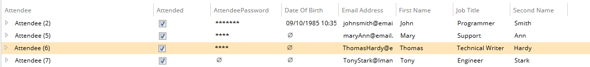

# Confidential and NonConfidential

These metadata allow you to configure whether the property value is hidden.

Metadata Property Name  | Type Signature  
------- | -----------
`Confidential` | `com.braintribe.model.meta.data.prompt.Confidential`
`NonConfidential` | `com.braintribe.model.meta.data.prompt.NonConfidential`

## General

If you assign the Confidential metadata to an element, then the element behaves like a password field and hides property's value. If the NonConfidential (or no) property is assigned, the property behaves like a normal property and its value is visible.

You can attach this metadata to:

* models
* properties
* entity types
* enum types
* enum constants

## Example

In this example, the Confidential metadata was assigned to the `AttendeePassword` property:

