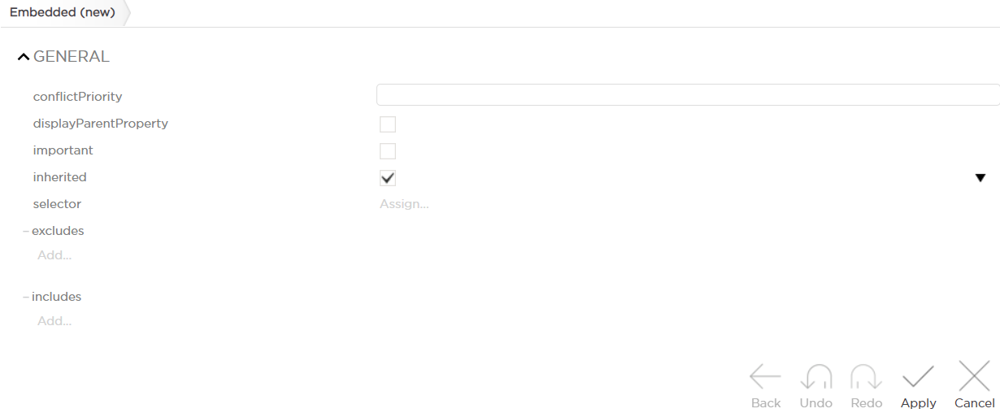
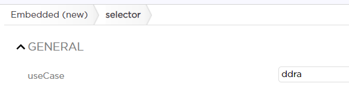

# Embedded
This metadata allows you to embed properties into their parent entity type.

## General
This metadata is assigned on a property. When assigned, all properties of that property are shown (embedded) on the parent entity.

Consequently, this metadata is useful if the property where this metadata is assigned has properties on its own.

Metadata Property Name  | Type Signature  
------- | -----------
`Embedded` | `com.braintribe.model.meta.data.prompt.Embedded`

## Example

You have a service request `MyRequest` that's mapped to an endpoint and exposed via REST API. This request has the `Person` entity type attached as a property. `Person` has a number of properties, including `firstName` and `lastName`. You want people using the request to see all properties of `Person` in Swagger. Additionally, you only want the properties of `Person` to be visible in Swagger. Thus, you need to do the following:

1. Add `Embedded` metadata on `Person`. Do not confuse it with `JpaEmbedded`, used for hibernate mapping. The following form opens:

    

3. Assign a `ddra` use case selector to only show embedded properties in Swagger.

    

4. Finally, commit your changes and check the service request in Swagger! All properties of `Person` should be listed.

>Important - using includes and excludes is not supported in `DdraMapping` yet.

