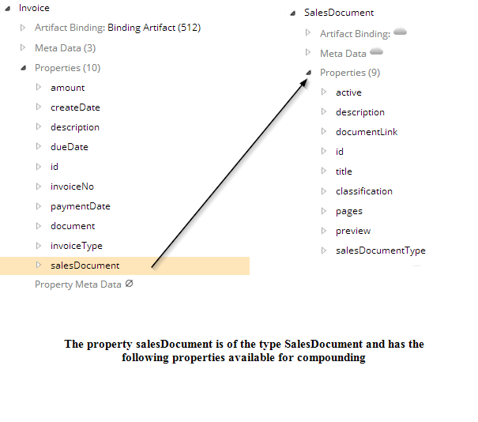
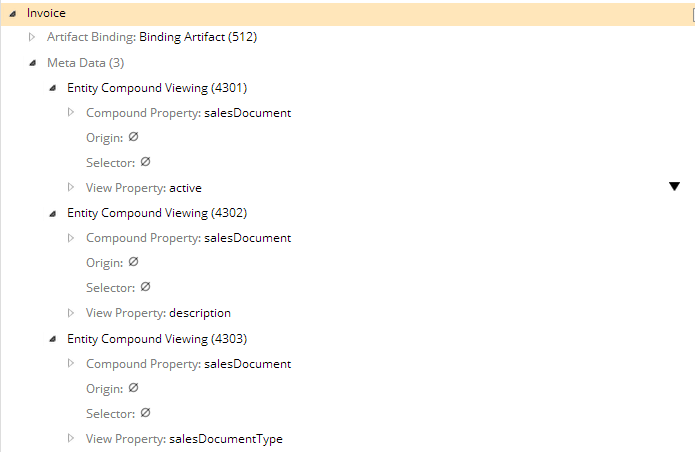
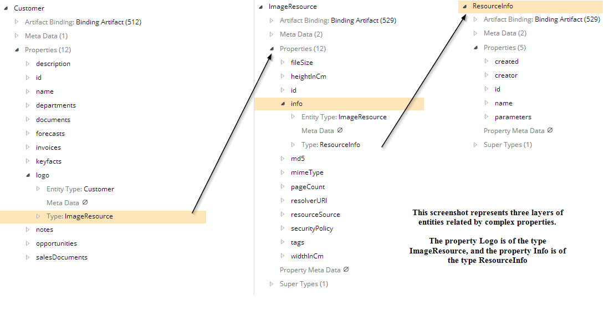
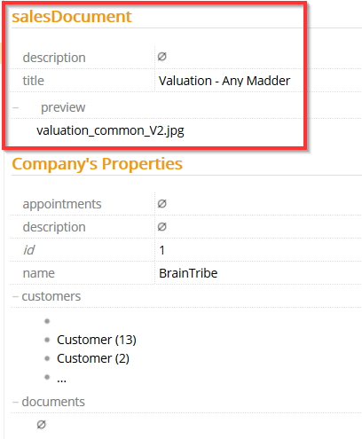
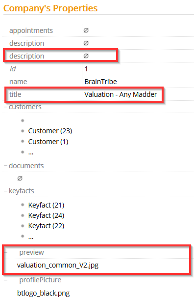

# Entity Compound Viewing

Using this metadata, you can display properties belonging to a complex type.

Metadata Property Name  | Type Signature  
------- | -----------
`EntityCompoundViewing` | `com.braintribe.model.meta.data.prompt.EntityCompoundViewing`

## General

Normally when querying an entity in Control Center or Explorer, the properties of a simple type are returned. Using the Entity Compound Viewing metadata, you can influence this behavior to display the related properties of the complex entity type. For example, if you have an entity called `Person` which has property `address`, which is of the type `Address`, you can display in the `Person` query data relating to the `Address` entity, such as street, city, and so on.

>This metadata is only capable of displaying one extra layer. If you wish to display properties relating to entities further down the tree, see the [More Layers](entity_compound.html#morelayers) section of this document.

There are two properties that require configuration for correct functionality: Compound Property and View Property. The Compound Property refers to the property in the main entity that is of a complex type, while the View Property is the property from the sub-entity that should be combined and displayed in the query. You must add an instance of the Entity Compound Viewing metadata for each additional property you wish to display.

## Example

To properly configure the Entity Compound Viewing metadata, you must define the two properties: Compound Property and View Property.

In the example below there is an entity called `Invoice`, which has a property belonging to it called `salesDocument`. This property is a complex type of the entity `SalesDocument`. The Compound Property, therefore, is defined as `salesDocument`, while the View Property is a property belonging to the entity `SalesDocument`.

For every property that you wish to display, you must define a specific instance of Entity Compound Viewing.

We add the `active`, `description`, and `salesDocumentType` properties of the entity type `SalesDocument`:

You can now query the main entity and it shows all the related data:

### More Layers {#morelayers}

Not only can you display properties which belong to an entity one level down in the hierarchy, you can display properties from a deep down in the tree as you wish.

An example would be the entity Customer:

* The entity `Customer` has the property `logo` which of the entity type `ImageResource`
* The entity `ImageResource` has the property `info` which is of the entity type `ResourceInfo`
* The entity type `ResourceInfo` has the property `name`. The name property is a simple type, `String`, and relates to the name of the file representing the customer's logo.

Therefore, it is possible through the use of this metadata to display the `name` property, from the entity `ResourceInfo`, in the `Customer` query.

To configure the Entity Compound Viewing 2 metadata, we must add a Property Path object to it, defined by the property Property Path.

The Property Path object holds a collection of properties. The first property should be the entity belonging to the main entity and the second property is the property from the sub-entity that should be combined and displayed in the query. You can add a third property which belongs to the sub-sub-entity, and so on.

For every property that you wish to display, you must define a specific instance of Entity Compound Viewing.

To properly configure the Entity Compound Viewing  metadata you must add a Property Path element. This element contains a collection of properties. The first property should be the property of the main entity. Each further property should represent the next step in the hierarchy. The last property should represent the simple type that should be displayed.

In the screenshot below it shows a hierarchy of three entities: `Customer`, `ImageResource` and `ResourceInfo`.

To configure this relationship using the PropertyPath element, we add three properties, `logo`, `info` and then a property from the `ResourceInfo` type, in this example `name`.
>You must configure an instance of Entity Compound Viewing  for each additional property that you wish to display in the main entity query.

#### Prevent Group

When you compound properties for viewing in an entity, they are displayed in the assembly panel and the properties panel. You can decide how they are displayed in the properties panel by setting the value of Prevent Group to either `true` or `false`. If set to `true`, all compounded properties are grouped together, under a section named after the compounded property. If set to `false`, all properties are displayed in only one section, regardless of which entity the property belongs to.
>Each individual instance of must be configured. If you have three instances and only configure one property with Prevent Group to `true`, the other two are still grouped.

* `False`
  If you set each instance of the EntityCompoundViewing's Prevent Group property to `false`, each property is grouped together.
  
  
  
* `True`
  If you set each instance of the EntityCompoundViewing' Prevent Group property to `true`, these properties are not grouped, but displayed together with all other properties instead.

  
