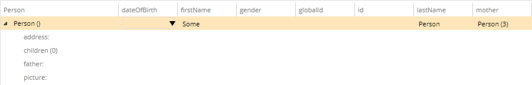

# Inline

This metadata property allows you to configure whether the complex properties of an entity type are displayed inline.

Metadata Property Name  | Type Signature  
------- | -----------
`Inline` | `com.braintribe.model.meta.data.prompt.Inline`

## General

The metadata property refers specifically to complex types, that is, properties which are themselves entity types. If you assign this metadata on a complex property, this property is displayed in a simplified way.

## Example

hen this metadata is added to a complex type property, this property is displayed inline:

