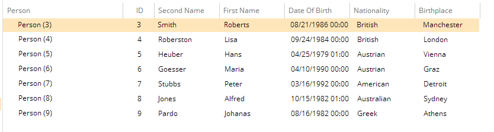

# Priority

This metadata property allows you to configure the priority of the element it has been assigned to.

Metadata Property Name  | Type Signature  
------- | -----------
`Priority` | `com.braintribe.model.meta.data.prompt.Priority`

## General

You configure the property Priority with a decimal value between `0` and `1`, where the entities are sorted according to the values defined in each instance of this metadata. It functions similarly to the Conflict Priority metadata.
>For more information, see the [Conflict Priority](../general_metadata_properties.md) document.

What this means is that you can configure the order of importance between the different entities within a model using this metadata. The higher the value the higher the priority.

You can also configure different properties of an entity type using this metadata, resulting in a different ordering of these properties in Explorer, both when displaying the columns and when creating a new instance of the entity type. Normally, the properties are displayed in the order in which they were created. However, you can use this metadata to change this ordering.

To configure this metadata you can enter a decimal value between `0` and `1`. The higher the value the higher the priority and it will be displayed nearer to the top of entity instance. Using this metadata on a series of properties of an entity type, therefore, allows you to determine their order.

## Example

You attach a Priority to each of the entities you wish to prioritize. If there are entities within a model that do not have this metadata set they default to 0. To set a priority for an entity, you enter a value between 0 and 1 in the Priority field. You can also assign the Priority metadata to a property.

In this example, each property has a Property Priority attached. See the table below for the values used to configure each.

Property Name | Priority Value
------ | ------
`ID` | `1.0`
`secondName` | `0.9`
`firstName` | `0.8`
`dateOfBirth` | `0.7`
`nationality` | `0.6`
`birthplace` | `0.5`

The columns are ordered using these priorities in Explorer. As you can see the higher the value, the higher the priority of the property. This means that properties with high values are displayed to the left and then the following properties are ordered afterwards, depending on the Priority value.

