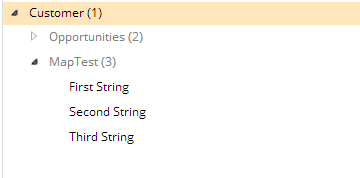

# Show as List

This metadata property allows you to configure how maps should be handled, either as a traditional map or as a list.

Metadata Property Name  | Type Signature  
------- | -----------
`ShowAsList` | `com.braintribe.model.meta.data.prompt.ShowAsList`

## General

When the Show As List metadata is assigned to a map property, then the property is displayed as a list, rather than as a map. It is important that your map adhere to the following structure:

```xml
map<Integer, Some other object>
```

The key of the map must be of the type `integer`; the value can be any valid object accepted by tribefire, either a simple type (String, Date, and so on) or a complex type. It is even possible for the value to be a collection itself.

Secondly, because the metadata uses the keys as an index when constructing the list, the keys in the map must follow the order `0,1,2,3...` Otherwise, the metadata is not able to function correctly.

## Example

If you assign the Show As List metadata to a map property, the property is displayed like a list.


