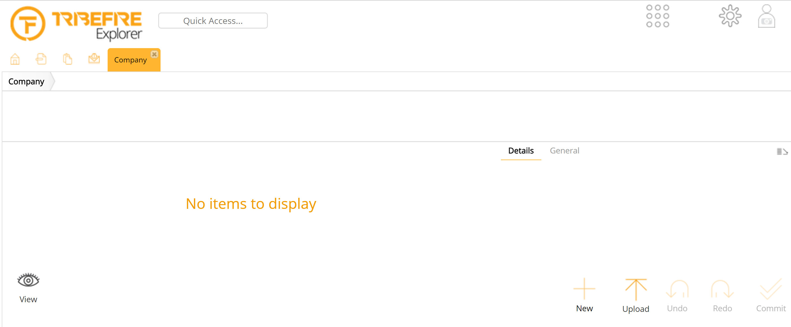

# Singleton

This metadata allows you to configure whether the Query Panel is displayed in Explorer.

Metadata Property Name  | Type Signature  
------- | -----------
`Singleton` | `com.braintribe.model.meta.data.prompt.Singleton`

## General

You assign this metadata on the entity level. If the Singleton metadata is assigned to an entity type, the Query Panel is not displayed in Explorer for that particular entity type.

## Example

The following screenshot shows how tribefire Explorer looks when the Singleton metadata is set for the `Company` entity type.

