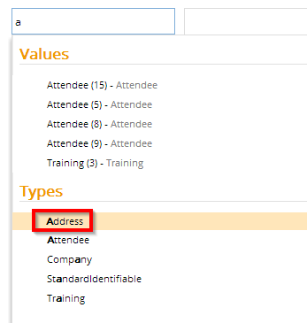
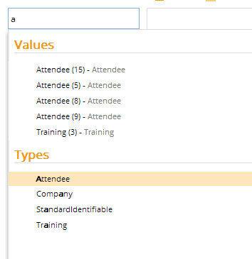

# Visible and Hidden

These metadata allow you to configure the visibility of the entity type they are assigned to.

Metadata Property Name  | Type Signature  
------- | -----------
`Visible` | `com.braintribe.model.meta.data.prompt.Visible`
`Hidden` | `com.braintribe.model.meta.data.prompt.Hidden`

## General

>This use of this metadata property does not preclude the option of configuring queries in Workbench for this entity type. Only the entity type is hidden in Explorer, not any queries based upon it.

If you assign the Visible metadata to an element, the element is visible in Explorer. The Hidden metadata, does the opposite. If you assign the Hidden metadata to an element, the element is not displayed in tribefire Explorer.

You can attach this metadata to:

* models
* properties
* entity types
* enum types
* enum constants

## Example

If the Visible metadata is added, the element is visible in Explorer. In this example an entity type called `Address` has been configured with this metadata property. As shown in the screenshot below, `Address` is visible.

If the Hidden metadata is added, the element is not visible in Explorer. In this example an entity type called `Address` has been configured with this metadata property. As shown in the screenshot below, `Address` is not visible.

