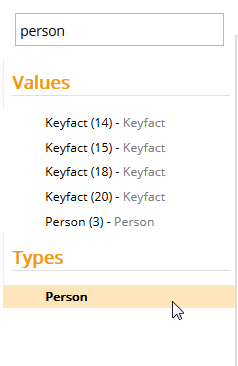

# Queryable and NonQueryable

This metadata property allows you to configure whether or not an entity type can be directly queried in Explorer. 

Metadata Property Name  | Type Signature  
------- | -----------
`Queryable` | `com.braintribe.model.meta.data.query.Queryable`
`NonQueryable` | `com.braintribe.model.meta.data.query.NonQueryable`

## General

If the Queryable (or no) metadata is configured, then a property is displayed when you directly query for it in Explorer. If the NonQueryable metadata is assigned, then a property is not displayed when you directly query for it in Explorer. It is still displayed if it is a part of another entity though.

## Example

If you assign the NonQueryable metadata to an entity, you cannot query for this entity using the Quick Access search box in Explorer.

In the example below, the entity `Person` has been configured so that it cannot be queried. You can search for the entity type, however, when clicking on the entity `Person`, no query is executed.

