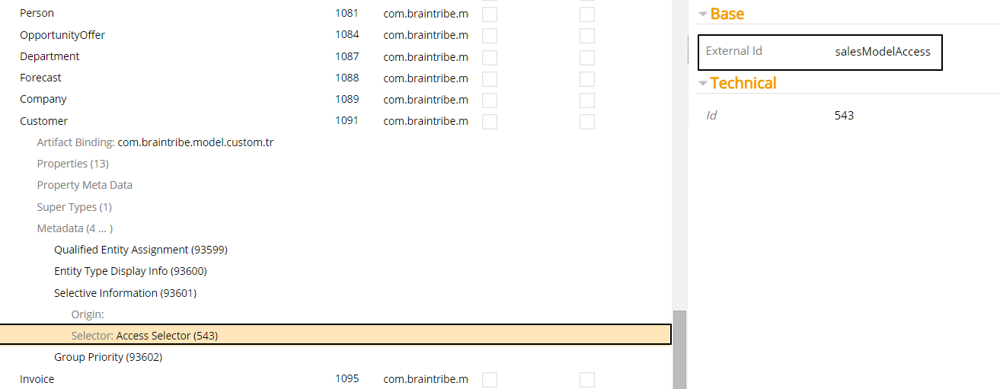
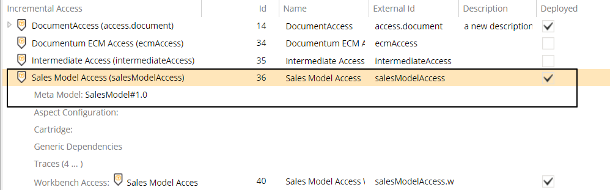

# Access Selector

The access selector allows you to activate metadata based on the external ID of the access associated with the model the metadata is assigned to.

Selector Name  | Type Signature  
------- | -----------
`AccessSelector` | `com.braintribe.model.meta.selector.AccessSelector`

## General

When configured, this selector only resolves metadata on any entity instance or property belonging to a model whose access' external ID matches the one defined in the selector. If the external IDs do not match the metadata is not resolved.

## Example
The access selector contains only one property that requires configuration - `externalid`.

The `externalId` property is where you must provide the value of an access' external ID. Only metadata belonging to models associated with that access are resolved.

In this example, we have the [Selective Information](../display/selectiveinformation.md) metadata belonging to an entity called `Customer`. We assigned it an access selector, whose external ID is `salesModelAccess`.

The entity, `Customer`, belongs to a model called `SalesModel`. We can see that this metadata is resolved since the external ID of the access associated with this model is `salesModelAccess`, the same as defined in the `externalId` property of the access selector.

