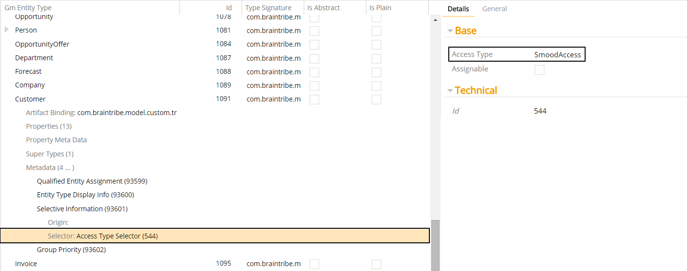
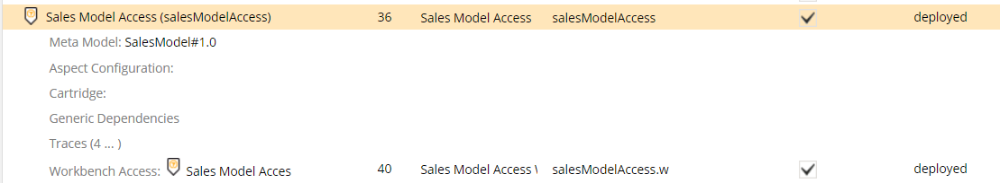

# Access Type Selector

The access type selector allows you to activate metadata depending on the type of access the model containing the metadata is associated with.

Selector Name  | Type Signature  
------- | -----------
`AccessTypeSelector` | `com.braintribe.model.meta.selector.AccessTypeSelector`

## General

When configured, only metadata which belongs to a model associated with the specific access type is resolved. If the access type is different, the metadata is not resolved.

You can assign the default and custom accesses to this selector. The access type selector contains two properties that are used to configure it:

Property | Description
------| ---------
Access Type | Used to specify the access type the metadata is resolved for.
Assignable | Used to specify whether the metadata is resolved for the subtypes of the Access Type.

>Leaving the **Assignable** checkbox unchecked means that all subtypes of the Access Type are also valid, so that metadata belonging to a model associated with a subtype is also resolved. If you check the checkbox, only the type assigned to the Access Type property is considered valid.

## Example

You must first determine the access type that should be matched, and whether subtypes of this type should also be considered when matching.

In this example, a [Selective Information](../display/selectiveinformation.md) metadata was assigned to an entity called `Customer`, and an access type selector was assigned to the metadata. The Access Type property was assigned the `SmoodAccess` type while the **Assignable** property is left unchecked.

This means that this metadata is only resolved when its model is associated with a SMOOD access or any subtype of SMOOD.

The `Customer` entity belongs to `SalesModel`, which in turn is associated with Sales Model Access. This access is of the type SMOOD, meaning that the metadata is resolved.

