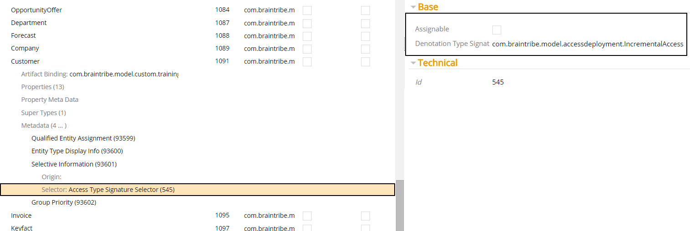
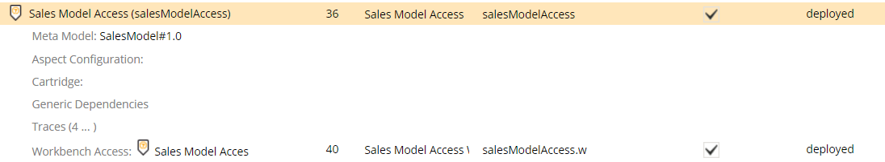

# Access Type Signature Selector

The access type selector allows you to activate metadata depending on the type of the type signature of the access the model containing the metadata is associated with.

Selector Name  | Type Signature  
------- | -----------
`AccessTypeSignatureSelector` | `com.braintribe.model.meta.selector.AccessTypeSignatureSelector`

## General

When configured, only metadata which belongs to a model associated with a specific access type signature is resolved. If the access type signature is different, the metadata is not resolved.

You can assign the default and custom accesses to this selector. The access type selector contains two properties that are used to configure it:

Property | Description
------| ---------
Denotation Type Signature | Used to specify the access type signature the metadata is resolved for.
Assignable | Used to specify whether the metadata is resolved for the subtypes of the Access Type.

>Leaving the **Assignable** checkbox unchecked means that all subtypes of the Access Type are also valid, so that metadata belonging to a model associated with a subtype is also resolved. If you check the checkbox, only the type assigned to the Access Type property is considered valid.

## Example

In this example, a [Selective Information](../display/selectiveinformation.md) metadata was added to an entity `Customer`, and the metadata was assigned an access type signature selector. The Denotation Type Signature for the selector was `com.braintribe.model.accessdeployment.IncrementalAccess`.

The **Assignable** property was unchecked. This means that the metadata is resolved only when its corresponding access is of the type Incremental Access or a subtype of it.

This entity belongs to a model called `SalesModel`, which was assigned to a SMOOD access.

Because SMOOD is a derivative of `IncrementalAccess`, the metadata is resolved.
