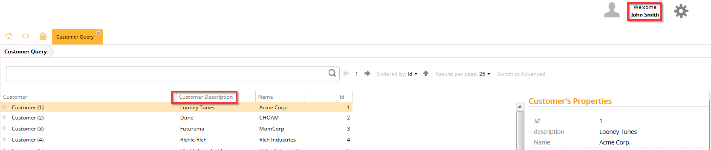

# Conjunction Selector

The conjunction selector allows you to determine two or more cases that must all be true for a metadata to be resolved.

## General

This selector has only one property which can be configured: `operands`.

Using this property, you build a list of metadata selectors that all must be true before the action of the metadata function. This is the equivalent of an **AND** operator.

> You can add as many selectors to the `operand` property as you like.

## Example

First, define the selector with an instance of the `ConjunctionSelector`.

Double click the newly created instance to open it up for editing. Here you can add as many `MetadataSelectors` as you wish. In this example, two selectors have been chosen: a `UseCaseSelector` and a `RoleSelector`. This means that both these conditions must be met before the metadata is resolved.

