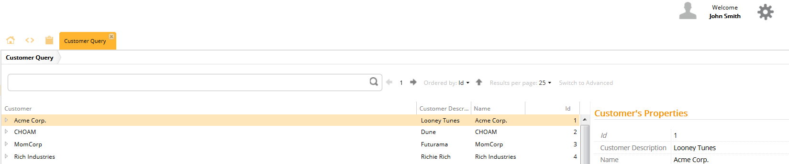
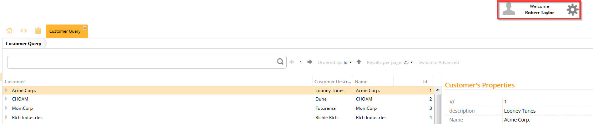
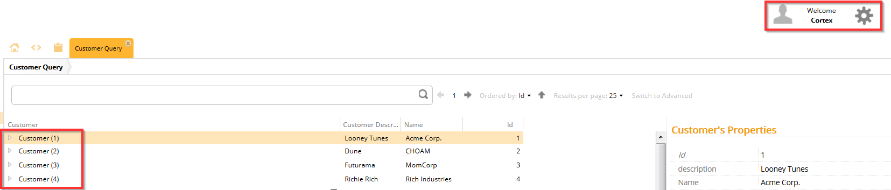

# Disjunction Selector

The disjunction selector allows you to define two or more metadata selectors, one of which must be matched for the metadata to be resolved.

## General

The `DisjunctionSelector` functions as an **OR** operator, unlike the `ConjunctionSelector`, where all selector conditions must be met.

This means that if any one of the conditions are met, the metadata functions according to the behavior defined by that selector.

> You can add as many selectors to the `operand` property as you like.

## Example

In this example, we define the operand property with an instance of the `RoleSelector`.

If any of the conditions are met, that is, if one of the selectors are true, that metadata is resolved; if more than one metadata matches the criteria, [Conflict Priority](../general_metadata_properties.md) determines which should be resolved. In this example, we define two `RoleSelectors` for

* `john.smith.role`
* `robert.taylor.role`

This means, that if the user has either the role `john.smith.role.a` OR `robert.taylor.role.a` then the metadata is resolved.

The user John Smith has the role `john.smith.role.a` defined, so the metadata is resolved and displayed.

The user Robert Taylor has the role `robert.taylor.role.a` defined, so the metadata is resolved and displayed.

However, the user Cortex has neither of the roles assigned, and therefore, the metadata is not resolved.

