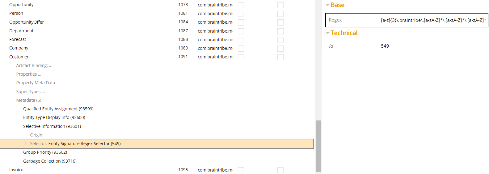
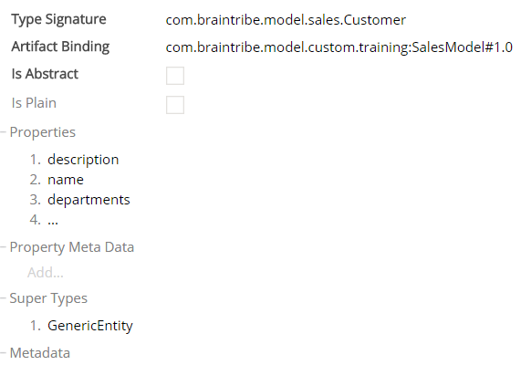

# Entity Signature Regex Selector

The entity signature regex selector allows you to activate metadata based on the type signature of the entity the metadata is assigned to.

Selector Name  | Type Signature  
------- | -----------
`EntitySignatureRegexSelector` | `com.braintribe.model.meta.selector.EntitySignatureRegexSelector`

## General

You can define this selector on both the entity instance and the property level.

In the case of property-level metadata, it is the entity the property belongs to that is used when matching against the regex. The whole of the entity's type signature must be matched by the regular expression for the metadata to be resolved. If the type signature is not matched, the metadata is not resolved.

## Example

The selector contains only one property that needs configuration - `regex`. The `regex` property is where you must provide the type signature.

The entity signature regex selector is used to match entity type signatures against a regular expression, and only if the expression is matched the metadata is resolved.

In this example, the metadata [Selective Information](../display/selectiveinformation.md) was added to an entity called `Customer`, and the metadata was assigned a entity signature regex selector with the following regular expression: `[a-z]{3}\.braintribe\.[a-zA-Z]*\.[a-zA-Z]*\.[a-zA-Z]*`

This regular expression searches for:

* a three letter word, followed by a period,
* the word `braintribe` followed by a period,
* another word followed by a period,
* another word followed by a period,
* ...and a word.

We can see from the type signature of the entity that the package name matches the regular expression and the metadata is resolved.

