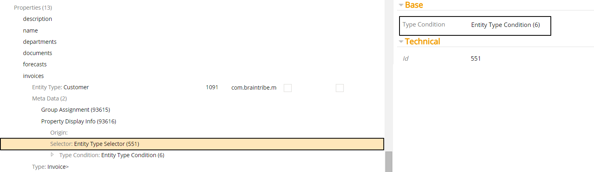
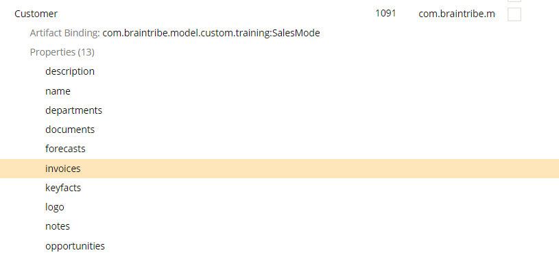

# Entity Type Selector

The entity type selector allows you to activate metadata based on a configured type condition.

## General

Type conditions allow you to match against entities, properties, collections, and elements within a collection. There are also other type conditions that are not used to match types; by contrast, they can be considered helper conditions that are used to change the scope of type condition matching. For example, you can use the conjunction and disjunction conditions to define more than one condition that should be matched by the metadata selector.

When configured, the entity or property that contains the metadata is compared to the type condition provided in the selector. Only when the entity or property matches the type condition, the metadata is resolved.

> For more information on type conditions, see the [Type Conditions](type_conditions.md) document.

You can add this selector to property- and entity-level metadata, and so the actual type condition that is assigned depends on which element the metadata is configured for.

## Example

The selector contains only one property - `typeCondition`. The property is where you assign the type condition that must be met.

In this example, the [Display Info](../display/displayinfo.md) metadata was added to a property called `invoices`, and an entity type selector was assigned to the metadata. An Entity Type Condition type condition was also added to the selector. This condition matches the entity configured in the condition against the entity belonging to invoices.

The Entity Type Condition has itself two properties for configuration. **Type Signature** defines what entity is matched. In this case, the property must belong to a `Customer` entity before the metadata is resolved. If we look at the property `invoices`, we can see that it does indeed belong to a `Customer` entity. Therefore, the metadata is resolved.

