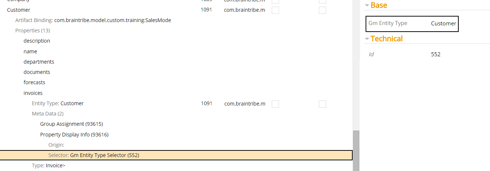
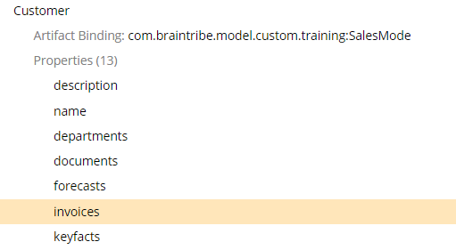

# Gm Entity Type Selector

The Gm entity type selector allows you to activate metadata based on the entity type.

## General

When configured, the entity type defined in the selector is compared to one of the following:

* the entity the metadata is assigned to
* the entity containing the property the metadata is assigned to

The Gm entity type selector contains only one property - `Gm Entity Type`. This property is where you provide the type signature of the entity to be compared against.

The metadata is resolved only when the entity assigned to this property matches the type signature of the Gm Entity Type property.

## Example

Any metadata's entity or entity belonging to the metadata's property is matched against the entity in Gm Entity Type property before the metadata is resolved.

In this example, a [Display Info](../display/displayinfo.md) metadata was added to the property invoices, and a GM entity type selector was assigned to the metadata with the `Customer` entity type.

We can see that the property `invoices` belongs to the entity `Customer`, meaning that the metadata is resolved.

