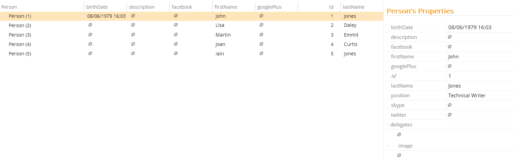

# Property Name Selector

This property name selector allows you to activate metadata based on the name of the property.

Selector Name  | Type Signature  
------- | -----------
`AccessSelector` | `com.braintribe.model.meta.selector.AccessSelector`

## General

When configured, this selector only resolves metadata on any properties that match the name of the value given. You can configure this metadata at the property level; however, it makes more sense use this selector on metadata that are configured at the entity level, using the property `PropertyMetadata`. This means that metadata affects all properties in the entity, and the Property Name Selector, means the specific metadata on each property will only be resolved in the value given in the selector matches the name of the property.

This selector has one property that must be defined, called: `PropertyName`. This should be defined with the name of the property that when matched the metadata will be resolved.

For example, if the metadata [Visible and Hidden](../prompt/visible.md) is defined in the Property Metadata property of an entity called `Person`, it affects all properties the same. That is, all properties are invisible or visible, depending on which the metadata is turned on or off. Adding the Property Name selector, with the value `lastName`, means that this metadata is only resolved on properties with the name `lastName`. In this example, all other properties are shown regardless, and you can use the metadata to decide whether the property `lastName` should be visible or not.

## Example

You can use this metadata selector on any property, but it makes more sense to use it with metadata configured at Property Metadata, an the entity level. To configure this selector, enter the name of the property that should be affected by the metadata to the property `PropertyName`.

In the following example the metadata [Visible and Hidden](../prompt/visible.md) is added to the Property Metadata property of an entity `Person`. The Property Name Selector is defined with the value `lastName` and the Hidden metadata added. This means that when displaying `Person` in Control Center or Explorer, the property `lastName` is invisible.

We create a new instance of a metadata, in this case Hidden, on the Property Metadata property and add a Property Name Selector with the value `required`, in this case `lastName`. Any property called `lastName` belonging to the `Person` entity is now invisible.

