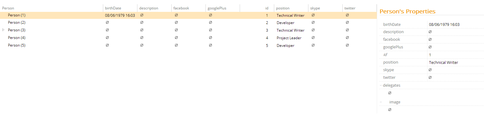

# Property Regex Selector

The Property Regex Selector functions in a similar way to Property Name Selector, in that it activates metadata depending on the name configured in the selector.

Selector Name  | Type Signature  
------- | -----------
`PropertyRegexSelector` | `com.braintribe.model.meta.selector.PropertyRegexSelector`

## General
Whereas Property Name Selector only activates metadata on properties whose name matches exactly the value give in the selector's `PropertyName` property, you can use Property Regex Selector to define a regular expression. This activates the metadata on all properties whose name matches the regular expression. You can define any property metadata with this selector; however, it makes more sense to use this selector on property metadata that is defined at the entity level, using the property Property Metadata. Without the use of any selector, this property activates the metadata on all properties belonging to the entity.

The selector only has one property that must be defined, called `regex`. This property should be used to define your regular expression.

## Example

You can use this selector on any property metadata, but it makes most sense to use it on metadata defined at the entity level, using the Property Metadata property. This property assigns metadata configured here to all properties belonging to the entity.

In the example below, there is an entity Person. The metadata Visible and Hidden is added to Property Metadata, which then makes all properties either visible or invisible depending on how the metadata data is configured. A Property Regex Selector is then be instantiated with a regular expression, which be used to resolve metadata only on properties that have the value Name at the end of their name – if more than one metadata is matched, Conflict Priority is used to determine which should be resolved.

>For more information, see [Conflict Priority](../general_metadata_properties.md#conflict-priority)

In the case of the `Person` entity, there are two properties which match this regular expression: `lastName` and `firstName`. This means the Property Visibility metadata only affects these two properties, allowing you to make them visible or invisible.

Create a new instance of a metadata, in this case Hidden, at the entity level, on Property Metadata. For the property `Selector`, create a new instance of `PropertyRegexSelector`. Using the property `regex`, enter a regular expression. In this example, we use the regular expression: `[a-z]*Name`

This regular expression matches all properties which have `Name` at the end of their property's name.

Now all properties which match this regular expression are invisible. In this example, there are two properties which match this expression: `lastName` and `firstName`. Both these properties are now invisible.

