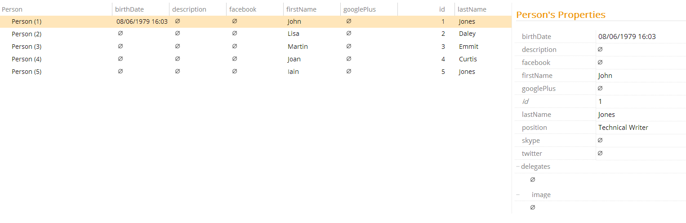

# Property Type Selector

The Property Type Selector allows you to resolve metadata depending on the type of property (String, Date, Entity, etc).

Selector Name  | Type Signature  
------- | -----------
`AccessSelector` | `com.braintribe.model.meta.selector.AccessSelector`

## General

This selector can be used at the property level, as well as at the entity level. Once set, metadata is only activated on a property only when the type defined in the selector matches the property type.

This selector has one property that must be configured - `typeCondition`. This allows you to define which type should activate the metadata, based on an instance of Type Condition, of which there are several. For more information, see the Type Conditions document.

For example, when you configure the metadata [Visible and Hidden](../prompt/visible.md), at the entity-level property metadata, and set the selector to use an instance of a Simple Type Condition, which has the Simple Type Name string, only properties which are of the type String have their metadata resolved. That is, you can choose to make all strings visible or invisible. Other properties belonging to this entity are not affected.

## Example

You can use this selector on any property metadata, but it makes most sense to use it on metadata defined at the entity level, using the Property Metadata property. This property assigns metadata configured here to all properties belonging to the entity.

In this example, there is an entity `Person`. The metadata Visible or Hidden is added to Property Metadata, which then makes all properties either visible or invisible depending on how the metadata data is configured.

A Property Type Selector is instantiated with the type condition Simple Type Condition, which, in turn, is defined as String. This means that only properties of the type String have their metadata resolved, meaning the other properties are displayed regardless of the setting configured. and that you can now decided whether the string type properties should be shown or not.

This then makes all string properties belonging to this entity invisible.
