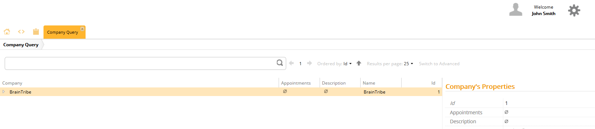

# Role Selector

The Role selector allows you to define which metadata should resolved depending a specific role.

## General

Roles are created and assigned to users using the **Authentication and Authorization** access. Once you have created a set of users and roles, you can then use Role Selector to define the metadata's behavior.

## Example

To configure the role selector for Control Center, you add a new instance of Role selector to your metadata. Collapse the Role selector by clicking the collapse icon and then select the property `Roles`. Click **Add*** and enter a role which matches one of the roles defined in **Authentication and Authorization**. Click **Add** and **Finish**.

This means that this metadata is only resolved on users who have the assigned role.

Otherwise, the metadata is not used.
