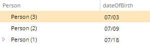

# Inverse Key Property Assignment

This metadata is used to create an inverted join between complex properties, either single or multiple aggregations.

Metadata Property Name  | Type Signature  
------- | -----------
`InverseKeyPropertyAssignment` | `com.braintribe.model.accessdeployment.smart.meta.InverseKeyPropertyAssignment`

## General

The functionality of the Key Property Assignment metadata is inverted, so that the `id` of the `key` property is used to find all entities that use this reference at the right-hand side of the join.

> For more information about Key Property Assignment, see [Key Property Assignment](key_property.md).

The metadata contains two mapping-specific properties:

* `keyProperty`
* `property`

Property | Description | Type
------| --------- | -------
`keyProperty` | The key property, against which the Property will be compared. In a simple join this will be the entity type of the complex property. | `GmProperty`
`property` | This is the property that will be compared against the key property. In a simple join this will be a property belonging to the integration entity being mapped. | `QualifiedProperty`

## Example

Currently, several upper and lower boundary configurations are supported:

Lower Boundary | Upper Boundary
------| ---------
month | null, year
day | null, year, month
year | null, year
second | null, year
null, milisecond | null, year

>If no valid combination is found, the default pattern is used - MM/dd/yyyy HH:mm for the English language.

To put things in perspective, let's assume that the lower boundary is a `day` and the upper boundary is a `month`. This means that the available values are all the days in a month. For example, setting the Date Clipping metadata for the `dateOfBirth` property of the `Person` entity, results in the following being displayed:

