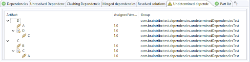

# Artifact Container

Artifact Container, a part of the DevRock Suite, is a plugin which helps you organize and resolve dependencies when working with artifacts which have a Maven-compatible dependency declaration.

## General

Artifact Container (also referred to as AC) is a Maven compatible class-path library, i.e. it reads the POM file of a Maven-compatible Eclipse project and resolves all  its dependencies into a class-path library. Furthermore, it can automatically replace a jar in the classpath with the respective Eclipse project if its available in the Eclipse workspace. There are of course quite some more features, you can find more about AC in its respective documentation.

## Dependencies to Other Plugins

### Mandatory Plugins
AC depends on the following DevRock plugins (and will not work without them):

Plugin | Version | Description
--- | --- | ---
DevRock's [Virtual Environment](virtual_environment.md) | 1.0 | Plugin to override system properties and environment variables to make dependent environments workspaces specific. 
DevRock's [Greyface](greyface.md)| 3.0 | Plugin to scan and upload artifacts from other remote repositories

### Optional Plugins
The plugins below are not mandatory, but AC can interact with them if necessary.

Plugin | Version | Description
--- | --- | ---
Sysdeo | Any | A tomcat plugin for older tomcats (< 8), requires AcDevloader in the correct version.
Tomcat plugin | Any | A tomcat plugin for current tomcats (>8), requires AcDevloader in the correct version.
Model Builder | 2.0 | The model nature provider.

You can access the Artifact Container's functionality from Eclipse toolbar or by right clicking an element in project explorer.

## Configuring the Container

You can access the configuration options of Artifact Container in Eclipse, from **Window/Preferences/DevRock/Artifact Container**. The options available in all sections are described in their respective sections below.

### Artifact Container


Property | Explanation
---|---
Dynamic classpath containter settings | Limit on how many project dependency paths can be analyzed simultaneously. Running all of them could result in performance issues with Eclipse. 
Dynamic update policy settings | Controls when AC should prune the protocol of the dynamic update process (aka Ravenhurst update). It just determines what is shown in the appropriate view (see below).
Settings for GWT | Contains the condensed name of the gwt user jar that AC should automatically inject into a model. This is required only if you work with GWT. The default value is `com.google.gwt:gwt-user#2.4.0.jar`.

### Artifact Origin Bias
This option allows you to tell Eclipse how to handle artifact dependencies. The group and artifacts IDs are used to identify the local artifacts that should have precedence of their counterparts in the remote repository. Whenever a dependency needs to be resolved, the dependency's group ID and artifact ID is matched against the entries in **Artifact origin bias**. If there is a match, dependency choices are restricted to the artifacts listed as locally installed.

`repositoryId` must match the repository ID from `settings.xml`. You must not use a regular expression here. If an inclusion is provided, the ID has to exactly match the `settings.xml` entry.

### Maven Integration
These settings control how AC should interact with Maven.


Property | Explanation
---|---
Currently active settings.xml | The active settings are a combination of both `settings.xml` files, your user file and the installation file. At least one file is required, and if both exist, they are merged. Any conflicting settings are overruled by the **user file**. You can change Maven defaults by selecting a file directly, or - recommended - by overloading the variable via Devrock’s Virtual Environment.
Currently active local repository | Derived from the combined settings, the local repository is set. Its value is shown and can be overruled.
Currently active profiles | Profile activation is rather complex and if you need to know the details, you can check [Maven documentation](https://maven.apache.org/guides/introduction/introduction-to-profiles.html). <br> Note that profiles cannot be activated by settings within other profiles. <br>You can use the Virtual Environment to overload all environment variables and system properties. For instance, profile activation based on the existence or non-existence of files will only rely on the state of your file system. <br>Basically, AC retrieves information about the active repositories from the active profiles. It shows you a condensed view of the following settings: <br> - The name of the repository <br> - The URL of the repository <br> - The ID of the mirror <br> - The ID of the server <br> - The update policy of the repository <br> If the repository supports the **Dynamic update policy** (Ravenhurst), it is marked. Otherwise, the active update policy is shown. AC (via MC) supports all Maven update policies.

#### Update Policies
AC supports all Maven standard update policies

**never**: 
The repository is never updated. If there is no local data, it is retrieved. If there is local data, it is never updated, i.e. refreshed.

**always**:
Each time a resolving event takes place, the repository is contacted and the local list is updated. Even if this only happens once within a scope, this makes the walk very slow.

**daily**
If repository data for an artifact (and solution) exists, AC can determine when a  repository was last updated, and if a day has passed (actually, the numbers of minutes in a day), it will update the repository information when a resolving update takes place.

**`interval:<minutes>`**:
Again, as AC can retrieve the update timestamp per artifact and solution, t can determine whether enough time has passed in order to contact the repository again.

**dynamic**: 
Specific to AC is the dynamic update policy. In that case, AC can connect to the repository and request a list of changes that happened since it last contacted the repository. It then selectively marks the respective information of that repository on the artifact and solution level as outdated. This is of course the most efficient update policy. 

The required functionality on the repository’s side can be added to a standard repository like Archiva via the Ravenhurst servlet, as we have with our Archiva at archiva.braintribe.com. The upcoming DevRock Repository based on Tribefire of course features this functionality as well. 

In order to mark a repository as featuring a dynamic update policy, you need to modify the appropriate settings.xml 
As this is not a standard maven policy, it cannot be declared in the standard way - it would invalidate the settings.xml. Therefore, it’s added via a property of the profile the repository is part of.

You need to add the following property:
```xml
<properties>
...				
<updateReflectingRepositories>expression</updateReflectingRepositories>
...
</properties>

```

The expression is a comma-delimited list of regular expressions, with support for a simple wildcard:

```
*
braintribe.standard
team,published,qa
internal.
```
If a repository is marked as supporting the dynamic update policy, its Maven policy is ignored, i.e. automatically considered as being `never`.

You can also distinguish between remote and local repositories - see the Maven documentation - and by the means of the keyword:

`external`

You can say, for example:

`external:tribefire,!*`

The above statement would activate a repository called `tribefire` as long as it is running an `http` protocol and is not bound to `localhost`, otherwise all other repositories are not dynamic.

#### Ravenhurst Adaptation
Currently, we use the Ravenhurst servlet which tabs into the database of our Archiva. This servlet provides the functionality of the dynamic update policy. This servlet will eventually be replaced, i.e. superseded as the upcoming DevRock Repository Cartridge will support this update policy natively. 

AC is - as it stands now - adapted to the new cartridge in its defaults, so you need to add the following properties to make it compatible with Ravenhurst

This is the example following the standard `settings.xml`:

```xml
<properties>
	<updateReflectingRepositories>braintribe</updateReflectingRepositories>
	<ravenhurst-context-braintribe>ravenhurst</ravenhurst-context-braintribe>
<ravenhurst-url-braintribe>http://archiva.braintribe.com/ravenhurst</ravenhurst-url-braintribe>
</properties>
```

>Important: if you want to modify the above, the following rule applies: <br> All ravenhurst specific properties start with ravenhurst and end with the name of the repository you specify the property for.


#### Example of `settings.xml` file
The following is a standard `settings.xml`, as should be used within the core team.

```xml
<?xml version="1.0"?>
<settings>
	<localRepository>${env.M2_REPO}</localRepository>

	<servers>
		<server>
			<id>central.mirror</id>
			<username>builder</username>
			<password>operating2005</password>
			<filePermissions>664</filePermissions>
			<directoryPermissions>775</directoryPermissions>
		</server>
	</servers>

	<mirrors>
		<mirror>
			<id>central.mirror</id>
			<url>http://archiva.braintribe.com/repository/standalone/</url>
			<mirrorOf>*</mirrorOf>
		</mirror>
	</mirrors>
  
	<profiles>
		<profile>
			<id>braintribe</id>
			<repositories>
				<repository>
					<id>braintribe</id>
					<layout>default</layout>
					<url>http://archiva.braintribe.com/repository/standalone/</url>
					<snapshots>
						<enabled>false</enabled>
					</snapshots>
					<releases>
						<enabled>true</enabled>
						<updatePolicy>never</updatePolicy>
					</releases>
				</repository>
			</repositories>
			<properties>	
				<updateReflectingRepositories>braintribe</updateReflectingRepositories>
				<ravenhurst-context-braintribe>ravenhurst</ravenhurst-context-braintribe>
				<ravenhurst-url-braintribe>http://archiva.braintribe.com/ravenhurst</ravenhurst-url-braintribe>
			</properties>
		</profile>
	</profiles>

	<activeProfiles>
		<activeProfile>braintribe</activeProfile>
	</activeProfiles>
</settings>
```
Note that mirrors are not required, nor do you have to supply update policy declarations. A minimal `settings.xml` could look as follows:

```xml
<?xml version="1.0"?>
<settings>
	<localRepository>d:/alt.m2_local_repo</localRepository>
	<profiles>
		<profile>
			<id>locallyRemote</id>
			<repositories>
				<repository>
					<id>locallyRemote</id>
					<layout>default</layout>
					<url>file:d:/alt.m2_remote_repo</url>
					<snapshots>
						<enabled>false</enabled>
					</snapshots>
					<releases>
						<enabled>true</enabled>
						<updatePolicy>always</updatePolicy>
					</releases>
				</repository>
			</repositories>
			<properties>		
			</properties>
		</profile>
	</profiles>
	<activeProfiles>
		<activeProfile>locallyRemote</activeProfile>
	</activeProfiles>
</settings>
```
#### Testing the Connectivity
As AC (via MC) will abort a walk as soon as it encounters a connection problem while connecting to a repository, a connectivity test was added to the preferences dialog.

It tests all repositories of the currently active profiles and reports the test results:


Keep in mind that in this case shown above, the synchronizations will fail. So when switching configurations, it may be a good idea to test the connectivity.

### Quick Import
In this preferences page, you configure the project related features, i.e. Quick Import and the import feature for container entries:


#### Source Repository Pairings 

Source repository pairings are explained in the table below:

Column | Description
--- | ---
name | The name of the pairing. It must be unique per preferences.
local | The local directory that represents the working copy.
url | URL that points to the remote location of the source repository.
kind | The type (kind) of the source repository server, either SVN or Git.

#### Quick Import Settings

Property | Explanation
--- | ---
Alternative UI Style for Quick Import dialog | Set it to true if you want to use the alternative set of keyboard commands (described later in this document).
Use local scan for Quick Import dialog | As there isn’t a dedicated Devrock server nor repository yet, Quick Import only supports your local working copy. A scan is automatically started when you start Eclipse, but you can always retrigger a scan from the Quick Import dialog or from the drop-down command in the toolbar or from the dialog you use to specify or edit a source repository pairing. <br> Once a Devrock server and repository exist, you can also query the remote server for projects that do not exist in your working copy yet. <br> If this settings is activated, then the data for the remote repository of a repository pairing is ignored. If it is deactivated, then the data is verified and an malformed URL will be reported as an error.
Allow selection of loaded project if a working set's selected | Normally, any artifact that exists in the workspace is greyed-out and cannot be selected for import. If this option is activated however, all projects can be selected for import, if a working set is selected in the package explorer. If such a project is imported (i.e. selected and the import action activated), it is (additionally) attached to the selected working set. 

## Adding a Container to a Project

1. Right-click the project in package explorer and go to **Build Path -> Configure Build Path**. A new dialog box opens.
2. Click **Add Library**, select **Braintribe Artifact Classpath Container**, and click **Next**. The property dialog box opens:

    

    Depending on the project’s nature, some settings are already set for your convenience. For instance, if your project has a Model nature attached, it will be automatically set as a Model artifact project. Defaults are:
    * Project choices : Standard artifact project
    * Clash resolving options : optimistic clash resolving.
4. Click **Finish** and the container is added to your project.

> Keep in mind that if a container is empty (your project currently has no dependencies whatsoever, Eclipse does not show the container in the package explorer, and you can only access it via the context menu’s **Build Path**.

## Setting Container Properties

1. Right-click the container in the package explorer and select **Properties**. The container’s properties dialog box opens.

Available properties:

Section | Property | Description
---- | ------ | -------
Project Info | Aggregator project, Tomcat project, Model project | An aggregator project is a project that doesn’t contain anything by itself, but only aggregates different projects via the dependencies. AC will not try to add a jar or project reference if this project is listed as a dependency in a project it manages. <br/> <br/> A tomcat project is a project that either has a SysDeo or a Tomcat plugin nature. If set, AC will automatically update the launch file for the AcDevloader.  <br/> <br/> A model project is defined (on this level) by having the Model nature attached. AC will if this nature is detected prior to assigning the container automatically adapt the project choice.
Project Choices | Standard project, Model artifact, GWT library project, GWT terminal project | Standard project is a plain vanilla project. Nothing special is done. <br/> <br/> Model artifact represents a model. If launched in GWT environment, AC will automatically inject the configured GWT user library and add the source directory to the compile path. <br/> <br/> GWT library project represents a GWT artifact, so it also gets the configured GWT user library plus the source directory attached. <br/> <br/> GWT terminal project represents a terminal GWT artifact. If you set that switch, AC will create duplicate path entries for any artifact-dependency, one for the jar and one for the sources (instead of using the standard complex Eclipse entry that incorporates all in one). And any dependency that is currently loaded in the workspace will also get the source classpath-entry additionally to the project classpath-entry.
Clash resolving options | Optimistic resolving, Depth based resolving, Index based resolving | Optimistic resolving means the dependency with the higher version wins. This relies on the hope that an higher version still has some backward compatibility and that if somebody requests a specific version, he in most cases has a reason for doing so. <br/> <br/> Depth based resolving means the dependency that is on a higher hierarchy level wins (that means a dependency in the terminal will overrule any dependency further down in the tree). That is supposed to mimic maven’s logic - it means that first of all the location of a certain dependency changes the outcome, and that somebody who has requested a specific higher version will get a lower version passed. <br/> <br/> Index based resolving means the dependency first encountered wins. Again, this has the same consequences as the depth based resolving.

## How a Container Works

### Compiling the Class Path
What we have seen so far is typical for any container. What really sets AC apart on the container level is that it’s a dynamic container.

A standard container fills the classpath with `jar` - or selectively with project references. AC, however, knows about the dual nature of a dependency, and can switch the kind of reference depending on whether the implementing project is present in the workspace.

R-click a `jar` it in the package explorer, and use the context menu to import its artifacts into the workspace. AC immediately detects that the workspace has changed and that a project has become available, and modifies the container to reflect that. This happens with any project with an assigned container in your workspace. AC will always refresh all containers if any event that changes the content of the workspace is detected. If this doesn’t happen due to any reason, you can always refresh the workspace manually.

Suppose you have the following project in your workspace:


We can simply import a project that implements a `jar` by - for instance - selecting it in the package explorer, and use the context menu to import it. Of course you can use any other means to import a project into the workspace:


AC immediately detects that the workspace as changed and that a project has become available, and modifies the container to reflect that:


This will happen with any project with an assigned container in your workspace. AC will always refresh all containers if any event that changes the content of the workspace is detected. If this doesn’t happen due to any reason, you can always refresh the workspace manually. 

### Understanding the Project Decorator
On the top left corner of the project’s entry in the package explorer, a little icon may appear. This is the project decorator controlled by AC. This icon gives you a quick overview about the state of the project’s dependencies:


Depending on the icon used, it conveys the following information about the project’s state:

Decorator icon | State of dependencies
--- | ---
None | Everything is fine with your dependencies
 | Something’s wrong, most probably you have clashes in your classpath.
 | Something’s broken, unresolved dependencies for instance.
 | The container is completely and utterly destroyed, and a capital error occurred during parsing.

So if your project does show a decorator icon on the top left position, especially the tiny error icon, go and check the dependency view to identify the cause of the problem.

### Runtime Classpath
The compile classpath is what you can see in the package explorer. Behind the scenes, the container handles another part of the story: the runtime classpath.

This classpath is required in the following situations:
* When you launch a managed artifact as Java application 
* When you launch a managed artifact as a Tomcat application

In order to use the container in respect to a Tomcat application, you need to do the following:

1. Make sure AC recognizes the project as Tomcat  project, i.e. it has one of the following natures:
  * Tomcat plugin nature
  * Sysdeo plugin nature

    

2. In the project’s Tomcat settings, activate the devloader, yet do not add anything to it:
   
3. Make sure that you have the corresponding `AcDevloader.jar` in your Tomcat’s library directory.

Now, when ever AC is updating the launch classpath (see above), it will update a hidden file named `<your project’s directory>/.#webclasspath_ac`. 

This file is a list of jars and project directory references that constitute the runtime classpath. The ACDevloader will identify that the project is a managed artifact (by detecting the AC container in the classpath) and will read the required library and directory references from the file rather than from anywhere else.

When you now run the Tomcat plugin with the context of the managed artifact active, you’ll see the following output (this is for a Tomcat#8.x and AcDevloader#1.3):

```
[DevLoader] org.apache.catalina.loader.DevLoader/1.3
[DevLoader] Starting DevLoaderApache Tomcat/8.0.33
[DevLoader] projectdir=<your managed artifact’s director>
[DevLoader] DevLoader uses .#webclasspath_ac as AC is active in project's .classpath
[DevLoader] added to classpath: file:/<first file of runtime classpath>
...
[DevLoader] added to classpath: file:/<the bin directory of your managed artifact>/
[DevLoader] class path for our application class loader = <a list of all files and directories>
```

### GWT Runtime Classpath
There is even one more thing happening behind the scenes. AC is injecting a launch classpath interceptor into Eclipse’s launch mechanism. 
It will make sure that if your managed artifact is a GWT terminal artifact, the classpath entries are adapted accordingly. 

## Persisted Containers

### Container settings
The container settings are persisted in a small xml file which resides within the project’s directory any can safely be committed to svn.

`<your project’s location>container.cfg.xml`

### Container data

Containers are persisted in the workspace’s data structure, so once Eclipse is closed and reopened, the content of the container is restored without the need of running a synchronization.

All AC’s data relevant to the workspace are stored in this location:
`<your workspace’ss location>.metadata\.plugins\com.braintribe.devrock.ArtifactContainer`

Per project, two files are written:
* `*.artifact.container.dependencies.zip`
  This zip file contains the list of realized dependencies for both compile and runtime state. 
* `*.artifact.container.compile.monitor.zip`
  This zip file contains collected information that was sampled during the last synchronization, again for both compile and runtime state. For more detail about the data, see the section about the dependency view. 

So, in our case, the files are:

* `A-1.1.artifact.container.compile.monitor.zip`
* `A-1.1.artifact.container.dependencies.zip`

Of course, if the structure of the dependencies of a project has been changed outside of Eclipse, AC will need to be synced manually.

### Updating Containers

Containers can update themselves automatically, but in some cases they need to be updated manually.
Basically, one needs to distinguish two different modes of updating:

* Synchronizing - this means that a full walk is made, i.e. the pom’s read and the full dependency tree is traversed. Once the solutions are determined, a refresh is made.
* Refreshing - this means that the existing set of solutions is used and correlated with what projects exist in the workspace. 

#### Automatic Updates
AC reacts on the following set of events broadcasted by Eclipse:

Event | Action on respective project | Action on other projects
---|---|---
Pom is changed | A full sync is made | None
Project is added | A sync request is made. If any persisted data exists, it is used. Otherwise a full sync is made. | All other projects are refreshed.
Project is opened | A sync request is made. If any persisted data exists, it is used. Otherwise a full sync is made. | All other projects are refreshed.

#### Manual Updates
There are several situations where a manual update is required. For instance, if you modify a pom of a project which is a dependency of another project, the depender will not recognize any changes (for now that is, the information is there, but not parsed yet).

You can select multiple projects in the package explorer and then use the context menu to synchronize or refresh the selected projects. The same options are available in the toolbar menu:


* Synchronize project(s) - synchronizes the selected projects
* Synchronize workspace - synchronizes the whole workspace
* Refresh project(s) - refresh any projects selected in the package explorer
* Refresh workspace - Refresh all projects in the workspace


#### Processing Updates
Refreshes are quick, synchronizes are slow. Traversing a complex artifact’s dependencies takes time, especially as AC will parse the full dependency tree and will not take any shortcuts (as Maven does, MC will only decide post hoc what clashes exist and how it should resolve it). 
As a consequence, great care was taken to keep the impact on Eclipse as small as possible. Any sync is run as a parallel job (which does keep Eclipse reacting, but unfortunately slows down traversing even more).

If an update is run, you can see it on the bottom right edge of the workspace’s window or in the progress view. If necessary, you can abort the scan using the red button next to the progress bar:


If need arises, you can abort the scan by clicking on the red button on the right of progress bar. This will cancel the traversing immediately, but lead to an incomplete container, do not expect your project to be in a stable state afterwards.

##### Compile and launch synchronizations
Any sync will run twice. Once for the compile classpath and once for the runtime classpath - the compile job will trigger the launch job as last action before it terminates. As soon as the compile classpath is ready, Eclipse will get an update and will be able to check the compile state of the project. As soon as the launch classpath is ready, you can launch the project from within Eclipse.

##### Scoped updates 
If you issue a workspace update request, all existing containers will react. AC will generate a scope which sets the environment (Maven settings as defined in the preferences) and the relevant containers. During the processing of the scope, AC will not react to any changes in the preferences, and Eclipse will only reflect any changes once all containers of the request have completed the compile classpath. During that time, any further request on a container within the scope will be ignored, you must wait until all the containers are processed before you can issue a new request. Any containers not contained in the initial scope however can be synchronized concurrently. 

## Basic POM Features
These are not really AC features, but MC features and are available wherever MC is working under the hood.

### Exclusions
MC fully supports maven’s way to exclude dependencies:

```xml
<dependency>
	<groupId>com.braintribe.model</groupId>
	<artifactId>ArtifactModel</artifactId>
	<version>2.2</version>
	<exclusions>
		<exclusion>
			<groupId>com.braintribe</groupId>
			<artifactId>Logging</artifactId>
		</exclusion>
	</exclusions>
</dependency>

```
It also supports wildcards as Maven does:

```xml
<dependency>
	<groupId>com.braintribe.model</groupId>
	<artifactId>ArtifactModel</artifactId>
	<version>2.2</version>
	<exclusions>
		<exclusion>
			<groupId>com.brain*</groupId>
			<artifactId>L*</artifactId>
		</exclusion>
	</exclusions>
</dependency>

```

In consequence, the following pattern in all dependency declaration leads to a flat pom, i.e. a non-transitive dependency tree:

```xml
<dependency>
	<groupId>com.braintribe.model</groupId>
	<artifactId>ArtifactModel</artifactId>
	<version>2.2</version>
	<exclusions>
		<exclusion>
			<groupId>*</groupId>
			<artifactId>*</artifactId>
		</exclusion>
	</exclusions>
</dependency>

```

and one for the lazy ones (amounting to the same as above):

```xml
<dependency>
	<groupId>com.braintribe.model</groupId>
	<artifactId>ArtifactModel</artifactId>
	<version>2.2</version>
	<exclusions>
		<exclusion/>
	</exclusions>
</dependency>

```

### Dominants
This feature, while transparent is not supported by Maven.

The idea is that a terminal can declare its own dependencies to be dominant throughout the full tree, i.e. the declared dependencies will overrule any dependency clash resolving that may take place. 

You define the dominant declarations as a property malaclypse-dominants in the properties section. The actual dependencies you define just as you’d define any other dependencies. 
What happens is the that the clash resolver will look at the dominant dependencies from the terminal artifact and overrule any other clash resolving solution.

```xml
...
<properties>
	<codebase>braintribe-dev</codebase>
	<malaclypse-dominants>
		com.braintribe.test.dependencies.dominantTest:A
		com.braintribe.test.dependencies.dominantTest:B
	</malaclypse-dominants>
</properties>
...
<dependencies>	
	<dependency>
		<groupId>com.braintribe.test.dependencies.dominantTest</groupId>
		<artifactId>A</artifactId>
		<version>1.0</version>
	</dependency>
	<dependency>
		<groupId>com.braintribe.test.dependencies.dominantTest</groupId>
		<artifactId>B</artifactId>
		<version>1.0</version>
	</dependency>
...
</dependencies>
...

```

## Additional Features

### Toolbar Features
The toolbar features are a collection of features that are available without using the context menu. They also can handle situations where nothing is selected (depending on the feature).


### Dependency-related Contextual Features


These are features that are centered on projects and dependencies, either directly on the ones selected in the package explorer or on entries of an existing container. If applicable, AC will deduce the main project from the selected dependency, in other cases, it will not propose the command.

### Project-related Contextual Features


Feature | Description
----- | -------
Synchronize project(s) | Synchronizes all projects currently selected in the package explorer. When directly run from the toolbar or from the context menu, it synchronizes the currently selected projects. You can also choose other options from the drop-down menu.
Refresh project(s) | Refreshes all projects currently selected in the package explorer. This command is only available in the context menu.
Import artifact(s) | Imports all projects currently selected in the package explorer. They are automatically synched and the workspace refreshed.
Copy condensed name to clipboard | Extracts the name of the artifact that is defined by this project as a condensed name, and copies into the clipboard for further use (for instance to use it as parameter for Greyface). This command is only available in the context menu.
Copy dependency declaration(s) | Copies the artifact’s data as a dependency declaration into the clipboard. It can also be used as parameters for Greyface, or just copied into a `pom.xml` in the editor. If multiple artifacts are selected, several dependency declarations exist in the clipboard, without the containing dependencies tag. So if you paste it into a pom, you need to place the insertion at the correct place. Keep in mind that paste it into a pom, no duplicate check whatsoever is made.
Paste dependency declaration(s) | Pastes all dependency declarations contained in the clipboard into the project selected. It opens the pom.xml of the projects, and inserts the dependency declarations to their appropriate place. It a matching declaration already exists, it’s not added. If a declaration with a different version exists in the pom, it is replaced by the declaration from the clipboard.
Quick Import | If run from the context menu, it will start the Quick Import dialog in dependency import mode. If run from the toolbar, it will start the Quick Import dialog in project import mode. If a project is selected in the package explorer, it will prompt whether to automatically add the imported project’s details into the pom of the selected project.
Copy / clone project | Starts the project cloner dialog.
Run tb | Starts the **TB runner wizard** dialog.

### Quick Import
The quick import feature of AC#2.7 has been overhauled and expanded. Now, there exist two different versions of the import, one that imports the selected projects and one that only determines the dependencies which then can be pasted into projects (see above).

Both versions have their assigned key codes

Key sequence | Action
---|---
CTRL+SHIFT+I | Quick import in project mode
CTRL+SHIFT+D | Quick import in dependency mode

#### Scanning
As described in the configuration section of Quick Import, only the local mode is currently supported. That of course requires that QI scans your local working copy in order to know what artifacts and projects reside in your working copy. 

As soon as you fire up Eclipse, QI will start a scan. It runs in the background, and you can always control its progress or cancel it using the standard means:


As to the progress estimation: AC will store the number of artifacts found in a scan, and use this as expected number of artifacts for the subsequent scan. This means of course that it most likely will take more than 100% steps. Still, it gives you an idea.

Again you can always stop the scan should you choose.

##### Errors During Scan
The scanner AC uses to scan the local working copies is the “location agnostic scanner” from MC. This scanner can resolve the artifact identification via properties and parent declaration, all while not making any assumption about the structure of the working copy. 
It does that be running a multi stage process. In the first process, it simply lists all pom files, and then tries to identify the artifacts. As it handles parents (and parents of parents), the resolving process may iterate several times over the poms, as a rule of thumb once per parent indirection.
If any poms remain unresolved, a message is shown in the error log:


This artifact `FtpServerCartridge#3.0` is known to be non-functional as its declaration is broken.

#### Alternative Key Settings
The new preference settings is called **alternative UI style for Quick Import dialog**. By default, it’s off, but you can set it to true, if you want to use the second set of commands.

Default style | Alternative style | Mode | Description
--- | --- | --- | ---
CTRL+ENTER | ENTER | condensed | Selects the currently selected artifact in condensed mode and imports the artifact with the most recent version number (i.e. the one with the highest number) in condensed mode.
ENTER || condensed | Leaves the condensed mode and enters explicit mode, the new entry point for the query is deduced from the selected artifacts.
|| ENTER | condensed | Imports the currently selected artifact. If multiple versions exist in the condensation, the one with the highest number is imported.
|| TAB | condensed | Leaves the condensed mode and enters explicit mode, the new entry point for the query is deduced from the selected artifacts.
|| TAB | explicit | Moves to condensed mode. The new entry point for the query is deduced from the selected artifacts. In other words, TAB toggles between the two modes.
ENTER | ENTER | explicit | Imports the currently selected artifact.

#### Selecting an Artifact


#### Specifying Artifacts
As soon as you start typing, the quick importer will issue queries against the incremental access and show the results in the tree below. 

There are several possibilities how to specify the search pattern. The simplest way is specifying a pattern for the artifact id, but you can always include additional filters on the group id and/or the version.

Basically, the pattern you enter (as artifact or group/artifact/version) is expanded as follows:

Input | Expansion
--- | ---
`abs` | `*abs*`
`abs*` | `abs*`
`Abs` | `Abs*`
`*Abs`| `*Abs*`
`AbsC` | `Abs*C*`
`ACSC` | `A*C*S*C*`
`*CSC` | `*C*S*C*`
`AbsCrSuCl` | `Abs*Cr*Su*Cl*`

Funny enough, all these expression will match AbstractCreditSuisseClient. 

If you want to specify values for groups and/or versions, just use the group delimiter. Without delimiter, the query is run against the artifact id:

Input | Expansion
--- | ---
`mo:Abs`|`*mo*:Abs*`
`Abs#2`|`Abs*#*2*`
`m.b:AbC`|`*m.b*:Ab*C*`
`mo:Abs#2`|`*mo*:Abs*#*2*`

Again, `com.braintribe.model:AbstractCreditSuisseClient#2.0` will be matched, but of course, versions `1.2`, `2.1` and so on will be candidates.

##### Multiple Selections
You can always combine several expression, that is you can generate a disjunction by separating two expression with a `|`.

So the actual format of your expression is as follows:

```xml
<expression>[|<expression]
```

where the actual expression would be:

```xml
[<group id>:]<artifact id>[#<version>]
```

Consider the below examples:

Input | Expansion
--- | ---
`AbsCrSuCl|ArM` | `Abs*Cr*Su*Cl* or Ar*M*`
`.mo:Abs#2|m.b:ArM` | `*.mo*:Abs*#*2* or *m.b*:Ar*M*`

##### Like or eq
As a default, the query is translated into `like` statements - with all the wildcards as described above. If you do not want it to do that, you can insert a leading single quote AND a trailing single quote. Then, what you entered is not treated as a `like` statement, but rather a direct match is made. 

##### Selecting Artifacts
The tree supports multiple selections, but the key-driven navigation will only select a single entry. So, using your mouse, you can select any number of artifact entries. An import procedure will import all selected artifacts and then synchronize the workspace (so that all artifacts in your workspace reflect the changes).

Of course, only artifacts can be selected. Group items will not select as they cannot be imported.

##### Navigation
Navigating the selection is easy. 

Initially, the topmost entry will be selected. If you press the `ARROW_DOWN` key, the selection will move one entry downwards; if you press the `ARROW_UP` key, it will move one entry upwards, as described below:

Key | Description
--- | ---
ARROW_DOWN | The selection will move one artifact further down. Groups are skipped. If you reached the last entry in the list, the process stops.
ARROW_UP | The selection will move one artifact up from the current position. Groups are skipped. You reached the first entry in the list, the process stops. 

> The navigation will *skip all entries that cannot be imported*. As a visual cue, these entries are marked in *italic*. Obviously that includes groups, but also artifacts that already exist in your workspace.

##### Condensed and Explicit Mode
The quick import feature dialog has two distinct view modes. No matter in what mode you are in, you can always specify new search patterns in the query edit field, and can navigate and select the artifacts you are interested in.
 
When you start the feature, you are automatically put into condensed mode. This allows you to quickly refine your selection (rather than having to jump over the numerous different versions of artifacts).

You can switch between modes by selecting and clearing the Condensed check box.

###### Condensed Mode
The different versions of an artifact are grouped together, and only one entry per artifact appears. 

You import an artifact in this view, the one with the highest version number is imported.So if you’re only interested in the most recent versions of artifacts, you may not even need to leave this mode. 

By removing the check on the mode checkbox in the lower right corner, you move the feature into the explicit mode. Depending on your current UI style, ENTER or TAB will also move you to the explicit mode. 

The key assignments in condensed mode are defined as follows:

Default style | Alternative style | Description
--- | --- | ---
CTRL+ENTER | ENTER |Selects the currently selected artifact in condensed mode and imports the artifact with the most recent version number (i.e. the one with the highest number) in condensed mode. 
ENTER | TAB | Leaves the condensed mode and enters explicit mode, the new entry point for the query is deduced from the selected artifacts. 

###### Explicit Mode
In the explicit mode, every version has its own entry, and importing one entry will (of course stating the obvious here) import only the selected version. 

In the explicit view, the key assignments are defined as follows:

Default style | Alternative style | Description
--- | --- | ---
ENTER | ENTER |Imports the currently selected artifact.
n/a | TAB | Moves to condensed mode. The new entry point for the query is deduced from the selected artifacts. In other words, TAB toggles between the two modes.

In both UI styles, ENTER will import the selected artifact. In the alternative UI style, TAB will move you back to the condensed mode. In the default UI style, you have to select the check box in the lower right corner of the dialog. More on switching modes below.

#### Switching Modes
If you are switching modes, the transition **will change your query**. So if you are initially - as in this example - running from a standard query, the query will reflect the selections you made in the mode prior to switching.

In the example here, this is your initial query:


As a result, the following artifacts are selected:


Now, when you switch modes, this is how your query changes:


As you can see, the query now reflects the selected artifacts. 

There is a slight difference in switching the mode. If you use the check box, the current query will remain (so depending on how you switch the mode in the first place, you can switch between the modes without refining the query).

#### Working with Multiple Working Copies
When working with multiple working copies, the results are separated depending on the working copy they were found in. In the example below, two identical working copies were specified, so each search expression returns two results: 


While this case doesn’t make sense, it shows that two overlapping working copies can be managed. 

#### Quick Import of Projects (CTRL+SHIFT+I)
The key combination `CTRL+SHIFT+I` or clicking on the respective button in the toolbar will start Quick Import in **import mode**.
This means that once you press ok, the selected artifacts are imported into your workspace.

#### Quick Import of Dependencies (CTRL+SHIFT+D)
The key combination CTRL+SHIFT+D or selecting the context menu entry will start Quick Import in **dependency mode**. This means that the dependencies of all selected artifacts are imported into the pom of a currently selected project, and, regardless of such a project existing, copied into the clipboard, where it can be used in the ways described above. 

### Cloning or Copying a Project
This command opens a dialog where you can either clone a project or create a new project based on the selected project (or one determined via QI).
In both modes, you select the target artifact. If you have project already selected in the package explore, its data is used as default.

#### Target Artifact


##### Actions
You can now either clone the project, i.e. copy the source artifact to the new artifact, or simply create a new one using the source artifact as template. 

Keep in mind that contrary to the feature in AC#2.7, if doesn’t do anything with svn, it only affects your working copy.

###### Cloning
**Clone** makes a full copy of the target artifact while adapting the artifact to reflect the new version. After copying, the `pom` and project files are adapted to the new version:


Now, a full cloning happens, i.e. all directories and the files within are copied to the new location, with the exception of the directories mentioned below:

* bin 
* build 
* classes 
* dist

###### Creating
Creating also creates the new artifact, but doesn’t do a deep clone:


It copies the following files:

Name | Action
--- | ---
src directory | created
pom.xml | Copied and adapted
.project | Copied and adapted
build.xml | Copied and adapted (if required)
.svnignore | Copied
.classpath | Copied
.container.xml | Copied (if present, as it’s the old AC container settings)
.container.cfg.xml | Copied (the new AC container settings)

###### Browsing for a Project


For more options and features look for the (upcoming) Devrock Shell feature called the **Project wizard**.

### TB Runner 
The tb runner is a tool that allows you to launch tb tasks from within Eclipse.

#### Running TB Targets with AC
The tb runner is more stable, but you need to set it up its preferences first, see the dedicated section.

Once this is done, you can start to use it. 

##### Selecting the goal
If you have one or several projects selected in the package explorer, the artifacts backing them are automatically inserted into the dialog, but can always type in the details or simply use the browse button to get a query run on the working copy’s content.

If you have multiple artifacts selected, they are using BtAntTasks multiple goal feature, i.e. depending on the task, the common dependencies of both goals are process only once, followed by the terminal task on the selected goals:


##### Adding a New Goal
Click the green Add button to create a new goal tab:


You can then either type in the goal data or use the **Browse** button to use Quick Search for the artifact.

##### Removing a Goal
You can remove all but one goal from the window by using the red Remove button.

#### Selecting the Target
On the left hand side, the targets you declared in the preferences are listed. You can add them to the selection by selecting them left, and the press the button with the arrow to the right. You can added as many targets to selection as you want and specify their sequence by using the Up/Down buttons:


#### Skipping
If you selected a transitive target (see the section about the preferences), you can specify a skip value which will then be passed to  all targets in the selection (if they are transitive).

#### Loading the Project
You can also select the **Load project after task's run** check box to load the artifact into the workspace after the ant build has run. If the check box is disabled, it means that the project already exists in the workspace or the artifact you entered as target artifact cannot be found (in the current set of artifacts found by the most current scan of the working copy).

## Artifact Container Views
To access AC views, navigate to **Window/Show View/Other/Devrock's Views**. The following views are available:

* Dependency View
* Update Policy View

### Dependency View
The dependency view is made to help you analyze the state of the dependencies of a project. The goal should be not to have any clashes and this view helps you to achieve this state. The view itself is split into multiple tabs and is connected to the currently selected project in the package explorer.

#### Short Definition of Terms

Term | Meaning
--- | ---
Artifact | A combination of files residing either in a local or remote repository.
Dependency | A dependency is a request for a solution. As a consequence, a dependency may have several solutions as a dependency has a version range and not a version attached. The range may be specific and indistinguishable from a version, but that is only a coincidence.
Solution | A solution is an artifact that answers the request of a dependency. By itself, it contains parts.
Part | A part represents a file, such as a `jar`, `pom`, `javadoc` or `zip`. 

##### Switching View Contents
As there are two traversing events taking place on each synchronization, you can switch between the two result sets.


The icon next to the view indicates which result set is currently displayed:

Icon | Action
--- | ---
| Shows the result for the compile classpath
| Shows the result for the runtime classpath (launch)

##### Dependency View’s Tabs
The view itself is split into multiple tabs and connected to the currently selected project in the package explorer.

###### Common Features

###### Tab Relevancy
Each tab indicates its relevancy, as explained below:

Icon | Meaning
--- | ---
None | No content
 | Content without problems
 | Content with a problematic issue
 | Content with a serious problem

###### Tab Commands
There are several commands available from tabs, either as icons directly on the view itself or via the drop-down menu. Each tab has different capabilities that show via the enablement of the icons or entries in the drop-down menu.

######  Copy to Clipboard
Tabs that support this feature can copy their full content into the clipboard. Some have two different modes, standard and enhanced. 
The icon in the toolbar of the view will call the standard mode. To access the enhanced mode, you need to pull down the menu. What the tabs actually copy to the clipboard depends on the tab itself of course (see below).

######  Expand and Collapse
Tabs that support this feature can automatically expand to their full content. Once expanded, they can collapse again.
Some tabs may - even if they support the feature - decide NOT to grant access to that feature, the reason being that it may cause too big a load on the display thread, and depending on your operating system, may blow the underlying UI toolkit. For instance, the solution tab will not expand if its initial number of items is greater than 100 (100 solutions).

######  Filtering
Tabs that support this feature can filter their display. In some cases, that might the only way to get the tab to expand its display (see the section about expansion about the limitations)
You can only access the filter via the pulldown menu, where you can edit, activate and deactivate your filtering expressions.

###### Defining Filters
Filters are simple expressions. Basically, they’re all regular expressions, but there’s a simplified form that suffices for most cases.

The tab will format all its entries into a condensed name, which takes the following form for solutions:

```xml
<groupId>:<artifactId>#<version>
```

And the following form for dependencies:

```xml
<groupId>:<artifactId>#<version range>
```

The specified filter is matched against each entry:


The two expressions below are equivalent

```
*.braintribe*:*#1.5
```

```
.*\.braintribe.*:.*#1.5
```

The upper is written in the simplified form, the lower as a pure regular expression. Note that the filter is stored in AC’s preferences, so it’s workspace specific. 

######  POM Opening Capability 
Any tab that supports this capability can open the selected `pom` file in the editor associated with the pom extension.

######  Project Import Capability
Any tab that supports this capability can import projects in the workspace. 
Each entry of such a tab shows whether it can be imported:

*  - can be imported
*  - cannot be imported as it’s either not backed by a project or already exists in the workspace.

######  Quick Import Feature
If a tab has this feature, a selection within the tab can be used to parameterize the **Quick Import** dialog and automatically open it in `project import` mode.

######  Repository Scan and Upload Feature (Greyface tie-in)
If a tab supports this feature, a selection within the tab can be used to parameterize and call Greyface.

###### Solutions
The **solutions** tab shows a list of the solutions (sorted alphabetically) that resulted from analyzing the dependencies.


You can sort the display by clicking the table column headers. 
 
Clicking on a solution will display the original solution, containing the dependency to the selected one:


Depending on the nature of the solution, i.e. its position in the chain, different icons are used:

Icon | Meaning
--- | ---
 | This solution is valid and can be imported into the workspace.
 | This solution represents the terminal artifact - i.e. is the root of the tree.
 | This solution is valid, but cannot be imported into the workspace, as it’s either already present in the workspace or not backed by a project in the working copy.
 | This solution is not a valid solution, most likely because the pom couldn’t be read.

###### Classpath relevancy
An artifact has a packaging, mostly `jar` or `pom`. If it’s a `jar` (or missing or bundle that is) it’s supposed to contribute to the classpath. If it’s a `pom`, it contributes to the logic of the walk (and the resolving of dependencies), but not to the classpath. 

A dependency again has a type. Again, it can be either `pom` or `jar` (or missing), and it also has an influence to that classpath. 

The combination now determines whether the artifact contributes to the classpath or not. Unfortunately, the artifacts are not always declared properly. AC is somewhat lenient in dealing with this situation, but it still has some rules. 

This column now gives you information on why a particular solution appears or not:

Icon | Meaning
--- | ---
None | Standard `jar`, used in the classpath.
 | POM aggregate, not used in the classpath.
| POM aggregate referenced as `jar` (at least once), used in the classpath.
| `jar`, referenced as `pom` aggregate, not used in the classpath.

The tab has the following features:

* Copy to clipboard, both standard and enhanced.
* Expand / Collapse
* Project import
* Filter
  
###### Dependencies
The dependencies tab shows the dependencies of the project. Top level are the direct dependencies of the terminal:


Again, you can sort the display by clicking on the title rows of the corresponding column.

Clicking on a dependency will show all the dependencies that the dependency itself contains, as demonstrated below:

Icon | Meaning
---|---
None | This dependency itself has other dependencies.
 | This dependency could not be resolved.
 | This dependency has no further dependencies.


If any dependencies could not be resolved, they are shown with the appropriate icon attached, and the tab itself indicates an error. The tab for unresolved dependencies shows more information in that case (see below).


Again, the tab has the following features:

* Copy to clipboard, both standard and enhanced.
* Expand / Collapse
* Project import
* Filter

###### Unresolved Dependencies

This tab shows dependencies that could not be resolved, i.e. no matching solutions could be found for the dependencies listed:


There could be several reasons why a dependency cannot be resolved, as it means that it couldn't be found neither in the local repository nor in the workspace. 

As a consequence, you can either use Greyface to scan external repositories to update one of the repositories that you currently use or use the Quick Import feature to import a project into the workspace. 

The tab has the following features:

* Copy to clipboard, standard and enhanced.
* Expand / Collapse
* Filter
* Quick Import
* Greyface import

###### Clashing Dependencies
This tab shows all clashes AC has found while traversing the dependency tree. 

While containing clashes is not a very serious problem per se, it is still an indicator that this project may cause problems at a later state. Any clash resolving by definition implies that a requirement of an artifact is not met. Using AC’s optimistic clash resolving, the chances are much higher that you get away with clashes in the classpath - but still, if the API involved wasn’t backward compatible, a runtime error may occur. Of course, Maven’s logic is doomed by default, as it blatantly will assign any version to any dependency requirement found, only dependent on the position in the tree. That may enable you to tweak a tree (you can still do so with AC/MC, see below), but that only works with terminals. A platform per definition is not a terminal, but a collection of artifacts, so the combination of them within a tree is not stable, and SOC dictates that an artifact should only contain references to direct dependencies. 

Clash resolving depends on the settings of the container (see the appropriate section). Dependencies are shown as follows:


You get concise information about the reason of the clashes:


Icon | Meaning
---|---
None | This is the dependency involved in the clash.
 | This is the requesting artifact, i.e. the artifact that contained the dependency in its `pom`.

> Keep in mind that clash resolving happens prior to solution resolving (see below). That’s why in this case you see both `C` versions and `B` versions in the requester list of both `X`. Both `C` and `B` were defined by ranges, so during clash resolving, both solutions were taken into account.

The tab has the following features:
* Copy to clipboard, standard and enhanced.
* Expand / Collapse
* Filter

###### Merged dependencies
One feature of AC is that it can merge version ranges to avoid clashes. If such a merge takes place, you’ll see it in this tab:


If you expand the tab, you’ll see how the merging happened:


Icon | Meaning
---|---
None | This is the range that was merged.
 | This is a requesting artifact, i.e. the artifact the range was specified in a dependency declaration.
 | This is a successful merge.

In the above example, two merges took place:

First, AC was able to merge two ranges, specified by `C#1.1` and `B#1.1` respectively, and the merge the result with the range specified by `O#1.0`.

In doing so, AC prevented clash resolving on this complex, and made sure that a valid dependency solution could be found that fulfilled the requirement of each artifact involved. 

The tab has the following features:
* Copy to clipboard, standard and enhanced.
* Expand / Collapse
* Filter
* pom import

###### Resolved Solutions
As soon as you have ranges in play, several solutions may fulfill the requirements. 

###### Understanding Version Ranges
Ranges come in different shapes, explained in this section.

**Version ranges**
A version range is basically an interval. It has a lower boundary and - obviously - an upper boundary. It can be open or closed. And, the boundaries may collapse to a single version. The notation is basically Maven standard (they couldn’t do much wrong here), but has a smart addition in form of a “dacherl” ( the Ivy guys also thought about that, but understandably use a plus sign for the same purpose).

Consequently, these are all valid ranges: 


Expression | Matching versions
--- | ---
(1.0,2.0)|1.0 < version < 2.0
(1.0, 2.0]|1.0 < version <= 2.0
[1.0,2.0)|1.0 <= version < 2.0
[1.0,2.0]|1.0 <= version <= 2.0
2.3 | 2.3
2.1.^ | 2.1.0 <= version <2.2
2.^ | 2.0 <= version < 3.0


Expanding the view shows the ranges. The top solution is the solution that was chosen, listed below are the solutions that also fulfilled the ranges’ requirement, with the dependency that contained the version range. 


Icon | Meaning
---|---
None | A solution, either the chosen one or a possible one.
 | The dependency that has the range specified.

Additionally, this tab has the POM import feature.

###### Undetermined Dependencies
Sometimes, your dependency tree is not clean. For instance, a version of a dependency may not be declared properly. In most cases, a parent is missing where the actual version is declared. In any case, AC tries to resolve all different cases of how one can imply versions of dependencies or artifact declarations.
Still, in some cases, the required information is simply missing.

AC then tries to imply the missing version from its knowledge of the full dependency tree.  In the following example, we have the following (constructed) situation.

Top level | Dependencies | Dependencies | Dependencies
--- | --- | --- | ---
Terminal |||
|| A | |
|||C|
||||D
||| D (undetermined)|
||B||
||| C (undetermined)|
||||D 

AC will still resolve the dependencies:


It does by resolving the undetermined dependencies:



As you can see, it finds the correct value for the undetermined dependency `D in A` from the qualified dependency `D in C`, and the correct value for the undetermined dependency `C in B` from the qualified dependency `C in A`.

The tab supports the following features:
* Copy to clipboard, standard and enhanced.
* Expand / Collapse
* Filter
* POM import

###### Part List
The part list reflects the solution list in its order, but contains other information. It shows what parts of the solution are available. In Eclipse, only a few files are of importance, and AC will always try to find these files: 


Expanding the view shows the actual existing parts of the solution:


Icon | Meaning
---|---
None | This solution is valid, yet cannot be loaded into the workspace
 | This solution can be loaded into the workspace.
 | This part represents the `jar`.
 | This part represents the `pom`.
 | This part represents the sources.
 | This part represents the javadoc.

The tab has the following features:
* Copy to clipboard, standard and enhanced.
* Expand / Collapse
* Project import
* Filter
* POM import

###### Traversing Protocol
The traversing protocol tab shows how the dependency tree was traversed. It shows both the dependencies and their solutions (reason being that a range will have several solutions and each of the solutions will be traversed - in post hoc mode at least). 

The tab also shows parents (and parents of parents), as parents can influence the dependency tree in several ways. Even if parents are only read once and cached during a walk, they will appear in the traversion each time they are referenced:


However, if a dependency has been resolved and read, it is not shown anymore, i.e. the reference is shown, but not its content:


If a redirection occurs, i.e. one pom only consists of a reference to another pom, it is shown as below:


The following pictograms are used to mark the different entries:

Icon | Meaning
--- | ---
None | This is a dependency
 | This entry represents a solution, and is backed by a pom file reference.
 | This is a dependency that has been traversed at another place in the tree.
 | This is a parent.
 | This is a redirection.
 | This is an import.


### Update Policy View
The view for dynamic updates shows a protocol of the information your local system has received from the repositories that support the dynamic update policy. The repositories are retrieved from the currently active profiles, and the information is read as stored in the respective protocol files.

The information is stored in the local repository, in the following files:

File name | Description
--- | ---
`.updated.main` | Contains the timestamps for a repositories that are somehow linked to this local repository. If this file is removed, the interrogation will not be incremental in the next run.
`.<repositoryId>.interrogation` | Contains the collected information of a specific repository. This information may be purged.

In the title of the view, the date of the last update is shown, as stored in the local repository:


If no updates have been received, the tab collates them into a sequence. If information has been retrieved, then a special entry is made. Both cases are demonstrated below:

Icon | Meaning
--- | --- 
 | This is a sequence where no information has been received.
 | This is an entry that contains update information.


An entry with update information simply lists the artifacts it was informed about.
(Note to self: seems that in an update situation, not the actual date of the update, but the last date before is displayed)

#### Purging 
This view can purge the information contained in a tab. It will parse the stored information and remove all entries that are older than the threshold you specified in the preferences.
