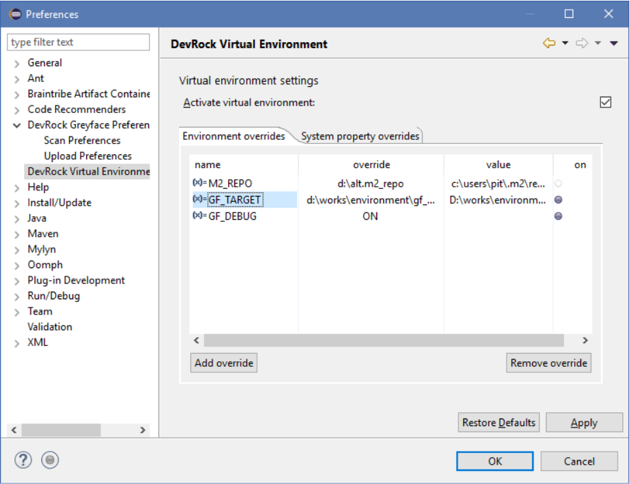
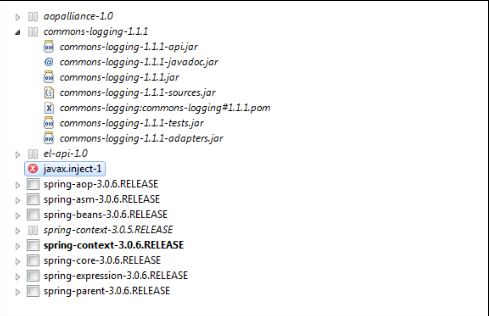
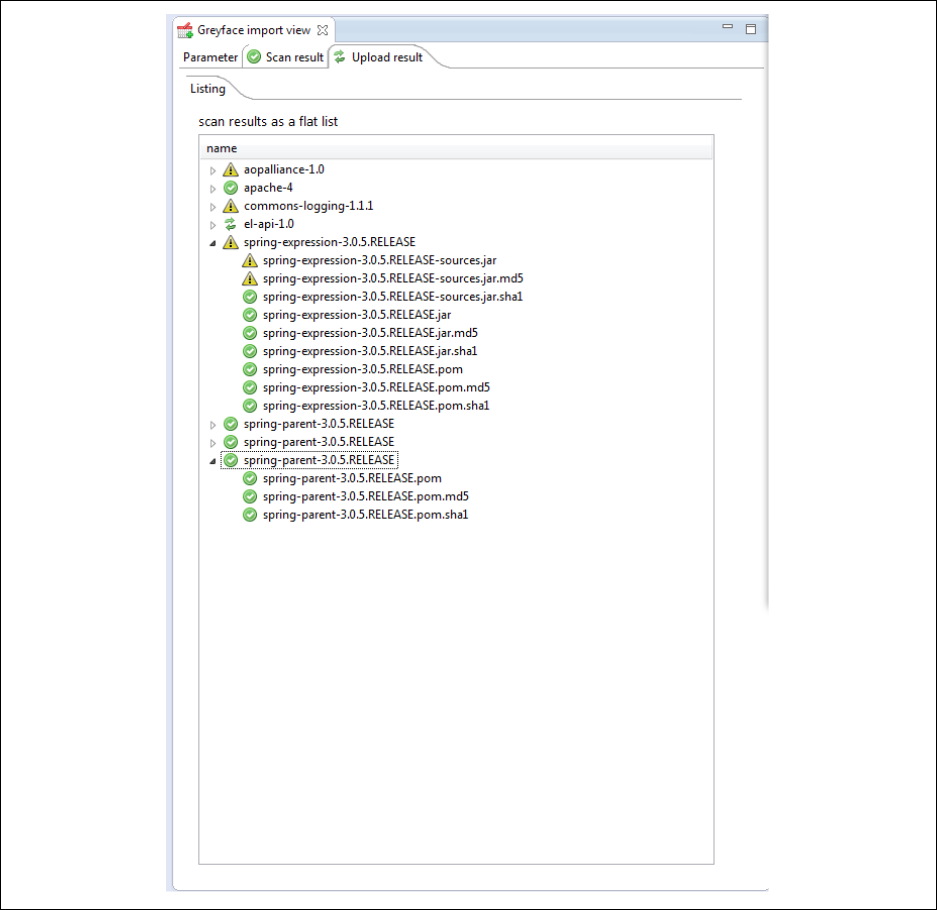

# Greyface

Greyface (GF) is a plugin which helps you organize dependencies by importing artifacts from several Maven repositories in a controlled manner.

## General

The plugin can be installed using the DevRock's update site via the **Install New Software** option in Eclipse (`http://devrock.braintribe.com` is the site you must add). Once installed it can then be configured using the newly created section in Eclipse's preferences.

The Greyface plugin offers the following features:

* you can both stop the scan and the upload process whenever you feel like it.
* It uses a mix-in pattern, i.e. you can add a local directory that you can use as a source for the scan/upload process.
* you can upload single files, i.e. only a javadoc or sources-jar
* you can specify the starting point of the scan in a much more convenient way
* the configuration ties in into your Maven settings.

GF has dependencies on other DevRock plugins:

* [Virtual Environment](virtual_environment.md)
* [Artifact Container](artifact_container.md)

## Settings - Main Tab

You can access GF's settings by going to **Window -> Preferences -> Greyface** in Eclipse. In the main tab, you specify the temporary directory and the source repositories.

### Directory for Temporary Files

The temporary directory’s default is derived from your Java environment, i.e. from the system property `${java.io.tmpdir}`, but can be overridden here. You can either specify an environment variable or a system property (prefixed by `$` and enclosed in parentheses), or you can select or specify a specific directory.

Greyface uses the temporary directory to store the files it downloads (to be uploaded again). Even if it uses Java’s `deleteOnExit` feature while creating the files, there may be cases where certain files remain. The pattern of the files is `<orginal file name>.gf.<autogenerated suffix>.tmp` such as `avalon-framework-4.1.3.pom.gf.7761561919645861709.tmp`.

You can safely delete any of these files, once all scans/uploads are completed.

### Repositories

You can add or remove remote repositories to your liking. The information is stored within the workspace’s setting, as provided by Eclipse. Default repositories - values that are injected if you haven’t any workspace specific settings are

* Central maven: `http://repo1.maven.org/maven2`
* Sonatype google: `https://oss.sonatype.org/content/groups/google`
* Google code: `https://oss.sonatype.org/content/groups/googlecode`

Besides a name and a URL, you can add a username and password combination if your remote repository requires it.

> You do not specify the target repository, as this is read from Maven’s `settings.xml`. A more into detail description follows in the section about the target repositories, see below. 

The preferences you edit are workspace specific, they’ll get stored in the following directory: `<workspace location>/.metadata/.plugins/com.braintribe.devrock.Greyface` in a file named `com.braintribe.devrock.Greyface.prefs`.

## Scan Tab

You can set default parameters for the scan processes in this tab.

Option          | Description
--------------- | ------------
Skip artifacts marked as optional | This option will ignore any dependency marked as optional and neither scan nor select it for upload.
Skip artifacts with scope test | As Greyface is used to import existing third-party artifacts, it doesn’t make much sense to import artifacts that are only used to test the artifacts because we expect them to work at this point.
Do not scan artifacts that exist in target repository | During the scan, Greyface will check if an artifact (or a solution) already exists in the target. If this switch is true, GF will abort the scan on this artifact.
Overwrite existing artifact in target repository | If set to true, you can select a solution and Greyface will delete any existing parts on the target repository before uploading the new versions.
Use 'compile' magic scope on terminal artifact | The 'compile' magic scope consist of the combination of `compile` and `provided`. It’s the standard magic scope required to build the artifact in question. Most of the times, this is not in your interest.
Validate POM during scan | Whenever an artifact is found, its POM is immediately validated against Maven’s XSD for POMs. Unfortunately, not everybody making POMs know how an XML must look like to be validated by an XSD. If such an artifact is encountered, it fails the validation.

## Upload Tab

You can set default parameters for the upload processes in this tab.

Option          | Description
--------------- | ------------
Enforce presence of license information as upload prerequisite | We can only use artifacts with valid licenses. The POM should have a reference to a license. A single POM doesn't have to have it, but then it should come from the parent. GF can check the license and show it in the scan results.
Repair parts of existing artifact in target repository | Switching to repair allows you to select single parts, no matter if the part exists in the target repository. Only the selected parts will be uploaded, any other files will remain. Keep in mind that the hashes will also be created and uploaded.If an upload process fails, Greyface will automatically fall back into this mode (if not activated already), as a failure means the some parts of the selected solutions have been uploaded, and some not.
Purge repository entries from POMs | In some cases, a POM contains repository settings. This leads to Maven checking that declared repository when it parses the file. If you activate this batch manipulation, every POM is scanned during the upload process. If it finds a repository declaration (project/repositories/repository), it will automatically turn it into a comment section. The rest of the POM remains unchanged.

## Debugging Greyface

If something’s wrong with Greyface - besides the actual upload process of course - you can switch it into a simulation mode and debug or even load the project from svn, but keep in mind that you’ll need a absolutely plain vanilla Eclipse to be able to debug it. Make sure to add the following memory settings if you plan to debug Greyface: `-Xms256m -Xmx1024m`.

If the environment variable `GF_DEBUG` is set, the preferences change and these sub pages for scan and upload show. You can of course use the VE to set the variables, as shown here:



Keep in mind that you need to close and reopen the preferences dialog so that GF will regenerate its preferences pages.

### Debug Scan Settings

* activate asynchronous scan
The additional parameter **Active asynchronous scan** does exactly what it says it does. If set to true, it will use a multithreaded scan algorithm, that scans several artifacts and repositories in parallel. Setting it to false will use a synchronous scan.

### Debug Upload Settings

* Copy files instead of uploading 
If set to true, Greyface will only simulate the upload and just copy the files to the target (set below)

* Destination file system
If the above key is set to true, then the Greyface will use key’s value as the target directory of the upload (instead of the URL of the target repository) and copy the files into that structure, all while keeping the internal logic. 

* Simulate upload errors
If `fakeUpload` is active, Greyface can simulate errors. This is done via a random number generator call. Basically, around 5% of the upload will fail. This mechanism works no matter whether you actually debug Greyface or not. So you can use Greyface to fill a local repository starting from your terminal. This means that if you have a project that is not using a remote repository, but a master file system, you can use Greyface to import into that file system.

## Using Greyface

You can start Greyface using the icon on the toolbar, from Artifact Container’s **Dependency** view, or by simply activating the view.

We recommend to dock the view to the right, as it has a more vertical alignment.

Once you have it activated, you see that it split into three main parts

* Parameter - the tab where you configure and launch the scan
* Scan result - the tab where you see the result of the scan and select what you want to upload, and where you launch the upload
* Upload result: the tab where you see the result of the upload

> Greyface’s view has a menu that supplies common features to some of the tabs. Not all tabs implement all of the features, so depending on the selected tab, some of menu entries may be unavailable.

### Parameter Tab

The parameter tab has four sections:
* where you specify the dependency, i.e. the starting point of the scan
* where you list the sources, i.e. the remote repositories you want to scan. The list of the remote repository comes from the preferences, but you can rearrange and deactivate the entries.
* where you select the target, i.e. the repository you want to upload to
* where you set the different options for the scan

#### Artifact Expression

Artifact expression is kind of a 'smart' text area. There are several ways to declare the dependency (or rather dependencies) to be used as starting points:

* a condensed name or a newline-delimited list of condensed names `<group id>:<artifact id>#<version>` 
* a maven notation  or newline-delimited list of maven notations `<group id>:<artifact id>:<packaging>:<version>`
* a full pom
* an XML snippet that contains `groupId`, `artifactId`, `version`
* a dependencies section from a POM (cut from a POM, with a container element)
* an XML snippet that lists dependencies (cut out from a POM, without a container element)

Examples: 
* condensed name or maven notation
```
org.springframework:spring-context#3.0.5.RELEASE
```
* condensed names or maven notations
```
org.springframework:spring-context#3.0.5.RELEASE
org.apache:activemq:jar:3.1.4
```
* XML snippet with groupId, artifactId, version without container

```xml
<modelVersion>4.0.0</modelVersion>
<groupId>org.springframework</groupId>
<artifactId>spring-context</artifactId>
<packaging>jar</packaging>
<version>3.0.5.RELEASE</version>
```

* XML snippet with dependencies with container

```xml
<dependencies>
    <dependency>
        <groupId>backport-util-concurrent</groupId>
        <artifactId>backport-util-concurrent</artifactId>
        <version>3.0</version>
        <optional>true</optional>
    </dependency>
    <dependency>
        <groupId>javax.annotation</groupId>
        <artifactId>jsr250-api</artifactId>
        <version>1.0</version>
        <optional>true</optional>
    </dependency>
</dependencies>
```

* XML snippet with dependencies without container

```xml
<dependency>
    <groupId>javax.ejb</groupId>
    <artifactId>ejb-api</artifactId>
    <version>3.0</version>
    <optional>true</optional>
</dependency>
<dependency>
    <groupId>javax.inject</groupId>
    <artifactId>javax.inject</artifactId>
    <version>1</version>
    <optional>true</optional>
</dependency>
```

If you supply a POM, only the project’s declaration are read and any dependencies are ignored as the project is going to be a starting point and its dependencies will be analyzed anyhow.

If you have not a valid XML snippet (as in the two examples without a container element) Greyface will try to encase the snippet in a created dummy container element and try to load it again. Obviously, if the XML is still not valid, the Greyface will fail and no information will be extracted. 

If anything can be extracted, Greyface shows the extraction right above the **Start Scan** button.

> Note that you are specifying a version range, even if in case of the project’s data a version is declared. For more information about version ranges, see [Version Management](asset://tribefire.cortex.documentation:concepts-doc/features/version_management.md).


#### Sources Selection

Greyface will interpret the list of sources as a fall-back chain. The top source will always be asked first, and only if nothing is found in that source, the next in line is used.

So if deactivating is therefore not of that most importance anymore, ordering is.

> You can use a simple drag’n’drop to move a source within the sequence.

There are also two more options you can select:

Option | Description
------ | -----------
import from file system | A special case is the use of a local directory. If you use that option, a synthetic source is generated and insert on top of the list of sources. Once you activate it, you can scan for a file. The file is only used to denote the directory, and if possible, a starting point is extracted from it. While you can select any file from the directory, it is recommended to either select a POM (with the best results), a `.jar` (standard or sources) or JavaDoc. 
import from a local maven compatible file system repository | This is a variant of the local file system repository, but you do not specify a single directory via a file, but actually a file system that is organized like a Maven compatible repository, just like Maven creates on your local file system (if you use it). If you activate it, Greyface will try to find out where your local Maven repository lies. It will first check if it is specified in your `settings.xml`. If there’s none specified, it accesses `M2_REPO`. You can always override it by specifying a directory of your choice. This synthetic source is injected above all others, i.e. it will be scanned before any other source. So any part (the files) of a solution that exists in this source, i.e. the directory, is used.

#### Target Selection

The last step is to specify the target repository. Greyface extracts that from your Maven’s settings file. Where it resides, depends on your setup. For information on how to set up Maven for Tribefire development, see [Quick Installation](asset://tribefire.cortex.documentation:development-environment-doc/quick_installation_devops.md#apache-maven).

Greyface uses Malaclypse's support for Maven settings, and relies on it extracting the repositories declared in the file. If finds the repository in the following way:
* scans for both `settings.xml` and merges them.
* scans then for active profiles in the merged result
* searches for the mirror and server settings that match the url of the repository declaration in the active profiles.

If it finds more than one repository, it will list them, but you can have only one target repository. A double click activates a target and deactivates the others.

#### Settings

For the description of the scan and upload settings, see the [Scan Tab](#scan-tab) section of this document.


#### Running the Scan

If your scan button isn’t enabled, check the following:

* a valid artifact expression is entered, and confirmed by Greyface
* at least one source is active (or none, yet the local filesystem imports on)

When the scan is started, you’ll notice the following:

* as soon as anything is found, the selection tab shows it
* the **Start Scan** button is disabled, and the **Abort Scan** button is enabled
* in the progress view or in status line of Eclipse, the process is shown.

You can abort the scan at any time by pressing the **Abort Scan** button, pressing the red rectangle right the to process’s listing in the progress view or by double-clicking on the process icon in the Eclipse status line, and then aborting the process in the process view as explained above.

### Scan Results Tab

As soon as the scanner finds a solution, it will appear in both child tabs of the selection tab.

While the scan is running, the scan result tab shows it with a respective icon.

At this point, you can already select artifacts, even start the upload on these, but some parts and/or solutions may still be missing.

Once the scan is completed, the icon changes, and you see the full set of results.

The selection tab itself is divided into two tabs that display the scan result in optimized ways.

The child tabs are as follows:

* listing: all solutions are shown in an alphabetically sorted flat list, with their parts as child items arranged below.
* structure: a hierarchically ordered view of your entry points, i.e. the starting point of your scan appears top-level, and the solutions of its dependencies as child items arranged below, and recursively so on.
* licenses: all licenses that the scanned artifacts come with. It may be that while scan results are coming in GF cannot determine the license, so it will - temporarily - show **no license**. If a parent comes in which declares the license, the tree is updated. 

> It is your responsibility to make sure that the artifact doesn't violate the license. Note that a license may state that an artifact is free for commercial use but may not be distributed via a repository. For more information about this, see [Apache documentation on licenses](https://maven.apache.org/pom.html#Licenses).

All tabs use the same style to mark the different states of the result, even if they do not show strictly the same information.

Depending on whether you can select an artifact or a part for uploading, the tree items have different images attached. If the selection image appears, you can select the item. If no selection image is shown, yet you think that you should be able to select it, check the display for hints why Greyface doesn’t let you, and don’t forget to look at the selection settings on the parameter tab. You can change these options any time you like. 



* Entry points
Entry points, i.e. the dependency you entered as starting points in a scan, are marked in bold. See both spring context artifacts in the example above. If they exist in the target repository, there are marked bold italic, see `spring-context-3.0.5.RELEASE`

* Existing artifacts
If an artifact already exists in the target artifact, it is marked in italic - see `spring-context-3.0.5.RELEASE` in the example above.

* Unresolved artifacts
Unresolved artifacts, i.e. artifacts that could not be found in any sources, are marked with an error symbol, see the `javax.inject-1` artifact above.

* End point
End points, i.e. artifacts where the scan stopped are marked with a special image, see `spring-context-3.0.5.RELEASE`, `aopalliance-1.0`, `el-api-1.0`, `commons-logging-1.1.1`.

* Parts
Parts are only shown in the flat tab. If they are of a well-known type, i.e. POM, .jar, javadoc etc, they will have an associated icon attached. Again, if they exist in the target repository, the name is displayed with an italic font.

#### Tooltips

Depending on what type the tree item represents, the tooltip shows different information. In case of a solution, you’ll see the full name and the repository it comes from. In case of a part, you’ll see the file name that represents the part. POM files always have a local representation, as they were downloaded during the scan.

#### Selection Process

The selection process depends on your **Parameter** tab settings. The default settings will not allow you to overwrite a solution that exists already in the target repository. Accordingly, no part can be selected, that is only solutions can be selected. 

If you activate overwrite mode, you can select a solution and Greyface will delete any existing parts on the target repository before uploading the new versions.

Switching to repair allows you to select single parts, no matter if the part exists in the target repository. Only the selected parts will be uploaded, any other files will remain. Keep in mind that the hashes will also be created and uploaded. 
If an upload process fails, Greyface will automatically fall back into this mode (if not activated already), as a failure means the some parts of the selected solutions have been uploaded, and some not.

You can instantly see whether you can select an item or not. If you can select it, a check-box appears, showing whether it is selected or it isn’t. If you cannot see a checkbox, the item is either not selectable (exists in target, yet overwrite isn’t active) or is selected by inference (a solution’s parent, unless repair mode is active).

There are several ways to select an item:

* double click on a selectable item 
The item is selected (and unfortunately, the item expanded/collapsed as a side effect)

* highlight one or multiple items, and click **Select**
All highlighted items are selected.

* highlight one or multiple items, and click **Select Related**
All highlighted items and their logical children are selected (starting with the selected item, its dependencies are recursively selected).

* use the global **Select** / **Deselect** action you find on the View menu's top right

You can change the selection (upload) parameters any time you like. The selection view will react instantly and show the selection possibilities you have with the changed settings.

#### Manipulations Section

In the scan result tab, there’s a section where you can activate some manipulations that should be performed on the artifacts during the upload process. Currently, there’s only one manipulation you can select: **purge repository entries from POMs**.

In some cases, a POM contains repository settings. This leads to Maven checking that declared repository when it parses the POM file. There are multiple reasons not to allow this:

* you want to control what artifact is downloaded as it is a part of our distribution and you are therefore liable for the contents
* it may happen that such a repository is not responsive and will block builds

If you activate this batch manipulation, every POM is scanned during the upload process. If it finds a repository declaration (project/repositories/repository), it will automatically turn it into a comment section. The rest of the POM remains unchanged.


### Upload Tab

If any solutions (or parts if repair mode is active) are active then you can start the upload process.

> If the upload button remains disabled, make sure that you have selected some solutions or parts. You can only start the upload if they are selected.


#### Starting Upload

To start the upload process, click the **Upload** button. When the upload is started, you’ll notice the following:

* as soon as something is uploaded (either with success or not), the upload tab shows it
* the **Start upload** button is disabled, and the **Abort upload** button is enabled
* in the progress view or in Eclipse status line, the upload process is shown

#### Aborting Upload

You can abort the scan at any time by:

* clicking the **Abort Scan** button
* clicking the red rectangle right the to process’s listing in the progress view 
* double-clicking on the process icon in the Eclipse status line, and then aborting the process in the process view as explained above.

#### Upload Result

There are two tabs in the **Upload** tab:

* result of current upload, which only shows the result of the upload you last initiated. Each time you start an upload, it will be refreshed.
* overall upload results, which shows the accumulated results of the uploads you initiated since the last scan. That means it will be refreshed when you initiate a new scan, but will collect all uploads of any uploads you initiated since the last scan.When you start your first upload, it obviously shows the same content as the tab above.

During the upload process, you get instant feedback of the solutions and their parts that are being uploaded. You also see the status of the upload on the solution level.

* green arrows: the solution’s parts are currently uploaded. 
* a green check mark: the solution has been successfully upload, i.e. all parts (and their hashes) have been successfully uploaded
* an exclamation mark: during the upload of the solution, an error has occurred, i.e. one of the relevant files of the parts was not uploaded.



If any of the uploads failed on part level, the exclamation sign marks the solution with the problem. Expanding the view will show the part whose upload failed.

#### Retrying an Upload

The upload of certain artifacts may fail due to a number of reasons. Should this happen, you wait until the upload process is done and go back to the **Selection** tab.

Greyface will have switched to repair mode and mark the missing parts as selected. So when you start the upload sequence again, it will only upload the parts that were not uploaded in the previous run.