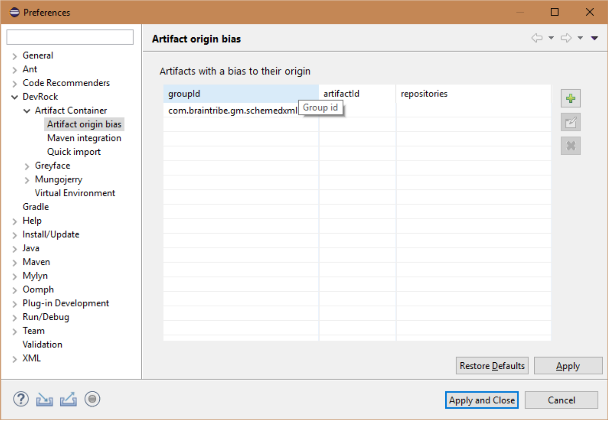
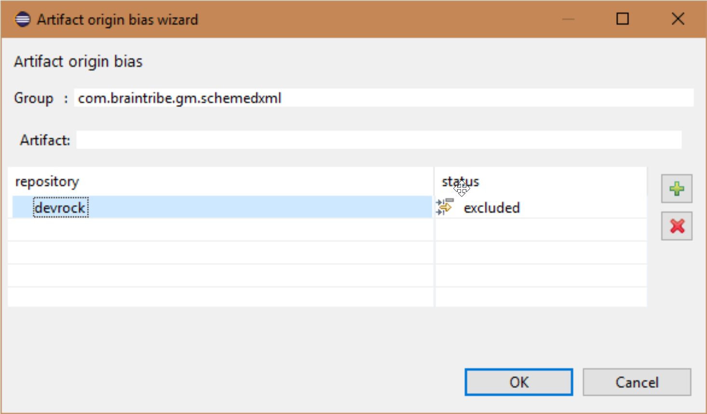

# Handling Artifacts with .pc_bias

Let's consider a situation where you work on your feature branch and have a set of artifacts in your workspace and you need to import a new one. It may happen that upon the import of a new artifact, all the artifacts you were working on have their dependencies updated to the latest versions of the artifacts they depend on. Your workspace produces errors because the changes you made to the artifacts are no longer considered.

This happens because the CI published a new version of the artifact you work working on and all your dependencies were updated to the latest version, not the version you were working on.

To avoid this situation, you can configure your system such that it favors certain artifacts over others. You do that using a `.pc_bias` file.

## Handling Artifacts using Eclipse

You do not necessarily have to create the `.pc_bias` file by yourself. If you are using an Eclipse-based setup with Artifact Container (AC), you can use AC's user interface to specify how you want your artifact dependencies to be handled.

Artifact Container has a UI feature to access and edit the file. You can find the respective preferences page in your Eclipse under **Window** -> **Preferences** -> **DevRock** -> **Artifact Container** -> **Artifact origin bias**.



For example, if you decide to add the origin bias as seen in the screenshot below:



the following is written into the `.pc_bias` file:

```xml
com.braintribe.gm.schemedxml;!devrock
```

## .pc_bias

The `.pc_bias` file contains a list of:

* group IDs
* artifact IDs

You must place the `.pc_bias` file in your local repository folder.

> For information on how to set up your local repository, see [Quick Installation](asset://tribefire.cortex.documentation:development-environment-doc/quick_installation_devops.md#apache-maven).
  
The group and artifacts IDs are used to identify the local artifacts that should have precedence of their counterparts in the remote repository. Whenever a dependency needs to be resolved, the dependency's group ID and artifact ID is matched against the entries in the `.pc_bias` file. If there is a match, dependency choices are restricted to the artifacts listed as locally installed.

The format of the list is as follows:

```xml
<groupId> [:<artifactId>] [; [!] <repositoryId>[,[!]<repositoryId>]]
```

`groupId` and `artifactId` may be regular expressions, `artifactId` may be omitted.

`repositoryId` must match the repository ID from `settings.xml`. You must not use a regular expression here. If an inclusion is provided, the ID has to exactly match the `settings.xml` entry.

A repository ID starting with `!` is considered to be an exclusion. If only exclusions are provided, any not excluded repository ID is accepted. If no repository IDs are provided, the bias is implicitly only for local, but you can add local as a standard `repositoryId`.

### Examples of .pc_bias Entries

.pc_bias Entry | Description
-------------- | -----------
`com.braintribe.devrock:malaclypse` | The `malaclypse` artifact of the `com.braintribe.devrock` group residing in a local repository has precedence over the same artifact residing in a remote repository.
`com.braintribe.devrock:malaclypse.*` | All artifacts of the `com.braintribe.devrock` group whose names start with `malaclypse` (for example: `malaclypse-test`, `malaclypse-configuration-model`) residing in a local repository have precedence over the same artifacts residing in a remote repository.
`com.braintribe.gm.schemedxml` | All artifacts of the `com.braintribe.gm.schemedxml` group residing in a local repository have precedence over the same artifacts residing in a remote repository.
`com.braintribe.gm.schemedxml:.*` | Same as above.
`com.braintribe.devrock:malaclypse;distribution` | Only the `malaclypse` artifact of the `com.braintribe.devrock` group are only retrieved from the repository with the ID of `distribution` (specified in `settings.xml`). Other repositories are ignored. When you add a single positive bias, you **must** also list all other repositories you still want to use.
`com.braintribe.devrock:malaclypse;!distribution` | The `malaclypse` artifact of the `com.braintribe.devrock` group is never retrieved from the repository with the ID of `distribution` (specified in `settings.xml`) as the repository is ignored.
