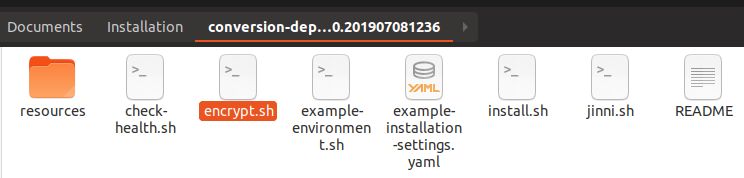

# Local Installation

If you don't want to use Docker or Kubernetes, you can install Tribefire (or applications built on it, such as ADx) using a provided `.zip` archive which contains all required tools and resources necessary for a local installation. This document will guide you through it. Read about the [Prerequisites](#prerequisites) first, then proceed to [Installation Procedure](#installation-procedure). You can also find important information regarding the package contents here.

## Prerequisites

* Linux server environment with a user having the `write` access.
* In order to avoid low server entropy, we recommend to install [Haveged](https://wiki.archlinux.org/index.php/Haveged) before proceeding.
* [Curl](https://curl.haxx.se/) must be installed - it's required by the health check script. This package has been tested with versions 7.58.0 and newer.
* Java version 8 (recommended). Java up to version 10 is allowed. Our packages have been tested with Openjdk, but Oracle JDK and other compatible JVMs are known to work as well.
* Environment variable `JAVA_HOME` must be set and `[JAVA_HOME]/bin` must be on the `PATH`. Alternatively, one can provide an [environment script](#environment-variable-script) to set these variables, see below.
* A running database - you will need the URL (host name and port) and user credentials. Database setup must be provided by your organization.
* A valid license file. If you don't have a license yet, please request it from your contact person at Braintribe.
* Deployment package downloaded to your machine. If you don't have the download URL or access, please request it from your contact person at Braintribe.

## Deployment Package Contents
Your package should have the following contents:


File / Folder | Description
------------- | -----------
`resources`   | Folder containing tools and resources required for local deployment. Do **not** modify this folder!
`check-health.sh` | Script that runs a health check against the specified URL. This can be used as an after-setup test to verify that deployed services are available and work properly.
`encrypt.sh` |  Script that encrypts the passed value. This is used to avoid clear text passwords in configuration files. See [Password Encryption](#password-encryption) for more information.
`example-environment.sh` | If this is the first deployment, you may want to create an [environment script](#environment-variable-script) which sets the environment variables. This is useful in environments where multiple Java installations are available and `JAVA_HOME` doesn't point to the one that's supposed to be used for the installation. The easiest way to create the environment script is to copy this file to a location of your choice. Afterwards, simply open the file in a text editor and set respective values.
`example-installation-settings.yaml` | Example configuration file which you can use as a template. See [Installation Settings](#installation-settings) for more information.
`install.sh` | Script that performs a local installation, i.e. Tomcat setup and asset deployment. Run `install.sh` to display usage information.
`jinni.sh` | Script that runs Jinni with the specified request. Jinni is the Tribefire setup tool. It is used for various setup related tasks such as asset downloading, Tomcat setup, Docker image building, Kubernetes manifest creation or password encryption. It therefore supports a lot of different commands for different use cases.  For further information about Jinni run `jinni.sh` to display usage information or `jinni.sh help` to list the available commands. </br> This deployment package has been built specifically for local installation. It's usually not required to run jinni.sh directly. Instead one can just use the provided convenience scripts (see above). These scripts also use Jinni, but require less parameters, and are thus easier to use. We provide example commands to help with the installation in the [Local Installation Procedure](#local-installation-procedure) section of this document.
`README`      | Readme file with basic information, linking to the documentation.

## Environment Variable Script
If you decided to run a script to set your environment variables, the easiest way to create the environment script is to copy the file `example-environment.sh` included in this package to a location of your choice. Afterwards, simply open the file in a text editor and set respective values:

```bash
#!/bin/bash

# This is an example environment script which can be used as a template to easily create your own file.

# exit when any command fails
set -e

# set Java installation path
export JAVA_HOME=/path/to/jdk
# add Java's bin folder to the PATH variable 
export PATH=${JAVA_HOME}/bin:${PATH}
```

When you have set the values, save your new script. It's now ready to be referenced by the encryption, installation, and health check scripts by adding the `--environment /path/to/environment.sh` part to the command as in:

Installation reference:

```
./install.sh --target-directory /path/to/installation --settings /path/to/installation-settings.yaml --environment /path/to/environment.sh
```

Encryption reference:

```
./encrypt.sh --value 'my-password' --environment /path/to/environment.sh
```

Health check reference:
```
./check-health.sh --url https://localhost:8443 --environment /path/to/environment.sh
```


## Installation Procedure

Follow this procedure to install Tribefire from a package. Make sure to meet the [prerequisites](local_installation.md#prerequisites) first.

1. Unzip your package to a directory of your choice.

    When done, your package is unzipped to a sub-folder (for example `tribefire-deployment-package`). Open the package folder and check its contents:

    

2. Open the terminal from the above location and run the following commands:

    ```
    mkdir ../additional-libraries
    ```

    ```
    mkdir ../license
    ```

    ```
    cp example-environment.sh ../environment.sh
    ```

    ```
    cp example-installation-settings.yaml ../installation-settings.yaml
    ```

    As a result, you have now created the **license** and **additional-libraries** folders next to the package folder and copied the template files with the installation settings and the environment script.

    > Note that you will only ever need the environment script if Java directory is not yet added to the PATH on your machine. If that's the case, [click here for more information](local_installation.md#environment-variable-script).

2. Put the license file provided to you in the **license** folder. If the file is provided as a `.zip` archive (or similar), unzip it into this folder. Example: `license/example-license.sigxml.glf`.
3. Add the database driver to the **additional-libraries** folder, as explained below.

    1. First, you need to download the correct driver. Knowing the database type used by Tribefire in your organization, download one of the below drivers:

        Database | Driver download page
        --- | ---
        PostgreSQL | [Download](https://jdbc.postgresql.org/download.html). Important: PostgreSQL has been tested with driver version **42.2.6**. Please use this version or newer.
        Oracle | [Download](https://www.oracle.com/technetwork/database/application-development/jdbc/downloads/index.html)
        MSSQL | [Download](https://docs.microsoft.com/en-us/sql/connect/jdbc/download-microsoft-jdbc-driver-for-sql-server). Important: MSSQL has been tested with driver version [**7.2.2**](https://www.microsoft.com/en-us/download/details.aspx?id=57782) and is reported to work with versions **6.3.2** and newer. Do not use older drivers.
        DB2 | [Download](https://www-01.ibm.com/support/docview.wss?uid=swg21363866)

    2. Now, add your driver to the **additional-libraries** folder, created previously - simply copy and paste the driver file into this folder.

3. Now, some configuration will be necessary. Open the `installation-settings.yaml` file in a text editor of your choice and edit the sections mentioned below (and only these sections).

### Installation Path
> When installing, you will need write access to create the below-mentioned path.

You can either use the default path or set the `installationPath:` property to the installation directory of your choice. If you do, remember to provide an absolute path in the configuration file. As a result, Tribefire will be installed in the provided directory. All relative paths used in the configuration file are resolved from the installation directory.

The result should present itself as below:

```yaml
# The directory where the application will be installed. Note that files from previous installations may be overridden.
# Note that there are other (relative) paths specified in this file, which will be resolved relative to this installation path.
# For example, if path is "/opt/braintribe/tribefire", the (default) log files directory is "/opt/braintribe/logs".
installationPath: "/opt/braintribe/tribefire"
```
<!-- restart PR-->

### Ports
The ports determine the URL under which Tribefire will be available when installed (as explained by the comments). For example http://hostname:`8080` or https://hostname:`8443`. 

Initially, this section looks as follows:

```yaml
# ** Ports **
# The following settings are used to configure ports where server listens for requests.
# If multiple nodes are installed on the same machine, ports have to be adapted for node.
# It usually makes sense to just change the first digit to use another port range.
# Example: node A uses 8xxx (i.e. 8080,8443,8009,8005), node B uses 9xxx (9080,9443,9009,9005), node C uses 10xxx (10080,10443,10009,10005).

# The HTTP port where the server listens for requests. If set to e.g. 8080, HTTP (base) url will be http://[host]:8080/.
httpPort: 8080
# The HTTPS port where the server listens for requests. If set to e.g. 8443, HTTPS (base) url will be https://[host]:8433/.
httpsPort: 8443
# The AJP connector port (see https://tomcat.apache.org/tomcat-9.0-doc/config/ajp.html)
ajpPort: 8009
# The Tomcat server port (e.g. for shutdown commands)
serverPort: 8005
```

In fact, if you don't want to change the ports, you don't have to. If you do, simply change the values of `httpPort:`, `httpsPort:`, `ajpPort:`, and `serverPort:` to the values you want.

That's it - let's move on to the next part.

### HTTPS/SSL 
HTTPS/SSL settings control how Tribefire should be accessed once installed. **If you don't need HTTPS access, you can skip this section entirely, and move on to [Resources](#resources)**. Otherwise, follow the below procedure.

Initially, this section looks as follows:

```yaml
# ** HTTPS/SSL **
# Whether or not to enforce HTTPS, i.e. redirect HTTP to HTTPS
#enforceHttps: false

# The path to the SSL keystore file, PKCS 12 format (see https://en.wikipedia.org/wiki/PKCS_12).
# If not set, the default keystore with a self-signed certificate will be used.
#sslKeystoreFile: !com.braintribe.model.resource.FileResource
#  path: "/path/to/keystore.p12"

# One can use openssl to generate a (self signed) keystore file:
#   openssl req -x509 -sha256 -nodes -days 365 -newkey rsa:2048 -keyout privateKey.key -out certificate.crt
#   openssl pkcs12 -keypbe PBE-SHA1-3DES -certpbe PBE-SHA1-3DES -export -in certificate.crt -inkey privateKey.key -out keystore.pkcs12 -name "tribefire"
# For more information see https://www.openssl.org/.

# The password for the keystore file (see above). Replace "[ENCRYPTED_PASSWORD]" with the encrypted password, e.g. "${decrypt('HMuN/VXo5+L0vVQzuJe7bAOiBmeKzWluP+POb7zjkcLCnzgawUfWmZAIu9eIOfVAzEQn6Q==')}".
#sslKeystorePassword: "${decrypt('[ENCRYPTED_PASSWORD]')}"

# If the keystore file was generated without a password, set the password to empty string.
#sslKeystorePassword: ""
```

1. Set `enforceHttps:` to `true`:

    ```yaml
    # Whether or not to enforce HTTPS, i.e. redirect HTTP to HTTPS
    enforceHttps: true
    ```

2. Now, you can either skip the path section entirely to use the default keystore, or generate your own self-signed keystore file. This tutorial shows the second option. If you don't want to do it, move on to [Resources](#resources).

    1. Remove the `#` comment marks in front of `sslKeystoreFile:` and `path:`. You should get the following result:

        ```yaml
        # If not set, the default keystore with a self-signed certificate will be used.
        sslKeystoreFile: !com.braintribe.model.resource.FileResource
          path: "/path/to/keystore.p12"
        ```

    2. Now we need to generate the keystore. First, let's create a folder where it will be stored. In this tutorial, it's the **SSL** folder under **Home/Documents**.

        

    3. Open the newly created folder and run the terminal from it.
    4. Execute `$ openssl req -x509 -sha256 -nodes -days 365 -newkey rsa:2048 -keyout privateKey.key -out certificate.crt`. You will be prompted for some data - this is expected. This command generates the private key and certificate:

        

        We will need those files to create the keystore.

    5. Execute `openssl pkcs12 -keypbe PBE-SHA1-3DES -certpbe PBE-SHA1-3DES -export -in certificate.crt -inkey privateKey.key -out keystore.pkcs12 -name "tribefire"`. This generates the `keystore.pkcs12` file. You will be prompted for password in the process - remember it, you will need it later!

        

    6. Now that you have the keystore, you can add its path to the configuration file:

        ```yaml
        # If not set, the default keystore with a self-signed certificate will be used.
        sslKeystoreFile: !com.braintribe.model.resource.FileResource
          path: "/home/user/Documents/SSL/keystore.p12"
        ```

    7. Finally, we need to encrypt the keystore password in order to provide it in the configuration file. Let's go back to the installation directory, where you will find the `encrypt.sh` script.

        

    8. Open the terminal and run `./encrypt.sh --value mypassword`. You should get the encrypted password as a response:

        ```
        VTGEjDxNV17nHqxj/aXrLwAKmksFgUWIht5JZdPIZb5r3yeODUE0v+hz72y4TDD7eZfP9Q==
        ```

        Copy this response and paste it into the `sslKeystorePassword` property, in place of `[ENCRYPTED_PASSWORD]`:

        ```yaml
        sslKeystorePassword: "${decrypt('VTGEjDxNV17nHqxj/aXrLwAKmksFgUWIht5JZdPIZb5r3yeODUE0v+hz72y4TDD7eZfP9Q==')}"
        ```

That's it - you have now configured HTTPS access for Tribefire. When installed with those setting, it should always redirect to HTTPS, using the keystore you generated.


### Resources
Unless instructed otherwise, you can simply use the default JVM values as shown below:

```yaml
# ** Resources **
# The initial heap size of the Java Virtual Machine
initialHeapSize: 512m
# The maximum heap size of the Java Virtual Machine
maxHeapSize: 4096m
# The maximum number of connections (or -1 for no limit)
maxConnections: -1
# The maximum number of request worker threads.
maxThreads: 150
```

That's it! You can move on to the next section.

### Logging 
In this section, you need to provide the directory for the log files. The easiest course of action is to use the default settings:

```yaml
# ** Logging **
# The path of the directory where log files will be written to. You can simply use the provided default location, which is resolved relative to the 'installationPath:' property. '&logFilesDir' specifies an anchor, which makes it possible to reference the value below, see setting 'checkWriteAccessForDirs'.
logFilesDir: &logFilesDir "../logs"
```

If you do, this section should look as follows:

```yaml
# ** Logging **
# The path of the directory where log files will be written to. You can simply use the provided default location, which is resolved relative to the 'installationPath:' property. '&logFilesDir' specifies an anchor, which makes it possible to reference the value below, see setting 'checkWriteAccessForDirs'.
logFilesDir: &logFilesDir "../logs"

# Log level for console output. Examples: SEVERE,WARNING,INFO,FINE,FINEST
consoleLogLevel: "INFO"

# Log level for file output. Examples: SEVERE,WARNING,INFO,FINE,FINEST
logFilesLogLevel: "FINE"

# Enables log rotation based on file size (in bytes). If the specified maximum is exceeded, the current log file will be archived and a new one will be created.
logFilesMaxSize: 15000000

# Enables log rotation based on a Cron expression. For more info see https://en.wikipedia.org/wiki/Cron.
# Rotate every midnight
logFilesCronRotate: "0 0 * * *"

# Maximum number of archived log files (see also log rotation settings above). If the maximum is exceeded, the oldest archived log files gets deleted.
logFilesMaxCount: 10
```

That's it! You can move on to the next section.

### Temporary files
Similarly as with the logs, you can simply use the default location for temporary files:

```yaml
# ** Temporary Files **
# The path of the directory where temporary files will be written to. You can simply use the provided default location, which is resolved relative to the 'installationPath:' property. '&tempDir' specifies an anchor, which makes it possible to reference the value below, see setting 'checkWriteAccessForDirs'.
tempDir: &tempDir "../temp"
```

That's it! You can move on to the next section.

### Admin User
In this section, you need to enter the credentials of the admin user.

1. As with the keystore, you need to encrypt the admin password. To do so, open the unzipped package, then open the terminal and run `./encrypt.sh --value mypassword`. You should get the encrypted password as a response:

    ```
    VTGEjDxNV17nHqxj/aXrLwAKmksFgUWIht5JZdPIZb5r3yeODUE0v+hz72y4TDD7eZfP9Q==
    ```

    Copy this response (the one you get, not the one above) and paste it into the `password:` property. The file should then look as follows:

    ```yaml
    # ** Admin User **
    # Configures the credentials for the default admin user.
    # If the user doesn't exist yet, it will be created and the password will be set as specified here.
    # If the user already exists, nothing will be done, i.e. its password will NOT be changed!
    predefinedComponents:
    ADMIN_USER: !com.braintribe.model.user.User
        # Admin user name
        name: "admin"
        # Admin user password. Replace "[ENCRYPTED_PASSWORD]" with the encrypted password, e.g. "${decrypt('HMuN/VXo5+L0vVQzuJe7bAOiBmeKzWluP+POb7zjkcLCnzgawUfWmZAIu9eIOfVAzEQn6Q==')}".
        password: "${decrypt('VTGEjDxNV17nHqxj/aXrLwAKmksFgUWIht5JZdPIZb5r3yeODUE0v+hz72y4TDD7eZfP9Q==')}"
    ```

That's it! You can move on to the next section.

<!--## ActiveMQ Settings
If you're installing Tribefire as part of a cluster, ActiveMQ connection has to be configured as explained in the file: 

```yaml
# ** ActiveMQ settings **
# Configures the AMQ connection. Note that this is only needed, if this node is part of a cluster.
# (In that case also runtime property TRIBEFIRE_IS_CLUSTERED has to be enabled, see below.)
# The host address is specified via tcp url, i.e. "tcp://amq-host:61616".
# If there are multiple AMQ nodes behind a load balancer, just specify the load balancer host/port, i.e. "tcp://amq-lb-host:61616".
# If there are multiple AMQ nodes, but no load balancer, one can specify multiple hosts using "failover", for example:
#   "failover:(tcp://amq-host1:61616,tcp://amq-host2:61616,tcp://amq-host3:61616)"
# For further information see https://activemq.apache.org/failover-transport-reference.html.

# If this node is part of a cluster, remove the "#" prefix in the next 3 lines and set the AMQ host address as explained above.
#  MQ: !com.braintribe.model.messaging.jms.JmsActiveMqConnection
#    name: "ActiveMQ Connection"
#    hostAddress: "tcp://[AMQ_HOST]:[AMQ_PORT]"
```

Note that using a load balancer is much more convenient, as you don't need to change the failover list when new ActiveMQ nodes are added, pointing to the load balancer IP instead. However, keep in mind that ActiveMQ needs a layer 4 load balancer, because it communicates with Tribefire nodes via the TCP protocol.-->

### System Database
In this section, you need to put the information describing your system database (user name, encrypted password, database driver, database URL) into the properties found under `connectionDescriptor:`. Other properties (apart from the name) **must be left with the default values**. Let's focus on the section in question:

```yaml
# Connection settings ( '&systemDatabaseConnection' specifies an anchor, which makes it possible to re-use the connection settings below)
    connectionDescriptor: &systemDatabaseConnection !com.braintribe.model.deployment.database.connector.GenericDatabaseConnectionDescriptor
      # JDBC Driver
      #   Postgres: "org.postgresql.Driver"
      #   Oracle: "oracle.jdbc.OracleDriver"
      #   MSSQL: "com.microsoft.sqlserver.jdbc.SQLServerDriver"
      driver: "[JDBC_DRIVER]"
      # JDBC URL
      #   Postgres: "jdbc:postgresql://localhost:5432/system-db"
      #   Oracle: " jdbc:oracle:thin:@localhost:1521:orcl12c"
      #   MSSQL: "jdbc:sqlserver://localhost:5433;databaseName=system-db;"
      url: "[JDBC_URL]"
      # Database user name
      user: "[DATABASE_USER]"
      # Database user password. Replace "[ENCRYPTED_PASSWORD]" with the encrypted password, e.g. "${decrypt('HMuN/VXo5+L0vVQzuJe7bAOiBmeKzWluP+POb7zjkcLCnzgawUfWmZAIu9eIOfVAzEQn6Q==')}".
      password: "${decrypt('[ENCRYPTED_PASSWORD]')}"
```

#### `driver:`
`driver:` will be different depending on the database type. Copy the driver property from the table below:

Database | `driver:` value
--- | ---
PostgreSQL | "org.postgresql.Driver" (default)
Oracle | "oracle.jdbc.OracleDriver"
Oracle 8i | "oracle.jdbc.driver.OracleDriver"
MSSQL | "com.microsoft.sqlserver.jdbc.SQLServerDriver"
MSSQL JTDS | "net.sourceforge.jtds.jdbc.Driver"
MYSQL | "com.mysql.jdbc.Driver"
DB2 | "com.ibm.db2.jdbc.net.DB2Driver"

#### `url:`
`url:` will be different depending on the database type. Use the syntax as explained in the table below:

Database | url: syntax | Example
---|---|---
PostgreSQL | "jdbc:postgresql://hostname:port/databaseName".  Replace `hostname` with the actual name (for example `localhost`) port with the database port (for example `5432`), and `databaseName` with the name of the database (for example `system-db`), then copy-paste into the `url:` property. | "jdbc:postgresql://localhost:5432/system-db"
Oracle with service name | "jdbc:oracle:thin@hostname:port/serviceName". Replace `hostname` with the actual name (for example `localhost`) port with the database port (for example `5432`), and `serviceName` with  the database service name TNS alias (for example `system-db`), then copy-paste into the `url:` property. | "jdbc:oracle:thin@localhost:5432/system-db"
Oracle with SID | "jdbc:oracle:thin@hostname:port:SID". Replace `hostname` with the actual name (for example `localhost`) port with the database port (for example `5432`), and `SID` with the database ID (for example `system-db`), then copy-paste into the `url:` property. | "jdbc:oracle:thin@localhost:5432:system-db"
MSSQL | "jdbc:sqlserver://hostname:port;databaseName". Replace `hostname` with the actual name (for example `localhost`) port with the database port (for example `5432`), and `databaseName` with the name of the database (for example `system-db`), then copy-paste into the `url:` property. | "jdbc:sqlserver://localhost:5432;system-db"
MYSQL | "jdbc:mysql://host:port/databaseName" Replace `hostname` with the actual name (for example `localhost`) port with the database port (for example `5432`), and `databaseName` with the name of the database (for example `system-db`), then copy-paste into the `url:` property. | "jdbc:mysql://localhost:5432/system-db"
DB2 | "jdbc:db2://hostname:port/databaseName". Replace `hostname` with the actual name (for example `localhost`) port with the database port (for example `5432`), and `databaseName` with the name of the database (for example system-db), then copy-paste into the `url:` property. | "jdbc:db2://localhost:5432/system-db"

#### `user:`
Simply enter the user name with access to the database.

#### `password`
As with all passwords, you need to encrypt the database user password. To do so, open the unzipped package, then open the terminal and run `./encrypt.sh --value mypassword`. You should get the encrypted password as a response:

    ```
    VTGEjDxNV17nHqxj/aXrLwAKmksFgUWIht5JZdPIZb5r3yeODUE0v+hz72y4TDD7eZfP9Q==
    ```

Copy this response and paste it into the `password:` property.

That's it! You can now proceed to the next section of the configuration file.

### Connection Pools
As stated by the configuration file comments, you don't need to change these properties unless instructed otherwise.

### Project Settings
Project descriptor available in this section defines the name and the displayed name of the tomcat service. You don't need to change these settings unless instructed otherwise.

```yaml
# ** Project Settings **
# Configures the project / product name. Usually these settings don't have to be changed. They names are e.g. used for Tomcat service name, see below.
projectDescriptor:
  name: "tribefire"
  displayName: "Tribefire"
```

### Tomcat Settings
Tomcat service descriptor available in this section defines the name of the service user when you run the application as a Tomcat service. You don't need to change these settings unless instructed otherwise.

```yaml
# ** Tomcat Service **
# One can use script /tribefire/runtime/host/bin/tribefire-service.sh to run the application as a Tomcat service.
tomcatServiceDescriptor:
  # Specifies the name of the service user
  user: "service-user"
```

### Runtime Properties

#### Platform Settings
Tribefire platform is configured with runtime properties. Some of them must be configured in this file:

```yaml
  ##############################################################################
  # Platform settings
  ##############################################################################
  # This enables support for encrypted passwords in this configuration file (don't change!)
  TRIBEFIRE_SECURED_ENVIRONMENT: "true"

  # Specifies how long a user session should remain active when there is no activity on the session.
  # After the specified inactive time has passed (i.e. no request with the corresponding session ID has been received by the server),
  # the session is flagged as inactive and consequently removed by a periodic cleanup process.
  # The time span can be specified as a human-readable string, using numbers and the time unit, as in 12h, 30m, 3600s, etc.
  TRIBEFIRE_USER_SESSIONS_MAX_IDLE_TIME: "30m"

  # When this is set to true, the login dialog will offer an option to stay signed-in after a browser restart.
  # If this is set to false, the user session will always be closed when the browser is closed.
  # This is achieved by using a session cookie that stores the user's session ID until the browser is closed.
  TRIBEFIRE_RUNTIME_OFFER_STAYSIGNED: "true"

  # The public tribefire services URL, i.e. the URL through which clients and other services can reach this service.
  # This is e.g. needed for callbacks, for example when service A invokes an (asynchronous) job on B and passes a callback URL,
  # through which B can notify A when the job is done.
  #
  # In many cases this settings can just be set to "https://(hostname of this machine):(https port configured above)/tribefire-services".
  # A typical use case where the URL is different, is a clustered service, i.e. multiple nodes behind a load balancer.
  # In that case the load balancer URL has to be specified here.
  #
  # Make sure that this public URL is reachable from other machines, e.g. verify that configured ports are opened in the firewall.
  TRIBEFIRE_PUBLIC_SERVICES_URL: "https://[PUBLIC_HOST]:[PUBLIC_PORT]/tribefire-services"

  # Indicates whether or not this node is part of a cluster.
  # (Note that a cluster may also just have a single node, thus this setting can always be enabled.)
  TRIBEFIRE_IS_CLUSTERED: "true"
```

`TRIBEFIRE_PUBLIC_SERVICES_URL` provides the URL on which this service can be reached. When using multiple Tribefire servers, provide the load balancer URL.

    > Important: `TRIBEFIRE_PUBLIC_SERVICES_URL` must be reachable from the outside. Make sure it is not blocked by a firewall. 

`TRIBEFIRE_IS_CLUSTERED` must be set to `true` if this node is going to be part of a cluster (but it can also be enabled for a single node, as explained).

## Running the Installation Script
Congratulations, now you're done configuring the file. Remember to save it (you can change the name and location, but you don't have to), then proceed to installation.

1. Go to the directory where you unzipped the package.
2. Open the terminal and run `./install.sh`. This command doesn't even require changing, provided you prepared the `installation-setting.yaml` and `environment.sh` as described. Otherwise, you need to adapt the paths and/or names accordingly (for example `/install.sh --settings /path/to/installation-settings.yaml --environment /path/to/environment.sh`.

    >If the installation failed, quote the full version of the package (including the `-p` suffix if it's in your package name) to the support team.

3. Tribefire should now be installed in the directory specified in the configuration file. To start it, enter `tribefire/runtime/host/bin` in the installation directory, then execute `./catalina.sh run`. Alternatively, you can [start the server as a Linux service](local_installation.md#starting-the-server-as-a-linux-service). 

    > Important - in a clustered environment, ActiveMQ must always be started first!

After start-up, Tribefire will be available in your browser under the host and port you configured (for example `http://localhost:8080`). Enjoy using Tribefire!

## Starting the Tomcat Server

Once the installation has finished, it is time to start the application. You can either start the server from command line, or as a Linux service.

### Starting the Server from the Command Line

1. Navigate to the target installation directory (`myDeployment` in this example) `/tribefire/runtime/host/bin` and run the `catalina.sh run` command.

Executing this script starts Tomcat and deploys the web applications. Tomcat prints a log message when the server startup completed:

```bash
Server startup in [53,178] milliseconds
```

### Starting the Server as a Linux Service
After installation, you can find a Linux script file in the `tribefire/host/bin/` folder: `tribefire-service.sh`. It can be used to install the Tomcat server as a linux service. At the moment we support the following **Init** systems: **sysvinit** and **Upstart**.

1. Run `tribefire-service.sh install`  as `root`.

    This will create a symbolic link to this script in `/etc/init.d` and register it as a service.

    To uninstall the service, run `tribefire-service.sh uninstall`.

2. Once it is installed, the service can be used to start and stop the server:

    * To start, run `/etc/init.d/tribefire start`
    * To stop, run `/etc/init.d/tribefire stop`

> Note that there are other ways to start Tomcat, e.g. also as a background service. For more information refer to [Tomcat documentation](https://tomcat.apache.org/tomcat-9.0-doc/RUNNING.txt).


## Testing the Deployment

You can run basic health checks on your deployment to make sure that all cartridges were deployed successfully.

To run the health check:

1. In the folder where you unzipped the deployment package, open the CLI and run the `./check-health.sh --url http://localhost:8080` command.

> Note that if you are using a different server, port or transfer protocol (`http`/`https`), you must change the command accordingly.
>Note that you can reference the environment variable script while running health check by adding `--environment /path/to/environment.sh` to the command.

There are two possible outcomes:

* `Successfully completed health check. Deployed services are available.`
* `Health check failed! For more information see health-check-result.json and/or run health check directly via http://localhost:8080/tribefire-services/healthz?scope=full.`

### Logging
After installing Tribefire, you can access all logs in the `logs` folder, which by default is in the same folder where you unzipped your package. Note that you can change the log location. To do so, add the path to the `logFilesDir:` property in the logging section of the configuration file, as in  `logFilesDir: "../logs"`.