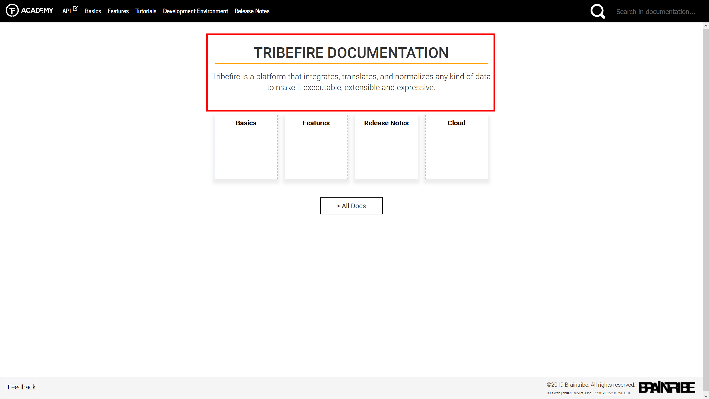
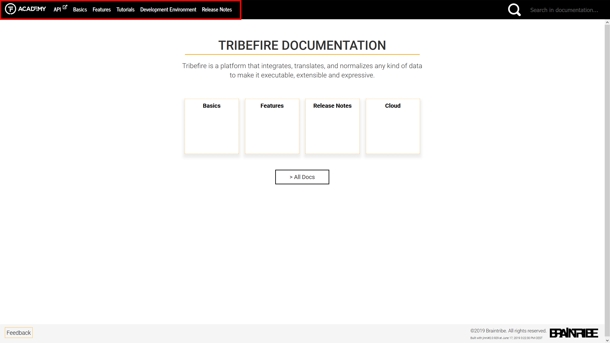
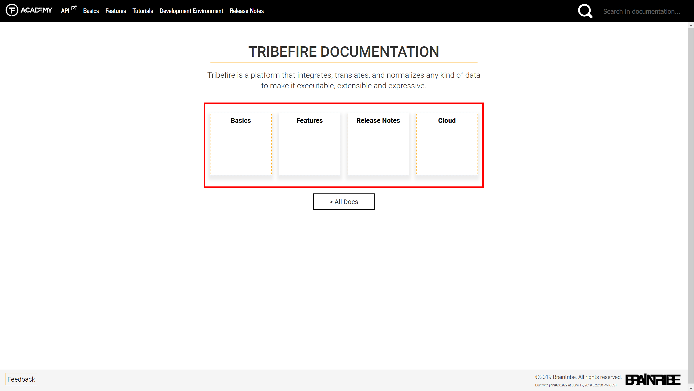
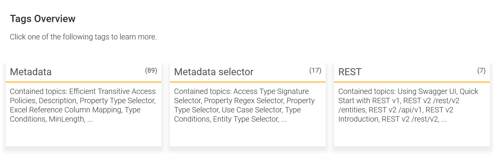
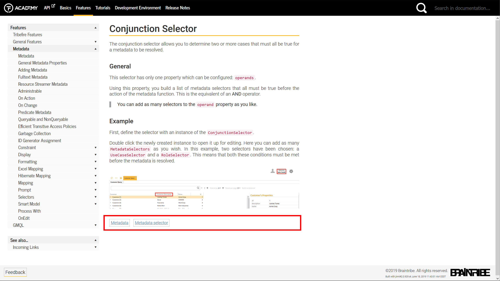
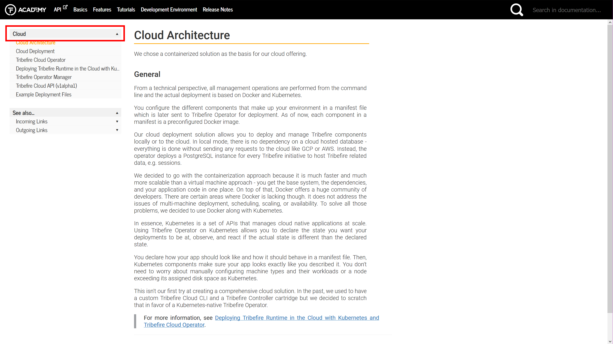
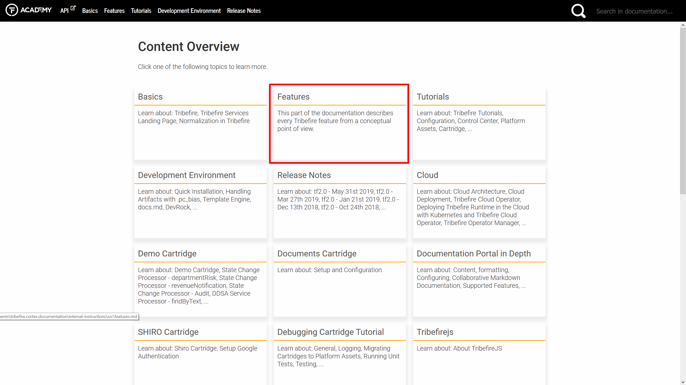
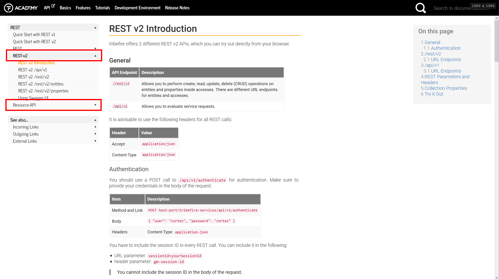
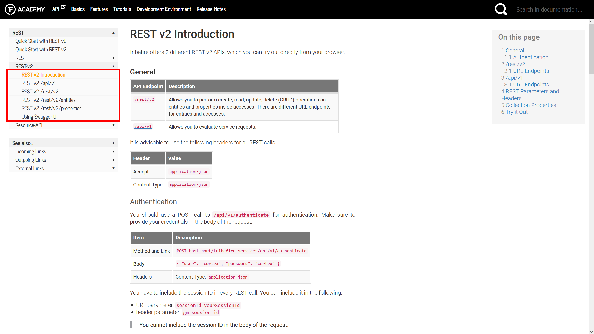

# Configuring $mdoc$

There is a number of elements in the tool that influence the look-and-feel and the overall experience of the generated documentation website. Each of those elements has an out-of-the-box value which means that if you don't configure the elements, the defaults are used. 

Normally, the configuration that spans across several assets or the whole website is provided by the means of a configuration asset. Asset-specific configuration is always stored within an asset.

> For more information about different asset types see [XXXXXXXXXX](#configurable-elements).

Depending on the element you want to configure, you will change a different file.

Website Element | Where to Configure
--------------- | ---------------
main landing page text | configuration asset`/resources/conf/greeting.md`
top navigation | configuration asset`/resources/mdoc-doc-metadata.yml`
entry points | configuration asset`/resources/mdoc-doc-metadata.yml`
featured assets | configuration asset`/resources/mdoc-doc-metadata.yml`
available tags | configuration asset`/resources/mdoc-doc-metadata.yml`
asset display title | asset`/mdoc-asset-metadata.yml`
asset description | asset`/mdoc-asset-metadata.yml`
folder display title | asset`/folder/mdoc-folder-metadata.yml`
side navigation menu order | asset`/folder/mdoc-folder-metadata.yml`

## Configurable Elements

You can configure the behavior of the following elements:

* [main landing page text](#main-landing-page-text)




* [top navigation](#top-navigation)



* [entry points](#entry-points)

<!--  -->

* [featured assets](#featured-assets)



* [available tags](#available-tags)





* [asset display title](#asset-display-title)



* [asset description](#asset-description)



* [folder display title](#folder-display-title)



* [side navigation menu order](#side-navigation-menu-order)




## Main Landing Page Text

The main landing page text is the first thing the visitor of your portal sees and is configured in the `greeting.md` file in the configuration asset. 

The configuration asset`/resources/conf/greeting.md` file is a simple Markdown document and supports all Markdown features. The snippet below is the source of what is visible in the screenshot.

```
# TRIBEFIRE DOCUMENTATION

Tribefire is a platform that integrates, translates, and normalizes any kind of data to make it executable, extensible and expressive.
```

## Top Navigation

The top navigation is a list of assets that are always displayed at the top of a given page. Because those assets are always visible, you might want to take extra care when deciding which assets to include in the top navigation.

The assets visible in top navigation are configured in the `/resources/mdoc-doc-metadata.yml` file of the configuration asset. You provide the assets as items in the `assets` array inside the file. Each item must conform to the following syntax: `groupId:assetId`, for example: `com.company.documentation:tutorials-documentation`. Moreover, each item must be enclosed within double-quotes (`""`). The snippet below is the source of what is visible in the screenshot:


```yml
---
!com.braintribe.doc.meta.CustomDocMetaData

assets:
  "tribefire.cortex.documentation:tribefire-home-doc":
  "tribefire.cortex.documentation:concepts-doc":
  "tribefire.cortex.documentation:tutorials-doc":
  "tribefire.cortex.documentation:development-environment-doc":
  "tribefire.cortex.documentation:release-notes-doc":

```

## Entry Points

TBD

## Featured Assets

TBD

## Available Tags

$mdoc$ supports adding tags to assets and individual pages. Tags are available in the following places:

* The **All Docs** page shows all tags used in the documentation portal. 
* Individual pages display their tags at the bottom.
* When you select a tag, a search query `Docs tagged "tag"` returns all pages where the tag is used. Note that other tags used by the page are also displayed in the description for your convenience.

Essentially, there are two steps to configuring a tag:

1. Adding the tag to the configuration asset so that it is available for all other assets to use
2. Adding the tag to the actual page/folder in an asset

Before you can use a tag on a given page, you must add it to the `/resources/mdoc-doc-metadata.yml` file of the configuration asset. Each tag has the following properties:

Property | Description
-------- | ------------
`tagId`  | Mandatory property used to refer to this tag from documents and folders from other assets.
`displayTitle` | Optional property used to change the title of the tag. By default, the display title is exactly the same as the `tagId`, but there are cases where you want the two to be different. 
`description` | Optional property used to provide a description of a given tag. The description is displayed on the **All Tags** page.

The snippet below is the `/resources/mdoc-doc-metadata.yml` file of what is visible in the screenshot:

```yml
tags:
  - tagId: rest
    displayTitle: REST
  - tagId: metadata
    displayTitle: Metadata
  - tagId: selector
    displayTitle: Metadata selector
  - tagId: template
    displayTitle: Template
    description: Templates are used to create template-based actions, such as customized queries and service requests.
```

> You may notice that the `template` tag is not visible in the screenshot. This is because there are no documents/folders tagged with this tag. 

Once you have introduced your tag to the configuration asset, you can simply add tags to folders and pages in the `mdoc-folder-metadata.yml` file of an asset:

```yml

  quick_start_rest.md: 
    tags: 
      - rest

  REST-v2:
    tags:
      - rest
```

As a result , `rest` tag is added to the `quick_start_rest.md` file, and to all files in `REST-v2` folder.

## Asset Display Title

The title of an asset is used to identify the contents of the asset and is used in the side navigation, top navigation and on the **All Assets** page.

You can configure the display title of an asset in the `src/mdoc-asset-metadata.yml` file. The snippet below is what is visible in the screenshot:

```yml

!com.braintribe.doc.meta.CustomAssetMetaData
displayTitle: "Cloud"

```

## Asset Description

The asset description is used to provide a short description of what is inside a given asset. The description is visible on the **All Assets** page.

You can configure the description of an asset in the `src/mdoc-asset-metadata.yml` file. The snippet below is what is visible in the screenshot:

```yml

---
!com.braintribe.doc.meta.CustomAssetMetaData
displayTitle: "Features"
shortDescription: "This part of the documentation describes every Tribefire feature from a conceptual point of view."

```

If you do not provide a description, the first five documents in the asset are listed.

## Folder Display Title

## Side Navigation Menu Order