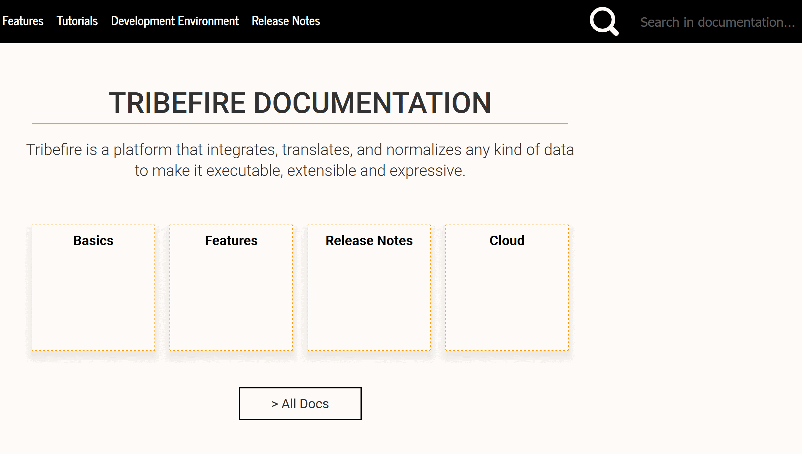

# Supported Features

If you're wondering whether our tool is the right choice for your documentation needs, you're in the right place - this list provides an overview of the available features.

## Modularity

$mdoc$ allows you to create documentation sets consisting of a number of smaller, self-contained documentation artifacts. By fragmenting your monolithic documentation into smaller pieces, you can work on, version, and release them independently.

Furthermore, $mdoc$ allows you to package and version not only the documentation artifacts, but also complete documentation maps, as well as the configuration of your documentation website.

## Versioning

Versioning is closely connected to the modularity of our solution. As every asset is a Maven artifact, you can version your pieces of documentation, website configurations, and documentation maps in a standard, Maven-compatible way. Treating your documentation as Maven artifacts in terms of versioning brings you one step closer to fully adopting the _docs as code_ philosophy.

## Fulltext Search

Sometimes even the most well-designed structure is not enough to quickly find the information your reader wants. In this case, search comes to the rescue. The website you can build with $mdoc$ comes equipped with a `Lunr.js` fulltext search and term highlighting.

## Offline Viewing

The documentation website you build with $mdoc$ is completely static - this means that it does not have to be served to be viewed. You can build and view the website locally or you can push it onto a server after it's built.

## Responsive Design

The website is designed to be used on different types of screens. Be it a mobile phone or a computer screen, all the important elements of the website are right where you need them, tailored to your screen.

## Tags

You can create abstract groups of information with tags. This way you can group topics from different assets dynamically, without the need to create a separate documentation map.

## JavaDoc Links

$mdoc$ natively supports JavaDoc links from your Markdown documentation. All you need for the link to work is the fully qualified name of a class and a configured URL to a deployed set of prebuilt JavaDocs.

## Configurable Frontend

You can quickly configure the look-and-feel of the website. Styling can be easily influenced with CSS and the layout of the pages can be changed with Apache Freemarker.
