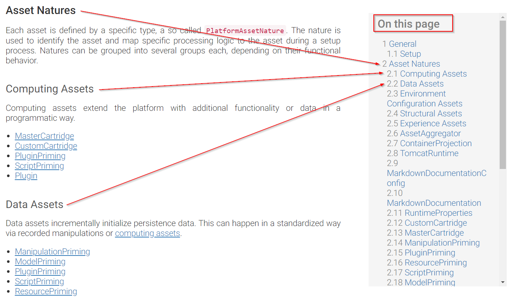

# Formatting

## Markdown Syntax
Documentation content is held in markdown files. We are using the flexmark compiler, which is based on the **CommonMark** specification. Additionally, we have added an extension to support adding tables. The following markodown items are thus supported:

* Lists (ordered and unordered)
* Tables
* Image linking
* Font emphasis
* Links

For detailed information on Markdown syntax, see [CommonMark Spec Documentation](https://spec.commonmark.org/0.28/).

On top of pure markdown, the tool introduces a few custom formatting features, described below.

## Linking
On top of standard markdown links, $mdoc$ introduces custom links to navigate between assets and to re-use content by importing existing markdown content into your file.

For instructions on linking, see [Links](links.md).

## Collapsing and Expanding Content
Collapsing and expanding is based on [includes](links.md#includes) extended with the `&collapsed` URL parameter. If you want to collapse a piece of content, you must create a separate markdown file out of it first. Then, follow the syntax below:

### Example - Collapsed Content

Consider the below statement:

```
[alias](file.md?INCLUDE&collapsed)
```

Using this statement in the markdown file results in the following on runtime:

1. The contents of `file.md` are imported into the target file, replacing the link in the output
2. Imported content is highlighted by a dedicated frame and collapsed by default.

Additionally, you can use the `level` parameter to influence (increase) the heading levels in the included piece of content. Consider the below statement:

```
[alias](file.md?INCLUDE&collapsed&level=2)
```

Using this statement will increase the levels of all included headings by 2 (so `# heading` becomes `### heading`).

## Code Blocks

You can include code blocks in your markdown files using the following syntax:

```markdown
The below example shows the syntax for a Java code snippet:

    ```java

    public class HelloWorld {

        public static void main(String[] args) {
            // Prints "Hello, World" to the terminal window.
            System.out.println("Hello, World");
        }

    }

    ```

To select the syntax within the snippet, simply denote the language name next to the snippet signature, for example **```c++**.

> Note that code blocks are collapsed by default from a certain length, depending on your device and web browser. 

```

$mdoc$ will automatically collapse long code snippets in HTML output.

## Table of Contents

Table of contents is generated automatically from headings, based on the heading level, and called **On this page**:



Note that `# Heading 1` is reserved for the title. Use `## Heading 2` and higher to format the content.

## Supported HTML Elements

The point of writing in markdown is to *avoid* dealing with HTML tags. However, if you do need to insert some of them, keep [these rules](https://daringfireball.net/projects/markdown/syntax#html) in mind.