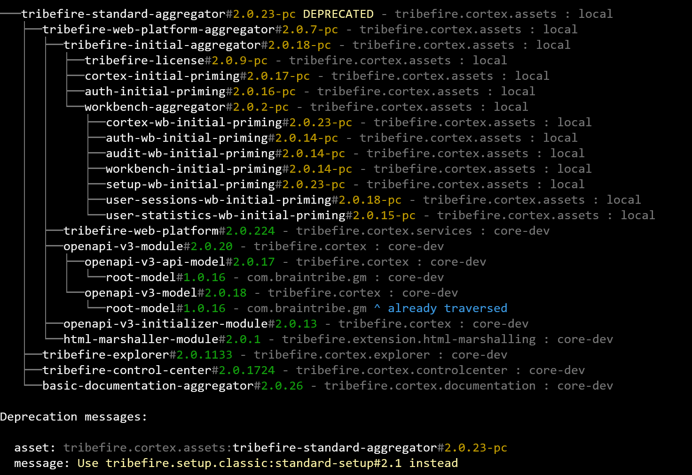

## Asset Deprecation

Assets can be deprecated by adding the `com.braintribe.model.meta.data.prompt.Deprecated` metadata on the asset nature in the `asset.man` file:

```
AssetAggregator = com.braintribe.model.asset.natures.AssetAggregator
Deprecated = com.braintribe.model.meta.data.prompt.Deprecated

$deprecated = Deprecated()
$deprecated.message = 'Use tribefire.setup.classic:standard-setup#2.1 instead'

$nature = AssetAggregator()
$nature.metaData + $deprecated
```

If the metadata is added and the asset is part of a setup, Jinni will print out emphasized `DEPRECATED` markers in the dependency tree. It will further list deprecation messages separately after the dependency tree, if a message was assigned to the `Deprecated` metadata. This feature is for information purposes only and has no further implications on the setup.

