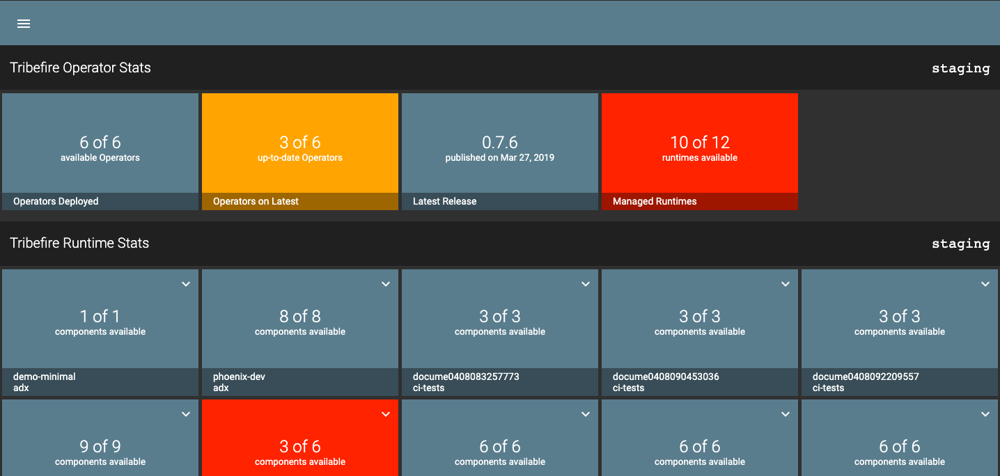
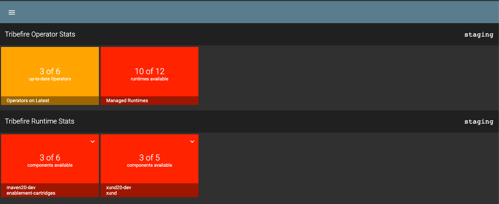
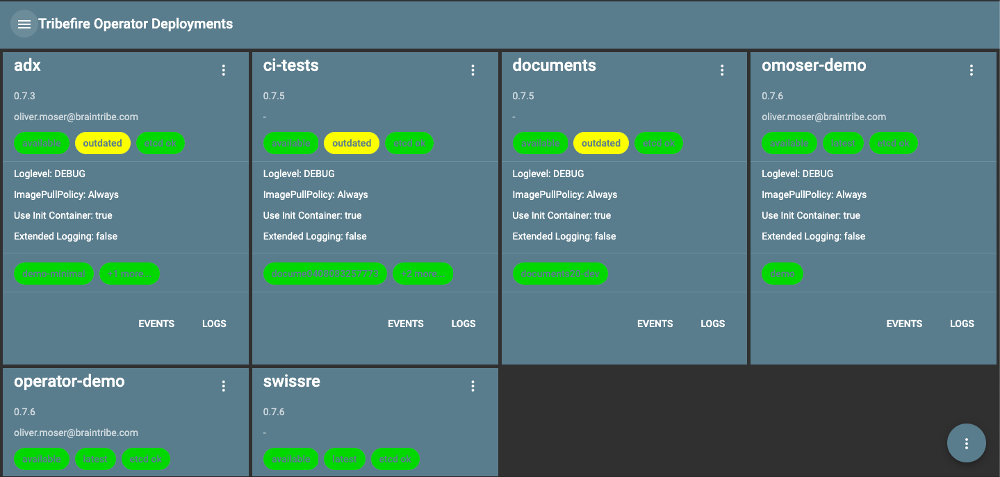
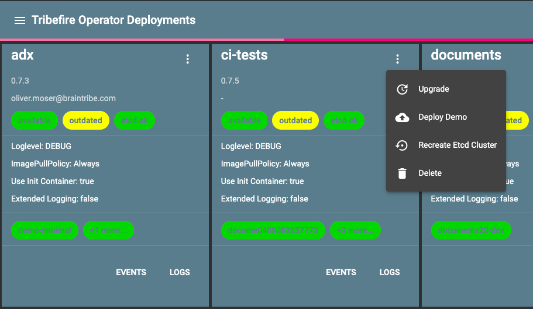
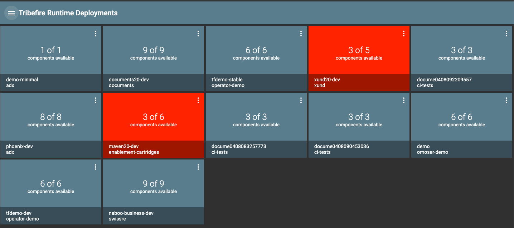
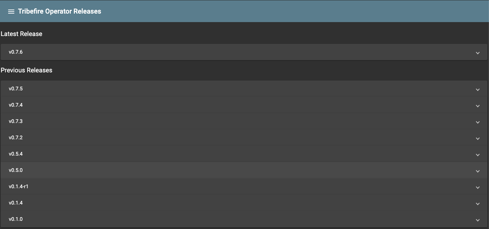
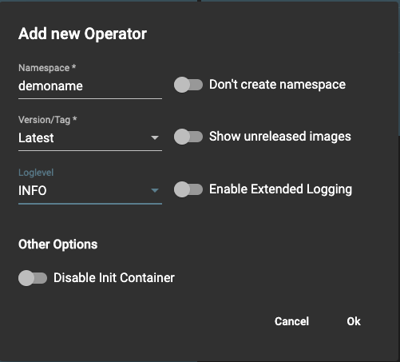

# Tribefire Operator Manager

To manage Tribefire operators in your cluster, you can use the Tribefire Operator Manager.

This simple tool enables you to:

* view Tribefire operators and Tribefire Runtimes in your cluster
* create new Tribefire operators
* monitor changes in your cluster in real time
 
To access the Operator Manager, go to [https://operator-manager.staging.tribefire.cloud/overview](https://operator-manager.staging.tribefire.cloud/overview)

To log in, you must have a Google account with the `braintribe.com` domain.

> Note that you can have only one Manager deployment in your Kubernetes cluster, but you can have one Tribefire operator per namespace.

## Available Views

Click the menu button on the top left corner and select one of the following views:

* [Overview](#overview)
* [Operators](#operators)
* [Runtimes](#runtimes)
* [Releases](#releases)

### Overview

In this view you can see a general overview of all operators in all namespaces and all Tribefire runtime instances.



Press `F` to switch to the focused mode. The focused mode shows operators and runtime instances that have problems. For example, runtimes that are unavailable, or operators that are not up to date.



### Operators

In this view you can see a more detailed overview of operators. Changes in your cluster are reflected automatically in this view and are color coded. Such changes can be the availability of the operator, the operator's status, running components, and the status of the `etcd` cluster.

Press `F` to switch to the focused mode that shows you only operators that have problems.



Click the options button to perform the following tasks:

* Upgrade the operator to the latest release.
* Deploy a Demo manifest of Tribefire runtime.
* Recreate the `etcd` cluster of the operator.
* Delete the operator.



### Runtimes

In this view you can see a more detailed overview of Tribefire runtime instances in your cluster. Click on a runtime instance to see all of its components.



Click the Options button in the top right corner to download the Runtime's manifest.

### Releases

In this view you can see a list of available releases.



## Adding a New Operator

> To add a new operator, you must have and `tf-admin` role.

To add a new operator, go the Operators view and do the following:

1. Click the plus icon.

2. Enter a ```Namespace``` to be created for the operator. 
	> If you do not want to create a new namespace, select the **Don't create namespace** option.
3. Select a version for the operator in the **Version/Tag** field.
	> This field shows only versions on Github by default. To show versions from Artifactory, select the **Show unreleased images**
4. Select the logging level in the **Loglevel** field. 
	> If you select the **Enable Extended Logging** option, source line numbers and other metadata such as the name of the TribefireRuntime and namespace are added to each log line.
5. Select the **Disable Init Container** if you don't want to run the Init container before running the Tribefire master container.
	> You might want to disabl the Init container only in cases where you have a pre-provisioned database.


