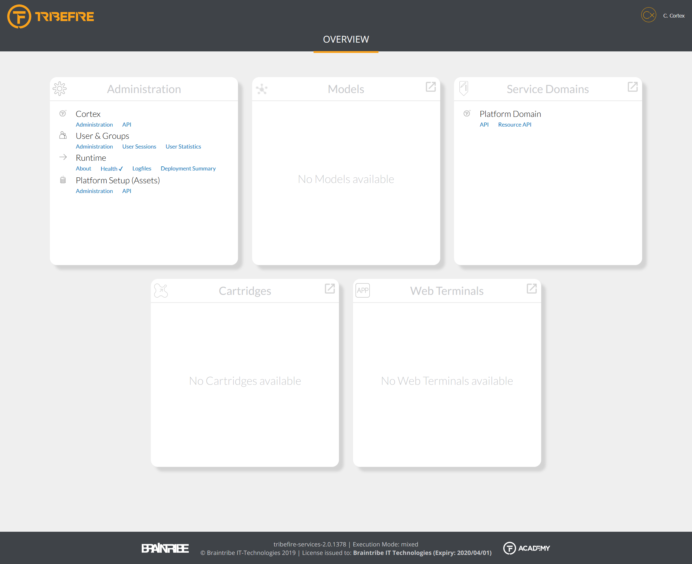

# Tribefire Services Landing Page

The first view you see when you log in to Tribefire is the landing page which provides you quick links to the most important UI-based Tribefire functionality, as well as an overview of the health of your cartridges.

The landing page is divided into several sections, some of which are always present:

* Administration
* Models
* Service Domains
* Cartridges
* Web Terminals

The sections are populated dynamically with the content they display, e.g the **Models** section will display all custom models present in your Tribefire instance, and the **ServiceDomains** section will display links to Swagger pages for every service domain (which might be a model deployed in an access).

> For more information about Swagger, see [Using Swagger UI](asset://tribefire.cortex.documentation:api-doc/REST-v2/using_swagger_ui.md).

Each section has a button  that opens the appropriate entry point in Control Center. Depending on the section where you click the button, a different entry point is opened.

> For more information about Explorer, see [Explorer](asset://tribefire.cortex.documentation:concepts-doc/features/ui-clients/explorer.md)

The landing page also displays the information about the currently logged-in user. By clicking the username, you can see how long has the current user been logged in. You can end the current session by clicking **Sign Out**.

## Instance Information

In the footer of the landing page, you can see the following information about your instance:

* revision of the `tribefire-services` master cartridge
* execution mode
* license information, including who the license was issued to and the expiry date

## Health Checks

The landing page displays the health status of the cartridges. Next to each cartridge you can see one of the following icons:

* **✔** indicates that all nodes in the cluster are healthy
* **✖** indicates that one (or all) nodes report issues

> For more information about monitoring, see [About](asset://tribefire.cortex.documentation:concepts-doc/features/monitoring/about.md), [Deployment Summary](asset://tribefire.cortex.documentation:concepts-doc/features/monitoring/deployment_summary.md), [Health Check](asset://tribefire.cortex.documentation:concepts-doc/features/monitoring/health_check.md), and [Logs](asset://tribefire.cortex.documentation:concepts-doc/features/monitoring/logs.md).