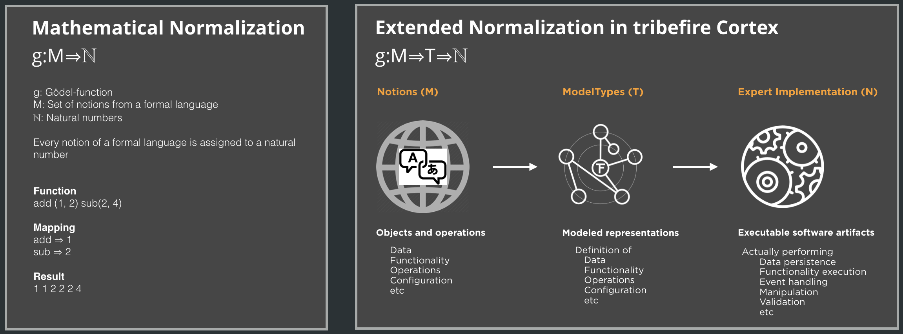
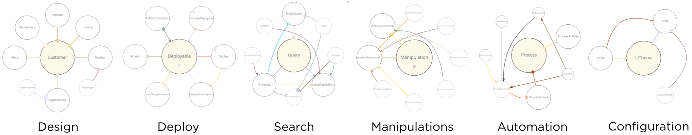

# Normalization in Tribefire

In Tribefire, GmCore is the programming paradigm which assures consistent normalization, leading to a generic way of dealing with concepts from all domains.

The reason why we came up with that paradigm is that usual high-level programming languages can't cope with the diversity of today's IT landscapes. We think that Java is a good basis, but if you have to deal with different abstraction layers, different technologies, different languages and different data, you need a more comprehensive way to approach those domains. Yes, there is the paradigm of genericity, but first of all it's hard to read such code and secondly, it's not consistent enough.

Problem of Conventional Languages | Solution Introduced by Tribefire
--------------------------------- | ---------
Non-normalized data objects. | Standardized and flexible type system based on interfaces.
Trade-off between generic vs. expressive: often this two requirements are exclusive and cannot be reconciled. This leads to trade-offs concerning type safety, efficiency, readability and flexible genericity |	Type-safe, efficient, yet still generic objects are generated from the descriptive models via code weaving into interfaces of the type system. Therefore an optimal combination of genericity and expressivity can be achieved.
Altogether missing or non-normalized support of generic and domain transcending algorithms.	| Extensive, normalized and efficient type reflection and consequently built-upon generic algorithms and API for traversing, cloning et al.
Missing normalization of model description and the models themselves. As a consequence multiple coding of essential rationales are required for both tiers.	| With Metamodel, MetadataModel and MetaData API there exists a normalization between model and model description.
Deficient support for unstructured/binary data.	| The ResourceModel and the resource API represent standardized links between unstructured and modeled data and allow, emanating from the structured instances, direct stream access to the associated unstructured data.
Proprietary and non-normalized persistence. |	Based on the QueryModels and the ManipulationModel, the access and session API create a normalized persistence interface, which allows to access modeled data independently from the actual storage technology.
Altogether missing, non-normalized, language dependent, or weak serialization of complex networks of instances with shared or even cyclic references. Model dependent serialization. | Fast, generic serialization of networks of any instances in binary, XML and JSON formats. Shared and cyclic references are expressively supported. The text formats (i.e. XML, JSON) can easily be interpreted and parsed or coded by other programming languages as they are with JAVA algorithms.
Passive and therefore static data objects. | Property Access Interceptors provide higher-level features such as manipulation tracking, lazy loading amongst others while still retaining easy access.

## The Normalization Principle

The Austrian mathematician Kurt Gödel introduced his normalization principle so he could treat operands and operators the same way by assigning natural numbers to each component of a mathematical expression. This was an important step for computer science, for example when dealing with Turing machines.

We extended this *gödelization* by mapping all kinds of concepts (data, functionality, operations, configuration, etc.) to model types and further mapping those model types to expert implementations. Through the compilation of those experts they become than natural numbers again. This way, a consistent normalization is assured, which leads to a generic way of dealing with concepts from all domains.

## Separation of Concerns

By keeping definition (model types) and executables (experts) separated, a solid separation of concerns is provided. Experts are interchangeable as the model types assure the contract - similar to the interface-principle in object-oriented programming, but brought to a generic level.

## Generic Models

The generic model types are exposed as their own API which allows you to deal with them in an expressive way.

> For more information, see 

A generic model defined via GmCore describes a concrete element (e.g. a service implementation), so this model is concrete by itself. The GmCore framework allows to access the properties of the modeled types by automatically provided methods. Having this principle, genericity and expressiveness is no contradiction anymore. This leads to sustainable code that allows to implement generic patterns that can be used by any model.

## Modeling Applications

Models provide a normalized way to describe all concerns of software development, they expose the generic entities in an expressive and type-safe way. The actual execution is done by exchangeable experts wired with the Model types. Once modeled, any entity can be processed out-of-the-box with the Cortex generic computing technology reaching from generic algorithms like traversing and cloning to a number of transport and persistence technologies.

This results in:

* Separation of concerns
* Highly generic while still expressive
* Reduction of repetitive tasks
* Software life-cycle-domain independence
* Gentle learning curve

Due to the entity type’s genericity it can be shared in distributed systems with no language fixation. Currently Java, JavaScript, Rest/JSON and XML are fully supported. Independent of software development, deployment or runtime, all domain specific entities are modeled and therefore handled the same way regarding design, instantiation, transport, searching, and manipulation.