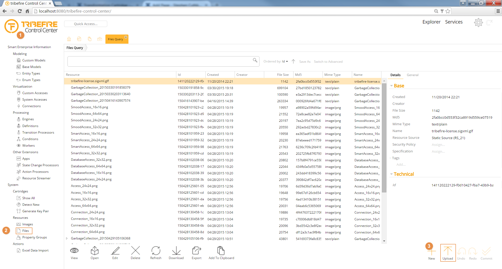
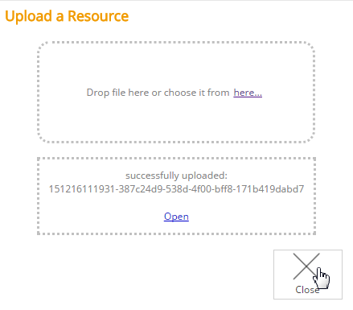
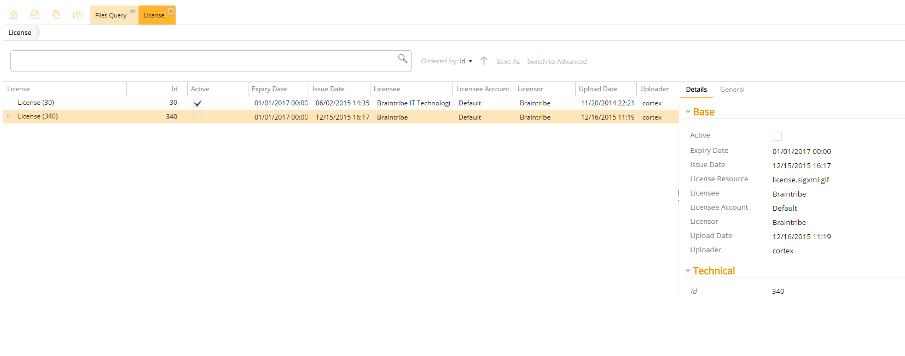

# Adding New Licenses

Tribefire is controlled by a license file, without which the creation of new accesses and other functionality is blocked.

## General
Licenses are time-based and it's natural that they expire. When your license is nearing its expiration date, make sure to contact your account manager to get a fresh license.

## Adding a New License
To add a new license:
1. First, you must upload your license file to Control Center: to do so, navigate to Control Center in your web browser, click **Files** and, at the **Properties Panel**, click **Upload**.
   
   The **Upload a Resource** panel is displayed.
2. Drag your license onto the area indicated, or use the **here...** option to browse for it. The panel will indicate that the file has been successfully uploaded. Afterwards, click **Close** to return to Control Center. 

3. You license file is now displayed among the other uploaded files.
4. Using the Quick Access Panel, search for the entity type License. Double-click the result displayed in the drop-down list. A query is executed and all instances of the type `License` are displayed.
5. Deselect the old license and select the new one by unchecking the **Active** property of the license that is no longer needed and checking the same property of your newly uploaded license. 
 
> In the screenshot there are two instances: the initial license and the newly uploaded one. When a new license file is uploaded, a new instance of this type is created.
6. Click **Commit** to save your changes what activates your new license.

## LDAP Authentication

If you use LDAP for authentication, authentication fails because the LDAP cartridge depends on a valid license. Since authentication fails, you are not able to login to Control Center to update the license. You need to do it manually, which requires access to the tribefire installation folder.

1. Get a valid license. If you just need a development license, you can find one on any recent tribefire deployment, under `storage > databases > cortex > resources > 1411 > 2022 > 21`.

2. Paste the new license under `storage > databases > cortex > resources > 1411 > 2022 > 21`.
> This folder should contain just one license file. The new license overwrites the previous one.
