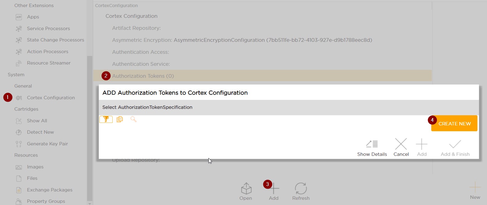

# Configuring JWT Authentication
Tribefire supports JWT authentication, which is configured via Cortex Configuration in **Control Center**, as explained on this page. You can either add a JWT key to read incoming tokens or configure Okta authorization service.

## Configuration

1. Log in to Tribefire and open **Control Center**.
2. Carry out the following procedure:

    

Now, you need to add a [JWT Key](#jwt-key) or configure [Okta Service](#okta-service)   

### JWT Key

1. Select **JwtAuthorizationKey** from the list.
2. Set the following properties:

    * **Key ID** - ID referenced in the incoming token header, in the `kid` property (`tokenid` in the example header below). This property is mandatory.

        ```json
        {
        "alg": "RS256",
        "typ": "JWT",
        "kid": "tokenid"
        }
        ```

    * **Roles claim** - incoming token claim that contains roles (note that roles are provided as a **list**). In the snippet below, `tf-admin` role is in the **roles** claim, which must be entered in Tribefire.

        ```json
        {
        "sub": "cortex",
        "roles": "[tf-admin]"
        }
        ```

    * **Users claim** - incoming token claim that contains users. In the snippet above, `cortex` user is in the **sub** claim, which must be entered in Tribefire.

3. Assign the key itself. You need to provide the following properties with the key:

    * **description** - optional key description for your use.
    * **encodedKey** - _public_ or _secret_ key used to verify the incoming token before accepting. Naturally, this property is mandatory. **RSA key must be at least 2048 bit long**.
    * **encodingFormat** - encoding format of the key (for example `x509`). This property is mandatory.
    * **encodingStringFormat** - for example `base64`. This property is mandatory.
    * **key algorithm** - for example `RSA` (for private-public key pair). This property is mandatory.
    * **key size** - optionally you can enter the key size here.

4. When done, commit your changes. You should now be able to send token-authorized requests!

### Okta Service
Instead of adding JWT keys, you can configure Okta service to handle authorization. You need to configure the following properties:

* Audience - the audience the verifier will expect. By default: `api://default`.
* Connection Timeout - connection timeout in miliseconds.
* Issuer - the issuer the verifier will expect (Okta authorization server URL).
* Read Timeout - network read timeout in miliseconds.
* Roles Claim - incoming token claim that contains roles (note that roles are provided as a **list**).
* Username Claim - incoming token claim that contains users.

When done, commit your changes. Okta service authorization should now work.