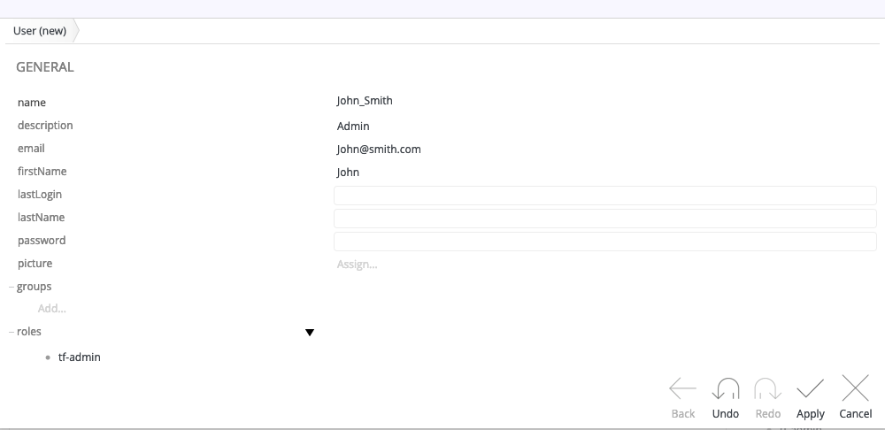

# Creating Users and Assigning Roles
Tribefire enables you to create users and assign custom roles to them.

## General
In Tribefire, the default users are Cortex (with tf-admin role), and Locksmith (with tf-locksmith role). 
For more information on roles in Tribefire, see [User Roles](asset://tribefire.cortex.documentation:concepts-doc/features/user_roles.md).

## Creating Users in Tribefire
Follow the steps below to create new users and assign roles to them:
1. Switch to the Authentication and Authorization access as follows:
    * If you are on the Tribfire landing page, under **Users & Groups** click **Administration**.

    * If you are in Control Center, click the cogwheel icon, and select **Switch to > Authentication and Authorization**.
2. Click **Users**, and then click **New**.
3. Fill in the user details and assign the appropriate role.
    
4. Cick **Apply**.

