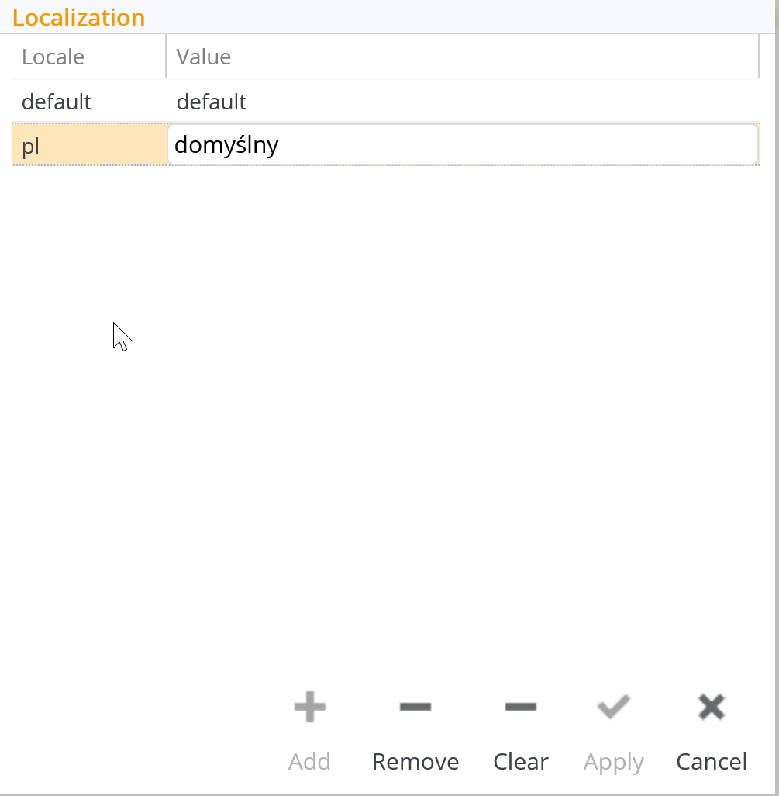

# Using Localization

In tribefire, localization is handled by the entity type `LocalizedString`. To use localization, the property type must be defined as `LocalizedString`, and not `String`. You can add localized values to the following metadata properties:

* [Name](asset://tribefire.cortex.documentation:concepts-doc/metadata/prompt/name.md)
* [Description](asset://tribefire.cortex.documentation:concepts-doc/metadata/prompt/description.md)

> Note that the default localization language is resolved based on the default language set in the browser.

## General

The entity type `LocalizedString` has only one editable property: `localizedValues`, a map used to hold a series of localized value.

The key holds the localization code, that is the language the entry represents, while the value of the language string. So that when you change your language in tribefire, the language code will be referenced, and if contained in the instance of localized string, the value will be used to display the appropriate string.

## Localization Panel

You can localize your strings by using the Localization Panel. This panel has two columns: **Locale** and **Value**. The **Locale** represents the key in the map and accepts internationally recognized language codes such as `en` for English or `de` for German. The value represents the word in the target language.

### Accessing the Localization Panel

1. Click the downward arrow icon of the property to be localized to display the context menu. The context menu will display the **Localization** option.
2. Click the **Localization** button to open the Localization Panel. The default value for each localized string is used if a language selected is not included in the localized list of values or if it is not recognized.

### Managing Localization Values

You can use the **Add**, **Remove**, and **Clear** buttons to manage the localization values in a list.

## `LocalizedString` and `I18nBundle`

The idea of the `I18nBundle` is to prepare localized messages which can be used in code (e.g. in a `ServiceProcessor`) when messages are returned to the user, for example when a notification is sent. `LocalizedStrings` are used mainly with the metadata of a model (e.g. `Name` or `Description`) as well as in the workbench (folder names).

> For information about `I18nBundle`, see [Internationalization](asset://tribefire.cortex.documentation:concepts-doc/features/internationalization.md).
