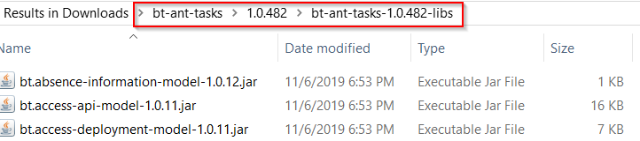
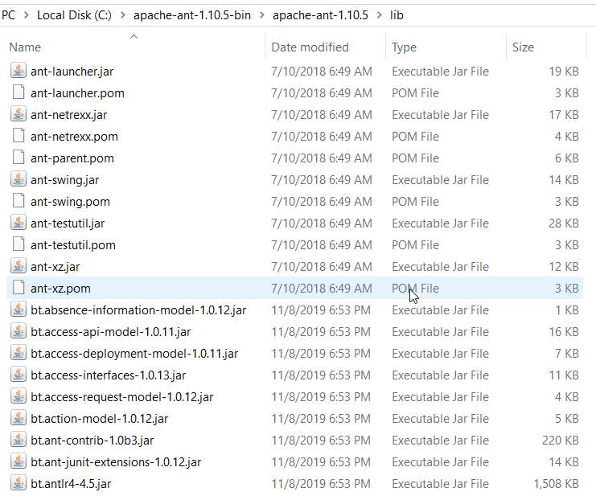

# Installing bt-ant-tasks
**bt-ant-tasks** is a set of libraries for Ant build system. Having installed Apache Ant, you can install **bt-ant-tasks** as follows:

1. [Download](https://artifactory.server/artifactory/webapp/#/artifacts/browse/tree/General/devrock/com/braintribe/devrock/ant/bt-ant-tasks) `bt-ant-tasks` library. Unzip it and open.
2. Open the latest version you can find in the package. Unzip the file that ends with `libs.zip`, and then open the `libs` folder:

    

3. Copy all files from this folder.
4. Open your **Ant** installation directory. Find the `lib` folder and paste the `bt-ant-tasks` files into it.

    

    `lib` folder should now contain both Ant and **bt-ant-tasks** libraries.

5. You're done!
