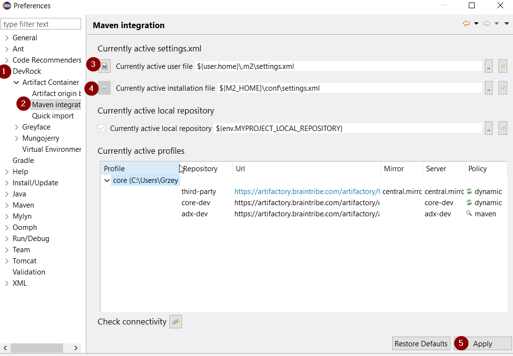
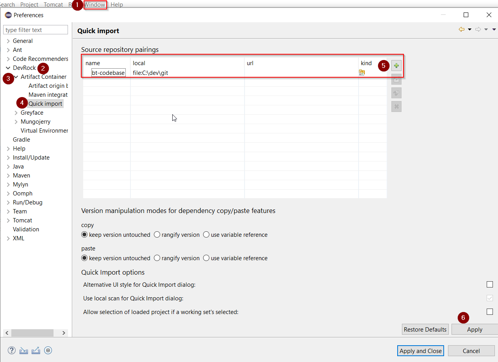

# Installing Development Tools
You need a set of tools before you can start to develop with Tribefire. On Windows, it's best to install all tools **in a single folder** (which can be then added to Windows Defender exception list).

1. First, let's create a central folder where we will install our components. In this tutorial, it's going to be `C:/dev`.

2. Download and install all components listed below. Note that **Jinni** and **bt-ant-tasks** require Braintribe authorization before downloading.

    * **Java 8** or later - [download Oracle JDK](https://www.oracle.com/technetwork/java/javase/downloads/jdk8-downloads-2133151.html), follow vendor's documentation to install.
    * **Eclipse** - [download](https://www.eclipse.org/downloads/), follow vendor's documentation to install.
    * **Apache Ant** - [download](https://ant.apache.org/bindownload.cgi), follow vendor's documentation to install.
    * **bt-ant-tasks** - [download](https://artifactory.server/artifactory/webapp/#/artifacts/browse/tree/General/devrock/com/braintribe/devrock/ant/bt-ant-tasks), [install](bt_ant_tasks.md).
    * **Jinni** [download](https://artifactory.server/artifactory/core-stable/tribefire/extension/setup/jinni/) and **Maven** [download](https://maven.apache.org/download.cgi) - see [Quick Installation](asset://tribefire.cortex.documentation:development-environment-doc/quick_installation_devops.md) for information on setting up these components.
    * **DevRock** - see [Installing DevRock](#installing-devrock)

## Installing DevRock
Before coding, we need to make sure our tools - Eclipse and DevRock -  are set up correctly. Note that the configuration shown here is just a quick way to get you started. For detailed information about DevRock, see [DevRock's documentation](asset://tribefire.cortex.documentation:development-environment-doc/devrock/devrock.md).

1. Open Eclipse.
2. Install DevRock as explained in [Installing DevRock in Eclipse](asset://tribefire.cortex.documentation:development-environment-doc/devrock/devrock.md#installing-devrock-in-eclipse).

### Maven Integration
Since DevRock interacts with Maven, you need to make sure that Devrock's Maven settings point to the correct Maven setup files. These are the user file and installation file, `.m2/settings.xml` and `.m2/conf/settings.xml` respectively.

1. Open Eclipse. Go to **Window/Preferences**.
2. Enter the user and installation files as shown below (`M2_HOME` is used in this case as an environment variable pointing to Maven installation folder, but this is completely optional):

    

    Note that if you are using MacOs, Eclipse might not have access to these environment variables. To solve this, start Eclipse from the terminal.

### Quick Import Settings
Another DevRock's feature - Quick Import - requires that you configure the pairings between your local and remote source code repository. This feature allows you to import artifacts into workspace in a single click (or a keyboard shortcut). In this tutorial, only the local repository is configured.

In a later step we might want to add the local sources to the Git repository. For this, we prepare a subfolder `D:\dev\git` where we will store our artifacts.

1. Open Eclipse. Go to **Window/Preferences**.
2. Set up **Quick Import** as follows:

    

    * **name** - any name for the pairing you like
    * **local** - repository address on your machine
    * **url** - normally, the remote address of your repository. We'll leave it empty for now.
    * **kind** - repository type (Git, SVN...)

## What's Next?
Having installed all components, you can proceed to [Creating Artifacts](creating_artifacts.md)!
