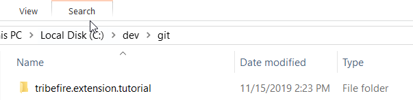
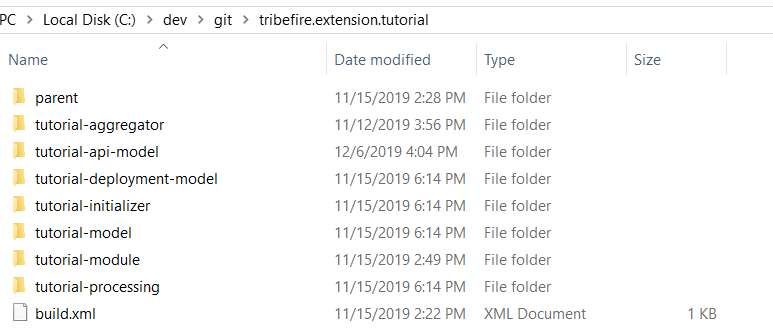
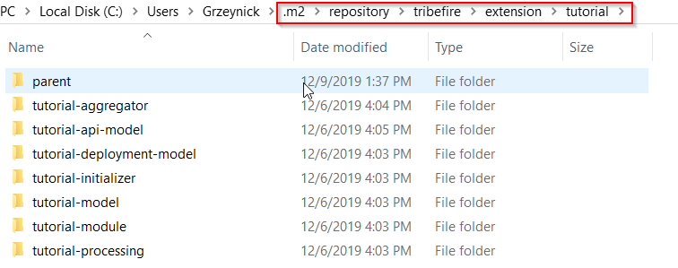

# Creating Artifacts
The first part of Tribefire development is the creation of an _artifact group_ and its constituent _artifacts_ - versionable, Maven-compatible sets of files.

All necessary development components must installed - see [Installing Development Components](components.md) for detailed instructions.

## Step-by-step guide

1. Create a folder called `tribefire.extension.tutorial`:

    

2. Step into this newly created folder and call `jinni create-group --groupId tribefire.extension.tutorial` The group got created with a predefined set of files: the parent artifact, a group build.xml, a predefined set of .gitignore values as well as a README.md

3. Before we move on, add the following properties to your parent pom.xml properties section:

    ```xml
	<properties>
		<V.com.braintribe.gm>[1.0, 1.1)</V.com.braintribe.gm>
		<V.tribefire.cortex>[2.0, 2.1)</V.tribefire.cortex>		
		<V.tribefire.cortex.assets>[2.0, 2.1)</V.tribefire.cortex.assets>
		<V.tribefire.cortex.services>[2.0,2.1)</V.tribefire.cortex.services>	
	</properties>
    ```

3. Now, we will create empty **model** artifacts. Please run all commands within the group folder. Use the Jinni command `jinni create-model <aid>` (do not confuse with **module**!). Create the following models (example - for **tutorial-api-model**, you need to run `jinni create-model tutorial-api-model`):

    * tutorial-api-model - defines the **service requests**
    * tutorial-deployment-model - defines the denotation types of our components like the **web terminal** and the **service processor**.
    * tutorial-model - defines required data types

3. Next, we will create a **processing** artifact holding the actual logic (service processor and servlet implementation) required by our app to work. Run `jinni create-library tutorial-processing` 
3. Now we will create our **initializer** artifact. Run `jinni create-initializer tutorial-initializer` 
4. Now we will create our **module** artifact (do not confuse with **model**!). Run `jinni create-module tutorial-module` from your group folder to do it.
5. Finally, create the aggregator artifact. Run `jinni create-aggregator tutorial-aggregator` from your group folder to do it.
    
    
    When you're done, your group should look as follows:

    


6. Open a command line tool and run `ant -Drange=parent` from your group folder to build the **parent** artifact. This creates the parent artifact in your local `.m2` repository.
7. Run `ant -Drange=.` from your group folder to build other artifacts. They are now available in your local `.m2` repository. Note how the group is organized in the local repository:

    


## Summary
Having created the group and artifacts, we can move on to coding! Go to [Developing Artifacts](developing_artifacts.md) to proceed.