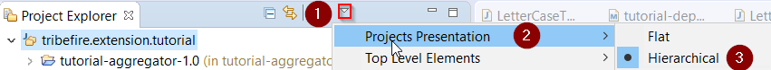
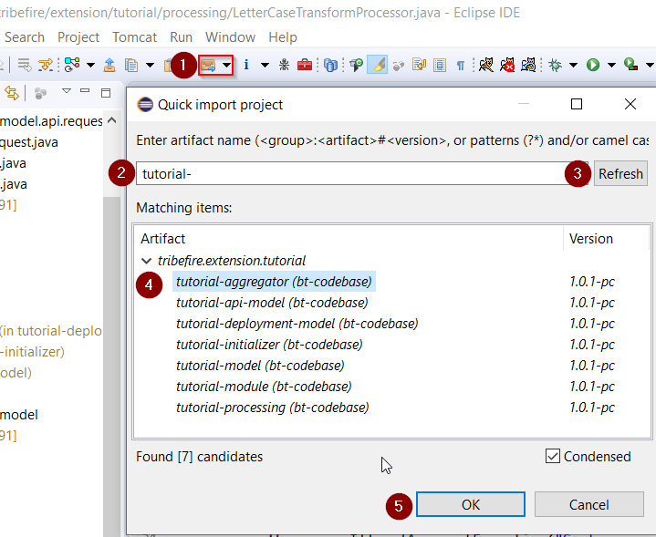
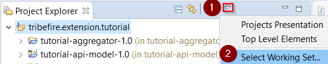
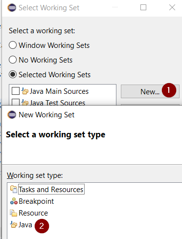
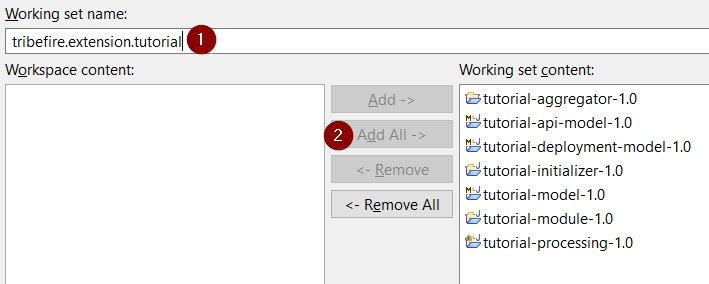
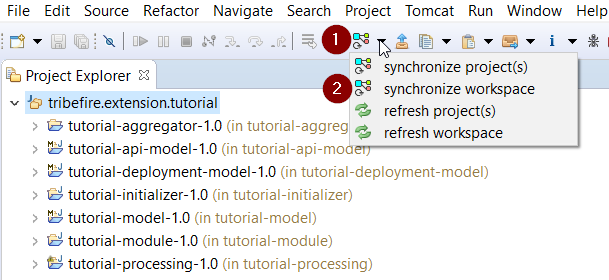
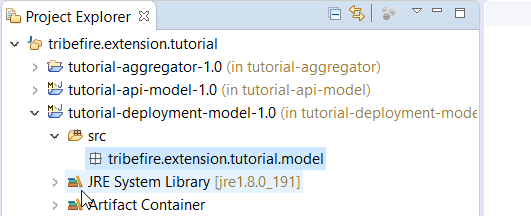
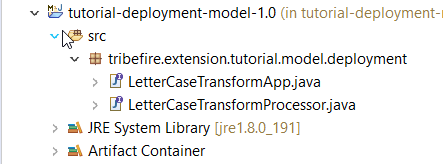
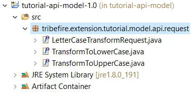
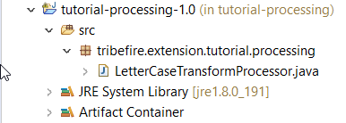

# Developing Tribefire Artifacts
Having created and built our artifacts, it's time to develop them!

## Developing Artifacts

### Setting up Workspace

1. Open Eclipse. Let's set Project Presentation to Hierarchical:

    

2. Now we can import our artifacts. Use the **Quick Import** feature as shown below (the list is empty until you type something and refresh):

    

6. Now, we will need a working set for our artifacts. This is optional depending on your preferences, however this setup should be helpful when developing Tribefire artifacts. First, open the **Select Working Set...** menu:

    

    Select **Java** as working set type:

    

    When prompted, add all artifacts to **working set content**:

    

7. Your workspace should now contain a working set with all artifacts. You can now synchronize it:

    

    **Synchronize** action is part of the DevRock suite. It means that AC reads the `pom.xml` files (in selected projects or the entire workspace, depending on your choice) and traverses the full dependency tree. Once the solutions are determined, a **refresh** is made (existing set of solutions is used and correlated with projects that already exist in the workspace). Every sync will run **twice**; once for the compile-time classpath and once for the runtime classpath - the compile job will trigger the launch job as the last action before it terminates. As soon as the compile-time classpath is ready, Eclipse will get an update and will be able to check the compile-time state of the project. As soon as the launch classpath is ready, you can launch the project from within Eclipse.


### Developing the Deployment Model
We're going to start our development with the **tutorial-deployment-model** artifact. This model, following Tribefire convention set for all deployment models, contains **denotation types** - abstract representations of Tribefire functionality (interfaces without the logic). In our case, these are our **Web Terminal** and **Service Processor**. We will later use Wire to _bind_ our denotation types to the processing logic.

1. First, let's make sure that our model has the correct dependencies. Open the `pom.xml` file and add the following dependencies:

    ```xml
    <dependencies>
        <dependency>
            <!--Contains the WebTerminal entity.-->
            <groupId>tribefire.cortex</groupId>
            <artifactId>extension-deployment-model</artifactId>
            <version>${V.tribefire.cortex}</version>
            <?tag asset?>
        </dependency>
        <dependency>
            <!--Contains the ServiceProcessor entity.-->
            <groupId>tribefire.cortex</groupId>
            <artifactId>service-deployment-model</artifactId>
            <version>${V.tribefire.cortex}</version>
            <?tag asset?>
        </dependency>
    </dependencies>
    ```

    When you have added the dependencies (i.e. saved the **pom.xml** with your changes), your workspace should synchronize automatically.

1. Initially, our **tutorial-deployment-model** looks as follows:

    

    The default package name is `groupId.model`, in this case `tribefire.extension.tutorial.model`. Let's change it to `tribefire.extension.tutorial.model.deployment` to follow Braintribe conventions.

2. Now, we can define the model's components. Let's add the following **interfaces** to the `tribefire.extension.tutorial.model.deployment` package:

    

    * **LetterCaseTransformApp** - this is our Web Terminal. It has to extend **WebTerminal** - the basic interface for all Tribefire Web Terminals.
    * **LetterCaseTransformProcessor** - this is our Service Processor. It has to extend **ServiceProcessor** - again, this is the basic interface for all Service Processors.

3. Every **entity** in Tribefire (more about entities [here](asset://tribefire.cortex.documentation:concepts-doc/features/entities/entities_in_detail.md)) has a static field **T**, which is known as the **type literal**. Essentially, `Person.T` returns an object which represents the **Person** entity. Type literals are necessary in all custom entities such as our interfaces, thus we need to enter the **T** literal in both interfaces so that the correct entity is returned. Add the literals as shown below:

    * T Literal in **LetterCaseTransformApp**:

        ```java
        EntityType<LetterCaseTransformApp> T = EntityTypes.T(LetterCaseTransformApp.class);
        ```

    * T Literal in **LetterCaseTransformProcessor**:

        ```java
        EntityType<LetterCaseTransformProcessor> T = EntityTypes.T(LetterCaseTransformProcessor.class);
        ```

    Having declared the literals, we are done with the deployment model! Both interfaces should now have the correct extension and the **T** literal, as shown below:

    ```java
    package tribefire.extension.tutorial.model.deployment;

    import com.braintribe.model.extensiondeployment.ServiceProcessor;
    import com.braintribe.model.generic.reflection.EntityType;
    import com.braintribe.model.generic.reflection.EntityTypes;

    public interface LetterCaseTransformProcessor extends ServiceProcessor {

	EntityType<LetterCaseTransformProcessor> T = EntityTypes.T(LetterCaseTransformProcessor.class);

    }
    ```

    Synchronize your workspace and move on to creating the API model!


### Developing API Model
**tutorial-api-model** is where we define the **service request** (our expert that will later be **wired** with the interfaces in deployment model) used to transform the letter size from lowercase to UPPERCASE. Since the request needs to work both ways (lower-to-upper and upper-to-lower), we're going to make it **abstract** and extend specific requests from it. In case a processor handles more than one request, we always need an abstract request bundling the concrete ones. The abstract request is then used as the binder for the processor implementation.

**tutorial-api-model** is what we call a _skeleton model_ - because it declares its own entity type. For our use-case, we're going to instantiate a _configured_ model later on.

1. First, we need to make sure that the artifact has the correct dependency. Open the `pom.xml` file and add the following dependencies:

    ```xml
    <dependencies>
        <dependency>
            <!--Contains the ServiceProcessor entity.-->
            <groupId>com.braintribe.gm</groupId>
            <artifactId>service-api-model</artifactId>
            <version>${V.com.braintribe.gm}</version>
            <?tag asset?>
        </dependency>
    </dependencies>
    ```

1. The default package name is `groupId.model`, in this case `tribefire.extension.tutorial.model`. Let's change it to `tribefire.extension.tutorial.model.api.request` to follow conventions.

2. Time to add our service requests. Create the following interfaces in the API model:

    

    * **LetterCaseTransformRequest** extending AuthorizedRequest - this is our abstract request.
    * **TransformToLowerCase** extending LetterCaseTransformRequest - this is the request handling transformation to lowercase.
    * **TransformToUpperCase** extending LetterCaseTransformRequest - this is the request handling transformation to uppercase.

3. Define **T** literals in every interface. This is the literal for **LetterCaseTransformRequest** - add it and follow the pattern for other requests:

    ```java
    EntityType<LetterCaseTransformRequest> T = EntityTypes.T(LetterCaseTransformRequest.class);
    ```

    Having defined the literals, you're done with **TransformToLowerCase** and **TransformToUpperCase**. We will use those interfaces in our **service processor** later on.

4. Since both of our requests take a sentence as input and both return a string, we can put the **sentence** property as well as the **eval** method (response) to the abstract base type **LetterCaseTransformRequest**:


    ```java
    package tribefire.extension.tutorial.model.api.request;

    import com.braintribe.model.generic.annotation.Abstract;
    import com.braintribe.model.generic.eval.EvalContext;
    import com.braintribe.model.generic.eval.Evaluator;
    import com.braintribe.model.generic.reflection.EntityType;
    import com.braintribe.model.generic.reflection.EntityTypes;
    import com.braintribe.model.service.api.AuthorizedRequest;
    import com.braintribe.model.service.api.ServiceRequest;

    @Abstract
    public interface LetterCaseTransformRequest extends AuthorizedRequest {
	
	EntityType<LetterCaseTransformRequest> T = EntityTypes.T(LetterCaseTransformRequest.class);

	String getSentence();
	void setSentence(String sentence);
	
	@Override
	EvalContext<String> eval(Evaluator<ServiceRequest> evaluator);
    ```

    >Note: On interface level, we ALWAYS model our variables as getter- and setter-methods!

5. Having created our requests, we can proceed to developing the processing logic in the processing model!

### Creating Processing Model
Processing model is where we write our **service processor**, which is where the processing logic is coded. 

Our service processor takes a service request as input. Since our service request is **abstract**, binding **two** actual requests, we need to map the request to the proper implementation (**dispatch** it). This is why we're going to extend a **AbstractDispatchingServiceProcessor**, where the proper method is already implemented.

1. Make sure that our model has the proper dependencies. Open `pom.xml` and add the following dependencies (one of them is our API model - our processor will need the **get-** and **set** methods implemented there):

    ```xml
    <dependencies>
        <dependency>
            <groupId>com.braintribe.gm</groupId>
            <artifactId>service-api</artifactId>
            <version>${V.com.braintribe.gm}</version>
        </dependency>
        <dependency>
            <groupId>tribefire.extension.tutorial</groupId>
            <artifactId>tutorial-api-model</artifactId>
            <version>${V.tribefire.extension.tutorial}</version>
        </dependency>
    </dependencies>
    ```

1. Adapt the package name. Since this is a processing model, the package should be called `tribefire.extension.tutorial.processing`.
2. Create a public class called **LetterCaseTransformProcessor**:

    

    Extend it from **AbstractDispatchingServiceProcessor**, entering **LetterCaseServiceRequest** as the request and **Object** (why?) as the response.

    ```java
    public class LetterCaseTransformProcessor extends AbstractDispatchingServiceProcessor<LetterCaseTransformRequest, Object> {
    ```

3. Implement the transformation logic. We're going to use the **toLowerCase** and **toUpperCase** methods, provided by Java's `Java.lang.String` library. We will get our input using the `getSentence()` method defined in our abstract **LetterCaseTransformRequest** interface:

    ```java
	private String transformToLowerCase(ServiceRequestContext context, TransformToLowerCase request) {
		
		//check if the incoming sentence is not null or empty - throw illegalArgumentException in such case
		//Otherwise return the lower-case sentence
		String sentence = request.getSentence();
		
		if(CommonTools.isEmpty(sentence)) {
			
			throw new IllegalArgumentException("Sentence must not be null or empty!");
		}
		
		return sentence.toLowerCase();
	
	}
	
	private String transformToUpperCase(ServiceRequestContext context, TransformToUpperCase request) {
		
		//check if the incoming sentence is not null or empty - throw illegalArgumentException in such case
		//Otherwise return the lower-case sentence
		String sentence = request.getSentence();
		
		if(CommonTools.isEmpty(sentence)) {
			
			throw new IllegalArgumentException("Sentence must not be null or empty!");
		}
		
		return sentence.toUpperCase();
	}
    ```

3. Override the **configureDispatching** method (remember that our request is abstract!) to map the request to the proper method (which we will implement in the next step):

    ```java
    @Override
	protected void configureDispatching(DispatchConfiguration<LetterCaseTransformRequest, Object> dispatching) {

		//Preparing internal logic. Depending on which request is incoming, execute the proper method (maps the request to
		//its implementation)
		dispatching.register(TransformToLowerCase.T, this::transformToLowerCase);
		dispatching.register(TransformToUpperCase.T, this::transformToUpperCase);
	}
    ```

4. You're done implementing the processing expert logic! Now that you have both the expert logic as well as the denotation type, it's time to _wire_ them. This is done in the **tutorial-module** artifact, as explained in the next section.

## Creating Tutorial Module
Tutorial **module** is where we wire the denotation types - our **Processor** and **App** interfaces in the deployment model - to their experts (the actual processor/app implementations in the processing artifact).

### Wiring the LetterCaseTransformProcessor
First, we're going to wire the LetterCaseTransformProcessor **denotation type** (interface from the deployment model) to the instance of LetterCaseTransformProcessor **expert** (logic in the processing artifact).

1. Rename the existing classes in **tutorial.extension.module.wire.space** package  to **TutorialDeployablesSpace** and **TutorialModuleSpace** to avoid confusion with other similar Module artifacts.
1. In order to have an expert to wire, we need to define the processor object in **TutorialDeployablesSpace**. Remembering that it is the `LetterCaseTransformProcessor` class from the **tutorial-initializer** artifact that hosts the processing logic, we define the object as follows:

```java
@Managed
public class TutorialDeployablesSpace implements WireSpace {
	
	@Managed
	public LetterCaseTransformProcessor letterCaseTransformProcessor() {
		return new LetterCaseTransformProcessor();		
	}

}
```

The instance of this object is going to be our _expert_ which we are now going to _wire_ to the _denotation type_ (our LetterCaseTransformProcessor interface from the deployment model).

2. Open **TutorialModuleSpace** and connect (bind) the previously created `letterCaseTransformProcessor` expert to its denotation type, which is the LetterCaseTransformProcessor interface.

    1. First, we need to import and instantiate **TutorialDeployablesSpace** created previously:

        ```java
        @Import
	    private TutorialDeployablesSpace deployables;
        ```

        We're going to point to our `letterCaseTransformProcessor` via **deployables** (note that we have just one expert inside at the moment, but in real life there will be more).

    2. We also need to import **TribefirePlatformContract**, which provides all available Platform contracts, including the `binders()` contract we will need:

        ```java
        @Import
        private TribefirePlatformContract tfPlatform;
        ```
    3. Now we can override the `bindDeployables` method provided by **TribefireModuleContract**. Together with the `binders()` contract from **TribefirePlatformContract**, we wire the expert to the denotation type as follows:

        ```java
        @Override
	    public void bindDeployables(DenotationBindingBuilder bindings) {
		// Bind deployment experts for deployable denotation types.
		// Note that the basic component binders (for e.g. serviceProcessor or incrementalAccess) can be found via tfPlatform.deployment().binders().
		bindings.bind(LetterCaseTransformProcessor.T)
		.component(tfPlatform.binders().serviceProcessor())
		.expertSupplier(deployables::letterCaseTransformProcessor);
        ```

        As a result, the whole class looks as follows (without the imports):

        ```java
        @Managed
        public class TutorialModuleSpace implements TribefireModuleContract {

            @Import
            private TribefirePlatformContract tfPlatform;

            @Import
            private TutorialDeployablesSpace deployables;
            //
            // Deployables
            //

            @Override
            public void bindDeployables(DenotationBindingBuilder bindings) {
                // Bind deployment experts for deployable denotation types.
                // Note that the basic component binders (for e.g. serviceProcessor or incrementalAccess) can be found via tfPlatform.deployment().binders().
                bindings.bind(LetterCaseTransformProcessor.T)
                .component(tfPlatform.binders().serviceProcessor())
                .expertSupplier(deployables::letterCaseTransformProcessor);
                
            }

        }
        ```

Having wired the experts to the denotation types, we can proceed to develop our initializer!

## Creating the Initializer
When Tribefire starts, we want it to be _initialized_ with certain components so that we can use the logic we developed previously right away. Otherwise, we would have to configure these components from within the running platform. We will initialize Tribefire with a configured API model. The model itself will be initialized with **ProcessWith** metadata, providing our **LetterCaseTransformProcessor** as an _expert_ to be used when a request comes in.

* **tutorial-api-model** - we need a _configured_ instance of it so that we can execute REST service requests on our platform when it is running. Configured API model must be initialized as a dependency to tribefire's **cortex service model**.
* **ProcessWith** metadata needs to be initialized on our API model so that it uses the processing logic we defined previously. This metadata is part of Tribefire - we will only use it, not define it.

### Renaming the Files
Files from your initializer artifact, when published to a shared repository, could easily be confused with similar files from another initializer artifact. This is why we need to rename these files to clearly indicate their origin and purpose.

1. Open `tribefire.extension.tutorial.initializer.wire.contract` package and remove the **RuntimePropertiesContract** - we will not use it in this tutorial.
1. In all packages, rename the remaining files so that they have the `Tutorial` prefix, to avoid confusion with similar files inside other initializer artifacts (keep in mind that everyone is using Jinni to build artifacts, so everyone gets the same default names!). Do it on all of the following files:

    * InitializerSpace -> TutorialInitializerSpace
    * InitializerMainSpace -> TutorialInitializerMainSpace
    * InitializerModelsSpace -> follow the pattern
    * InitializerContract
    * InitializerMainContract
    * InitializerModelsContract
    * InitializerWireModule
    * Initializer

### Setting up Contracts
As a convention, initializer uses a system of _contracts_ to refer to items being initialized (configured API model with ProcessWith metadata in our case). Go ahead and set up the contracts as described below:    

1. Open `tribefire.extension.tutorial.initializer.wire.contract` package. 
2. Open the **TutorialInitializerModelsContract** and add a new model to it. Let's call it **configuredTutorialApiModel** (we have not yet defined it, but we will later):

    ```java
    public interface TutorialInitializerModelsContract extends WireSpace {

        GmMetaModel configuredTutorialApiModel();
    }    
    ```

    This is the model that we will later add to the cortex service model in the main initializer.

2. In the same package, open **TutorialInitializerContract** and add the `ProcessWith` metadata to it (again, we will define the metadata later):

    ```java
    public interface TutorialInitializerContract extends WireSpace {

	ProcessWith processWithLetterCaseTransform();

    }
    ```

3. In **ExistingInstancesContract**, we're going to refer to instances getting created by Tribefire on runtime (this is why we call them _existing_ instances) via the `GlobalId` annotation. We know the conventions Tribefire follows when assigning `GlobalId` to both modules and models, and we're going to use that knowledge now to refer to existing instances of **tutorial-module** and **tutorial-api-model**. 

add the following String constants and GlobalId annotations:


    ```java
    @InstanceLookup(lookupOnly=true)
    public interface ExistingInstancesContract extends WireSpace {

        String GROUP_ID = "tribefire.extension.tutorial";
        String GLOBAL_ID_PREFIX = "model:" + GROUP_ID + ":";
        
        @GlobalId("module://" + GROUP_ID + ":tutorial-module")
        Module tutorialModule();
        
        @GlobalId(GLOBAL_ID_PREFIX + "tutorial-api-model")
        GmMetaModel tutorialApiModel();
        
        // TODO
    }
    ```

    We have now defined how the `GlobalId` (mandatory property present in every tribefire entity) is initialized on the module and API model.

4.  Finally, open **TutorialInitializerMainContract**. We need our previously defined contracts as well as the **CoreInstancesContract** (which bring the cortex service model) in the main contract (you can remove other contracts if present):

	```java
	public interface TutorialInitializerMainContract extends WireSpace {
	
		TutorialInitializerContract initializer(); 

		ExistingInstancesContract existingInstances();

		CoreInstancesContract coreInstances();
	
		TutorialInitializerModelsContract models();

	}
	```

    We're going to refer to our contracts in the initializer through the main contract.

You're done working with the contracts now!

### Setting up Initializer Wire Spaces
We need to define how our configured API model and ProcessWith metadata should be initialized, which is done in the wire spaces.

#### TutorialInitializerSpace
We define metadata initialization in this initialized wire space.

1. Open `tribefire.extension.tutorial.initializer.wire.contract` package. 
2. Open **TutorialInitializerSpace**. Implement **TutorialInitializerContract**:

    ```java
    @Managed
    public class TutorialInitializerSpace extends AbstractInitializerSpace implements TutorialInitializerContract
    ```

2. Add the following contract:

    ```java
    @Import
	private ExistingInstancesContract existingInstances;
    ```

    We will need `existingInstances` to refer to our **tutorial-module** instance.

2. Now, we will define how our service processor should be instantiated. First, we create an instance, then we assign the **Name**, **ExternalId**, and our **tutorialModule**.

    ```java
    @Managed
	private LetterCaseTransformProcessor letterCaseTransformProcessor() {
		LetterCaseTransformProcessor bean = create(LetterCaseTransformProcessor.T);
		
		bean.setName("Letter Case Transform Processor");
		bean.setExternalId("serviceProcessor.letterCaseTransform");
		bean.setModule(existingInstances.tutorialModule());
		return bean;		
	}
    ```

    We are now able to instantiate the **ProcessWith** metadata with the above service processor.

3. Finally, we define how the **ProcessWith** metadata should be instantiated. We will call it `processWithLetterCaseTransform` to clearly indicate what we're using it for. Then, we assign the `letterCaseTransformProcessor` with the `setProcessor` method to our entity.


    ```java
    @Override
	@Managed
	public ProcessWith processWithLetterCaseTransform() {
		ProcessWith bean = create(ProcessWith.T);
	
		bean.setProcessor(letterCaseTransformProcessor());
	
		return bean;
	}
    ```

4. Your **TutorialInitializerSpace** should now look as follows:

    ```java
    @Managed
    public class TutorialInitializerSpace extends AbstractInitializerSpace implements TutorialInitializerContract {

        @Import
        private ExistingInstancesContract existingInstances;

        @Override
        @Managed
        public ProcessWith processWithLetterCaseTransform() {
            ProcessWith bean = create(ProcessWith.T);
            
            bean.setProcessor(letterCaseTransformProcessor());
            
            return bean;
        }
        
        @Managed
        private LetterCaseTransformProcessor letterCaseTransformProcessor() {
            LetterCaseTransformProcessor bean = create(LetterCaseTransformProcessor.T);
            
            bean.setName("Letter Case Transform Processor");
            bean.setExternalId("serviceProcessor.letterCaseTransform");
            bean.setModule(existingInstances.tutorialModule());
            return bean;		
        }
        
    }
    ```

    Having finished coding the metadata initialization, we can now proceed to developing **TutorialInitializerModelsSpace**, where we define how the models are initialized.

#### TutorialInitializerModelsSpace
Now, we define how our configured API model should be instantiated. This model will be added as dependency to the skeleton API model and we will send our requests to it.

1. Open **TutorialInitializerModelsSpace** and implement **TutorialInitializerModelsContract**.

    ```java
    @Managed
    public class TutorialInitializerModelsSpace extends AbstractInitializerSpace implements TutorialInitializerModelsContract {
    ```

2. Import the **ExistingInstancesContract**:

    ```java
    @Import
	private ExistingInstancesContract existingInstances;
	
    ```

3. Create an instance of the **configuredTutorialApiModel**, set a name on your instance, and add **tutorialApiModel** as a dependency.

    ```java
    @Override
	@Managed
	public GmMetaModel configuredTutorialApiModel() {
		GmMetaModel bean = create(GmMetaModel.T);

		bean.setName(ExistingInstancesContract.GROUP_ID + ":configured-tutorial-api-model");
		bean.getDependencies().add(existingInstances.tutorialApiModel());

		return bean;
	}
	}
    ```

    Your initializer models space should now look as follows:

    ```java
    @Managed
    public class TutorialInitializerModelsSpace extends AbstractInitializerSpace implements TutorialInitializerModelsContract {

        @Import
        private ExistingInstancesContract existingInstances;

        @Import
        private CoreInstancesContract coreInstances;

        @Override
        @Managed
        public GmMetaModel configuredTutorialApiModel() {
            GmMetaModel bean = create(GmMetaModel.T);
            
            bean.setName(ExistingInstancesContract.GROUP_ID + ":configured-tutorial-api-model");
            bean.getDependencies().add(existingInstances.tutorialApiModel());

            return bean;
        }

	}
    ```

#### TutorialInitializerMainSpace
Finally, we need to implement **TutorialInitializerMainContract** in the main space and add unimplemented methods.

1. Open **TutorialInitializerMainSpace** and implement **TutorialInitializerMainContract**.

    ```java
    @Managed
    public class TutorialInitializerMainSpace implements TutorialInitializerMainContract {
        @Import
        private TutorialInitializerContract initializer;
        
        @Import
        private ExistingInstancesContract existingInstances;
        
        @Import
        private CoreInstancesContract coreInstances;
        
        @Import
        private TutorialInitializerModelsContract models;
        
        @Override
        public TutorialInitializerContract initializer() {
            return initializer;
        }

        @Override
        public ExistingInstancesContract existingInstances() {
            return existingInstances;
        }
        
        @Override
        public CoreInstancesContract coreInstances() {
            return coreInstances;
        }

        @Override
        public TutorialInitializerModelsContract models() {
            return models;
        }
	}
    ```

### Setting up Main Initializer
Finally, having set up all of the above components, we are now ready to develop our initializer.

1. Open **TutorialInitializer**. Pass **TutorialInitializerMainContract** to **AbstractInitializer**.

    ```java
    public class TutorialInitializer extends AbstractInitializer<TutorialInitializerMainContract>
    ```

2. Override the **getInitializerWireModule** method:

    ```java
	@Override
	public WireTerminalModule<TutorialInitializerMainContract> getInitializerWireModule() {
		return TutorialInitializerWireModule.INSTANCE;
	}    
    ```

3. We're going to add a method in our initializer that adds **processWithLetterCaseTransform** metadata to our **configuredTutorialApiModel**. To that end, we're going create a method to do the following:

    1. Instantiate the contracts that contain our model (**TutorialInitializerModelsContract**) and metadata (**TutorialInitializerContract**).
    2. Instantiate the metadata editor for **configuredTutorialApiModel**.
    3. Use the editor to add **processWithLetterCaseTransform** metadata on **LetterCaseTransformRequest** entity.

    The full method should look as follows:

    ```java
	private void addMetaDataToModels(TutorialInitializerMainContract initializerMainContract) {
		TutorialInitializerModelsContract models = initializerMainContract.models();
		TutorialInitializerContract initializer = initializerMainContract.initializer();
		
		ModelMetaDataEditor editor = new BasicModelMetaDataEditor(models.configuredTutorialApiModel());
		
		editor.onEntityType(LetterCaseTransformRequest.T).addMetaData(initializer.processWithLetterCaseTransform());
	}    
    ```

4. Now, we are prepared to implement the main **initialize** method. We need to do the following to initialize Tribefire properly:

    1. Instantiate **CoreInstancesContract** (which provides the cortex service model methods).
    2. Instantiate **TutorialInitializerModelsContract** (which provides our configured API model).
    3. Assign our configured API model as a dependency to the cortex service model.
    4. Add **processWithLettercaseTransform** metadata to our model.


    ```java
	@Override
	public void initialize(PersistenceInitializationContext context, WiredInitializerContext<TutorialInitializerMainContract> initializerContext,
			TutorialInitializerMainContract initializerMainContract) {

		CoreInstancesContract coreInstances = initializerMainContract.coreInstances();
		TutorialInitializerModelsContract models = initializerMainContract.models();
		coreInstances.cortexServiceModel().getDependencies().add(models.configuredTutorialApiModel());
		addMetaDataToModels(initializerMainContract);
		
	}    
    ```
5. That's it! You can now build your group again. Execute `ant -Drange=.` from your group folder to build all artifacts. You should now be able to [execute REST calls](executing_rest.md) we defined in Tribefire!