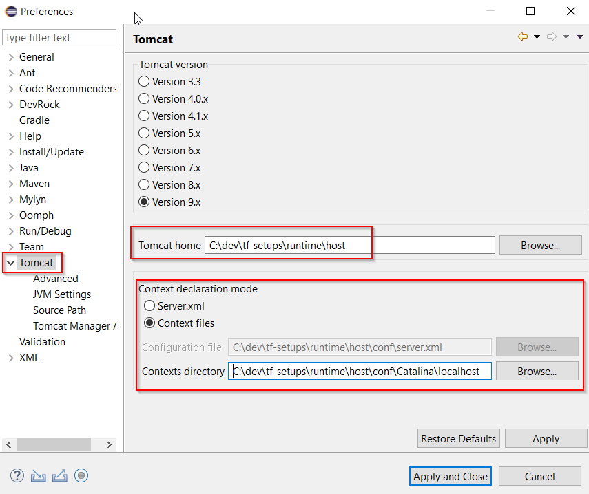

# Executing REST Calls on Developed Platform
This page explains how to execute REST calls on Tribefire platform developed as described in [Developing Tribefire Artifacts](developing_artifacts.md) tutorial.

## Prerequisites
* Any tool for executing REST API requests (we will use Postman).

## Setting up Debug Project

1. First, we need to set up a Tribefire tomcat platform which can be run from Eclipse. In a directory of your choosing, run the following command (adjust `--installationPath` argument before executing):

    ```
    jinni setup-local-tomcat-platform --setupDependency tribefire.extension.tutorial:tutorial-aggregator#1.0 --installationPath path --debugProject tribefire.extension.tutorial:tutorial-debug
    ```

    This command builds a Tribefire tomcat platform from artifacts added as dependencies in `tutorial-aggregator` inside the path you enter after `--installatonPath`. The `--debugProject` option means that the setup will not deploy your TF inside the **webapps** folder (as normally), but creates/updates an equivalent Tomcat project of given name for your (Eclipse) IDE. This project can be the found in the **debug** folder. 

2. Having built the tomcat platform for our IDE, we now need to adjust the settings inside Eclipse so that it knows where the tomcat actually is. Go to **Window/Preferences** and set Tomcat home (`installation_path/runtime/host/bin`) and Contexts directory (`installation_path/runtime/host/conf/Catalina/localhost`):

    

## Executing REST calls on Tribefire
Having finished our development, it's time to start Tribefire to see if it behaves as expected.

1. Select **Tomcat/Start Tomcat** from Eclipse's top menu. Tomcat platform running Tribefire should start in less than a minute under `localhost:8080`.
2. Open Postman.
3. Send a POST authentication request to get the session ID. Use the default cortex/cortex user and password combination (tribefire is initialized with this user).

    ```
    http://localhost:8080/tribefire-services/api/v1/authenticate?user=cortex&password=cortex
    ```

    Copy the returned session ID.

4. Now, you can send a request to one of our endpoints! 

    TransformToLowerCase request:

    ```
    http://localhost:8080/tribefire-services/api/v1/cortex/TransformToLowerCase?sentence=Your sentence here&sessionId=20200206152014656-76f09a6f-c0f6-4b17-965d-96a32cf95ba1
    ```

    TransformToUpperCase request:

    ```
    http://localhost:8080/tribefire-services/api/v1/cortex/TransformToUpperCase?sentence=Your sentence here&sessionId=20200206152014656-76f09a6f-c0f6-4b17-965d-96a32cf95ba1
    ```

    As a result, you should get the transformed sentence!

Congratulations, you have now completed this tutorial, officially beginning your journey with Tribefire!
