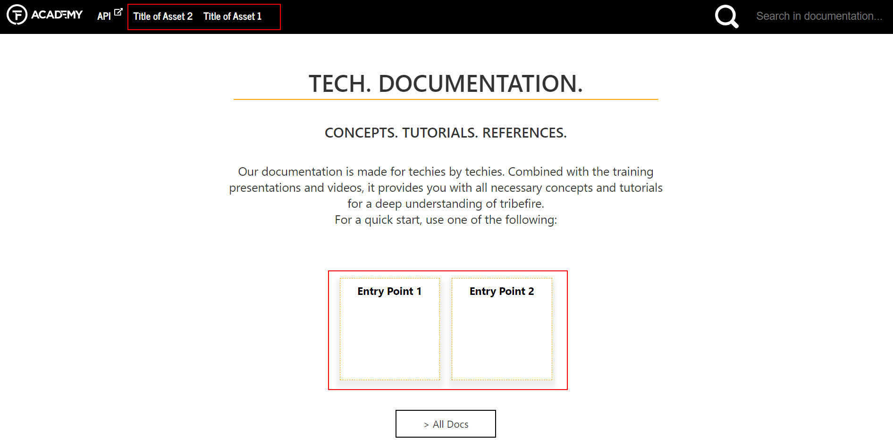
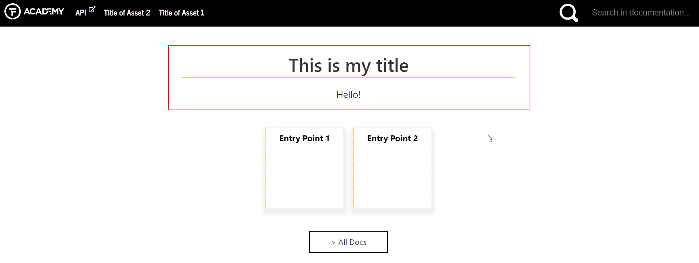

# Creating Documentation Portals

As everything in tribefire, this documentation portal is essentially a set of aggregated platform assets, hosting Markdown files with the actual content (and a few `.yml` files responsible for the structure). This means that you can expand it with your own doc assets, hosting information on features developed in your repositories. You can also create your own  Naturally, you can also edit any source Markdown file that you have access to.

## Prerequisites
* Access rights to the repository where you want to create or edit documentation assets.
* [Jinni](asset://tribefire.cortex.documentation:development-environment-doc/resources.md#Jinni)
* [bt-ant-tasks](../development/bt_ant_tasks.md)

## Documentation Stages
The process of creating a Jinni-based documentation portal consists of the following steps:

1. **Creating a group** with the `create-group` Jinni command. You can skip this step if you already have a group for your doc artifacts.
2. **Creating the aggregator** for your documentation assets with the `create-aggregator` Jinni command.
3. **Creating the configuration artifact** using the `create-md-doc-config` command. This artifact is responsible for customizing your future documentation site (changing the logo, adding custom styles, defining tags, and more).
4. **Creating the documentation content assets** using the `create-md-doc` command. These artifacts are where we actually write the documentation content.
5. Writing the content in documentation artifacts.
6. Optionally, writing custom specifications for Jinni in the `md-doc-config` artifact.
7. Adding your documentation assets to the aggregator.
8. Building the aggregator.
9. Publishing generated content.

We'll go through all stages in this document

### Creating Documentation Artifacts

1. Create a group in any directory of your choice by running `jinni create-group documentation`. Group artifact called **documentation** is created, containing the **parent** artifact as well as the `build.xml` file.
2. Enter the newly created **documentation** directory.
3. Create the following artifacts:

    * `jinni create-md-doc doc-asset1` - one of the two documentation assets
    * `jinni create-md-doc doc-asset2` - one of the two documentation assets
    * `jinni create-md-doc-config doc-config` - asset where we can add custom specification for the documentation portal
    * `jinni create-aggregator doc-aggregator` - aggregator for our documentation assets

### Writing the Content
Write your content in your documentation assets  (such as `doc-asset1` and `doc-asset2` created previously). Writing is a creative process where you're not limited by anything except the following rules:

1. Think about the structure of your documentation first (for example one doc asset-one TF project). If necessary, create folders in the `src` directory of your asset to group your content by categories. If you're planning to use pictures, it's best if you save them in a single `images` folder in `src`. Your folder hierarchy will be automatically reflected in the portal's navigation menu.
2. Write down your content in Markdown files. For information on Markdown syntax and formatting, see [Markdown Documentation](https://daringfireball.net/projects/markdown/syntax).
3. If you want to order the items (files and folders) inside any folder, create a metadata file called `mdoc-folder-metadata.yml` (don't change the name of this file or your metadata won't be recognized) in that folder. The portal simply reflects the order of items inside the `.yml`. For example, files in this folder are set up as follows:

    ```yml
    ---
    !com.braintribe.doc.meta.CustomFolderMetaData
    files:

      setting_up_platform_assets.md:
        displayTitle: "Setting Up Platform Assets"

      working_with_platform_assets.md:
          displayTitle: "Working with Platform Assets"
        
      expanding_doc_portal.md:
          displayTitle: "Expanding the Documentation Portal"
    ```

    > Unordered items will simply be sorted alphabetically. Note that you can also use the metadata file to order folders within the current `.yml` directory - to do that, simply use the folder name instead of the markdown file name.

### Linking
Linking between our Jinni documents includes custom functionality and deserves a paragraph on its own.

#### To a file in the same asset
Simply use relative links, as in: 

`[alias](../target_folder/target_file.md#target-heading-if-needed-dashes-replace-spaces)`

To link to a picture, use `![alias]` instead of just `[alias]`.

#### To a file in a different asset
Use the following syntax:

`[alias](asset://groupId:artifactId/target_folder_ignore_this_if_src/target_file.md)`

#### To javadoc
Use the following syntax:
`[alias](javadoc:package.name)`, as in:

`[JavaDoc](javadoc:com.braintribe.model.access.IncrementalAccess)`

> Javadoc links open outside the main portal, in a separate javadoc site.

#### Content Inclusions
You can re-use the content from any file by adding the `?INCLUDE` parameter at the end of your link, as in:

`[alias](asset://groupId:artifactId/target_folder_ignore_this_if_src/target_file.md?INCLUDE)`

As a result, the link is replaced with the contents of the target file. This is useful when you have a piece of content that you want to show on multiple pages, because you only need to edit one file referenced in multiple .md documents.

### Writing Customization Specs in md-doc-config

#### Documentation Config Metadata
Open the `doc-config` artifact created previously in a tool of your choice. You will see the following structure:

```yaml
      └──doc-config/
         ├──resources/
         │   └──mdoc-doc-metadata.yml
         ├──.gitignore
         ├──.project
         ├──asset.man
         ├──build.xml
         └──pom.xml
```
The `mdoc-doc-metadata.yml` file defines the high-level configuration of your documentation build. Consider the following example:

```yaml
---
!com.braintribe.doc.meta.CustomDocMetaData

title: "Doc Title"

assets:
  "documentation:doc-asset2":
    displayTitle: Title of Asset 2
  "documentation:doc-asset1":
    displayTitle: Title of Asset 1

entrypoints:
  - assetId: documentation:doc-asset2
    displayInfo:
      displayTitle: Entry Point 1
      startingPoint: doc1.html

  - assetId: documentation:doc-asset1
    displayInfo:
      displayTitle: Entry Point 2
      startingPoint: doc1.html
```

* `title` is responsible for the title of the generated HTML pages
* `assets` controls which assets are displayed in the top menu. This parameter also controls the order of assets (top-to-bottom in the metadata yaml -> left-to-right in documentation)
* `entrypoints` controls the square entry points in the landing page (name and target link)
* `displayTitle` allows you to customize names of assets and entry points
* `startingPoint` is the target document which opens when you click on the entry point

The effect of the above design is shown below:



#### Advanced Customization Options
You may want to further customize your portal. Some of the typical customization cases include:

* Changing some of the resources, such as the icons (for example the Academy logo and TF favicon)
* Changing the default text in the landing page
* Customizing the header and the footer
* Applying custom stylesheets

To do the above:

1. Open your `md-doc-config` artifact.
2. Add the following folders in the `resources` directory:

    * res
    * conf
    * templates

3. In `res`, you can add the following items:

    * Resources you want to include in the portal (such as the logo or favicon files).
    * `custom.css` stylesheet where you can override the styles.
  
4. In `conf`, create a file called `greeting.md`. Text in this file can override the default landing page text. For example:

  ```markdown
  # This is my title
  Hello!
  ```

  results in:

  

5. Finally, in `templates` you can customize the header and the footer. Use freemarker templates to do it - below you can find an example of `header.ftlh` where the API link has been removed. Note the `resDir` references - you can point them to your custom files 

  ```
  <header class='header'>
    <span class='home-button'><a href=${relativeFilePathToRoot}index.html><span class='non-visual-only'>Back to home screen</span></a></span>
    <nav>
	    <#list headerMenuAssets>
	    <ul id=header-menu class=tile>
	    	<#items as asset>
	    	<#if mdFile?? && mdFile.asset == asset>
	    		<#assign class="ownAsset" />
	    	<#else>
	    		<#assign class="" />
	    	</#if>
	    	<li class='${class}'><a href="${relativeFilePathToRoot}${asset.groupId}/${asset.name}/${metaDataOf(asset).startingPoint!"##"}">${metaDataOf(asset).displayTitle}</a></li>
	    	</#items>
	    </ul>
	    </#list>
	    
	    <#list headerMenuAssets>
	    <ul class='nav dark tile tiny-screen-only'>
	    	<li class='tile'>
	    		<a href=# class='tile'>MENU</a>
		    	<ul>
				    <li>
			    		<a href="#" class='tile'>Version</a>
			    		<ul class="version-list">
				    	</ul>
				    </li>
				    <#if javadocLocation??>
				    <li><a href=${javadocLocation} class='outsidelink' id='api-link' target='_blank'>API</a></li>
				    </#if>
			    	<#items as asset>
			    	<#if mdFile?? && mdFile.asset == asset>
			    		<#assign class="ownAsset" />
			    	<#else>
			    		<#assign class="" />
			    	</#if>
			    	<li class='${class}'><a href="${relativeFilePathToRoot}${asset.groupId}/${asset.name}/${metaDataOf(asset).startingPoint!"##"}">${metaDataOf(asset).displayTitle}</a></li>
			    	</#items>
			    </ul>
		    </li>
	    </ul>
	   
	    </#list>
    </nav>
	<form id=search-bar action="${relativeFilePathToRoot}search.html" method="get" class='tile' role='search'>
		<div class='tile' id='search-icon'>
			<input type=image src="${resDir}search.svg" value="search" alt='search icon' />
			<label id="toggleIcon" class="switch" title="Toggle Highlighting">
				<span class="non-visual-only">Toggle Highlighting (this takes immediate effect)</span>
				<input type=checkbox id="toggleHighlightingCheckbox" />
				<div class="slider"></div>
			</label>
		</div>
		<label>
			<span class="non-visual-only">Search in all documentation</span>
	        <input class='search-input tile' placeholder="Search in documentation..." name="searchText" />
        </label>            
    </form>
  </header>

  ```

## Adding Your Asset to the Aggregator
Before you can build the documentation portal, you need to make sure your new doc artifact will be aggregated by Jinni. If you are writing docs for your own tribefire extension, then you can add it as a dependency to your `pom.xml` aggregator. Otherwise, you need the permission of the repository owner.

Documentation assets and aggregators for core tribefire functionality (contents of this portal) are maintained by Technical Writers and Developers in the `tribefire.cortex.documentation` repository.

The `pom.xml` file of the aggregator for artifacts created in this tutorial should contain both documentation assets as well as the config asset, as shown below:

```xml
<?xml version="1.0" encoding="UTF-8"?>

<project xmlns="http://maven.apache.org/POM/4.0.0"
	xmlns:xsi="http://www.w3.org/2001/XMLSchema-instance"
	xsi:schemaLocation="http://maven.apache.org/POM/4.0.0 http://maven.apache.org/xsd/maven-4.0.0.xsd">
	<modelVersion>4.0.0</modelVersion>
	<parent>
		<groupId>documentation</groupId>
		<artifactId>parent</artifactId>
		<version>[${major}.${minor},${major}.${nextMinor})</version>
	</parent>
	<artifactId>doc-aggregator</artifactId>
	<version>${major}.${minor}.${revision}</version>
	<properties>
		<major>1</major>
		<minor>0</minor>
		<nextMinor>1</nextMinor>
		<revision>1-pc</revision>
	</properties>
	<dependencies>
        <dependency>
            <groupId>documentation</groupId>
            <artifactId>doc-asset1</artifactId>
            <version>${V.documentation}</version>
            <classifier>asset</classifier>
            <type>man</type>
            <?tag asset?>
        </dependency>
        <dependency>
            <groupId>documentation</groupId>
            <artifactId>doc-asset2</artifactId>
            <version>${V.documentation}</version>
            <classifier>asset</classifier>
            <type>man</type>
            <?tag asset?>
        </dependency>
        <dependency>
            <groupId>documentation</groupId>
            <artifactId>doc-config</artifactId>
            <version>${V.documentation}</version>
            <classifier>asset</classifier>
            <type>man</type>
            <?tag asset?>
        </dependency>					
	</dependencies>
</project>
```

## Building the Artifacts Locally
If you need to build the artifacts locally, run `ant -Drange=.` (`tb` should also work) from your group directory. As a result, Maven artifacts are created in your local `.m2` repository (for example in `.m2/documentation` in case of this tutorial). These artifacts can now be used by Jinni to build your documentation portal!

## Building a Stand-alone Documentation Site
If you want to set-up the documentation site as a stand-alone item (without a tribefire platform), use the `package-platform-setup` Jinni command. For the artifacts created in this tutorial, it would look as follows:

`jinni package-platform-setup --setupDependency documentation:doc-aggregator#1.0 --noDocu false : options -v`

This will create a package containing the documentation portal contents in your current directory. To check the output, open the `index.html` file from `PACKAGE_DIR/package/tribefire-master/documentation/mdoc`.

## Building the Docs with a Tomcat Platform
To build the documentation portal with tribefire, run the standard Jinni command with the `-noDocu` flag set to `false`, as in:

 `jinni setup-local-tomcat-platform --setupDependency groupId:artifactId#2.0 --installationPath %CD% --noDocu false : options -v`. 

 As a result, your documentation portal should be available under `TF_INSTALLATION_DIR/Documentation/mdoc/index.html`. Enjoy!

## Publishing
In case of this documentation portal, the content is published daily to `documentation.tribefire.com` by a Jenkins pipeline, every time a change is merged. You can manually trigger the [Jenkins job](https://CI-SERVER/job/academy/job/update-documentation-website-draft) yourself (provided you have the rights). Technical writers in the company can share more details concerning the publishing process.

## What's next?

For a deep-dive into the documentation asset world, see [Collaborative Markdown Documentation](asset://tribefire.cortex.documentation:internal-instructions/collaborative_documentation.md)