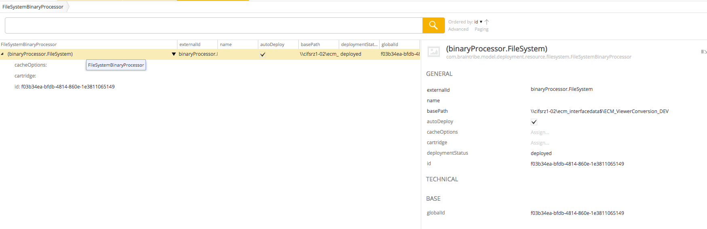
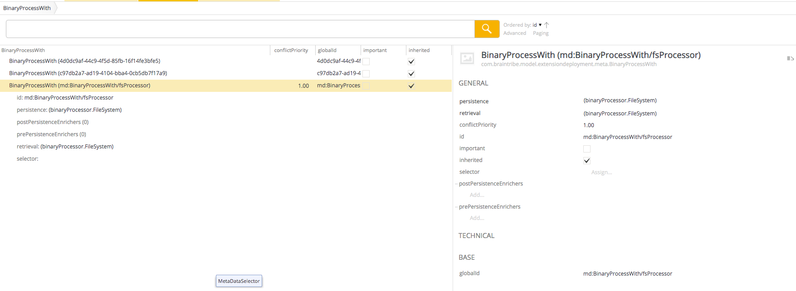
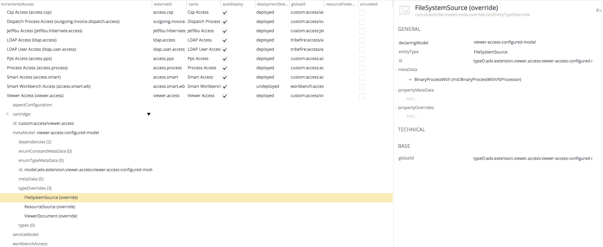

# Changing Resource Folder Location

You can change the default directory where your resources are persisted. You can do this by overriding certain properties of the entity type the resource comes from.

> If you want to change the resource folder location in a cloud setup, it is better to use a SQL database to store resources as it can be accessed by every instance in your setup. For more information, see [Persisting Resources in SQl Database](asset://tribefire.cortex.documentation:tutorials-doc/resources/persisting_resources_sql.md).

## Changing Resource Folder Location Programmatically

In this procedure we assume the access is a `SmoodAccess` and the metamodel your access uses has a dependency to `basic-resource-model` which contains the `FileSystemSource` entity type. For more information about accesses, see [Access](asset://tribefire.cortex.documentation:concepts-doc/features/data-integration/access.md).

1. Find the proper `ResourceSource` your model uses. In this example, our model uses the `FileSystemSource`. Depending on your model, your `ResourceSource` may be different.

2. Create an instance of `FileSystemBinaryProcessor` and, in the `basePath` property, assign the path where you want your resources to be persisted.

> It is best to use the common Tribefire storage path runtime property (`${TRIBEFIRE_STORAGE_DIR}/your/custom/path`) as the base for your custom path but you can also use an absolute path or a completely new runtime property. For more information on available properties, see [Runtime Properties](asset://tribefire.cortex.documentation:concepts-doc/features/runtime_properties.md).

```java
   @Managed
    private FileSystemBinaryProcessor fsStreamerProcessor() {
        FileSystemBinaryProcessor bean = FileSystemBinaryProcessor.T.create();
        bean.setExternalId("binaryProcessor.FileSystem");
        bean.setBasePath(TribefireRuntime.getProperty("RESOURCE_BASE_PATH"));
        return bean;
    }
```

3. Create an instance of the `binaryProcessWith` metadata and set the values of the `retrieval` and `persistence` , for example:

```java
   @Managed
    BinaryProcessWith fsBinaryWithRequest() {
        BinaryProcessWith processWith = BinaryProcessWith.T.create();
        processWith.setRetrieval(fsStreamerProcessor());
        processWith.setPersistence(fsStreamerProcessor());
        processWith.setGlobalId(someId);
        processWith.setConflictPriority(1d);
        return processWith;
    }
```

4. Add your configured instance of `binaryProcessWith` metadata to the `FileSystemSource` entity type of your model:
```java
    ModelMetaDataEditor mdEditor = new BasicModelMetaDataEditor(yourModel);

    mdEditor.onEntityType(ResourceSource.T).addMetaData(fsBinaryWithRequest());
    mdEditor.onEntityType(FileSystemSource.T).addMetaData(fsBinaryWithRequest());
```

## Changing Resource Folder Location in Control Center

1. Log in to Control Center. For more information about Control Center, see [Using Control Center](asset://tribefire.cortex.documentation:tutorials-doc/control-center/using_control_center.md).

2. Create an instance of `FileSystemBinaryProcessor` (`com.braintribe.model.deployment.resource.filesystem.FileSystemBinaryProcessor`) and assign proper values for the following:
   - `externalId`
   - `name`
   - `basePath`



3. Create a `BinaryProcessWith` Metadata (`com.braintribe.model.extensiondeployment.meta.BinaryProcessWith`) and assign proper values for the following:
   - in the `persistence` property, assign your instance of `FileSystemBinaryProcessor` from step 2
   - in the `retrieval` property, also assign your instance of `FileSystemBinaryProcessor` from step 2



4. Create a `GmEntityTypeOverride` type override (`com.braintribe.model.meta.override.GmEntityTypeOverride`) and assign proper values for the following:
   - in the `declaringModel` property, assign the metamodel of your access
   - in the `entityType` property, assign  `FileSystemSource`
   - assign your instance of `BinaryProcessWith` metadata here

5. In the metamodel of your access, add your instance of `GmEntityTypeOverride` you created in step 4.

