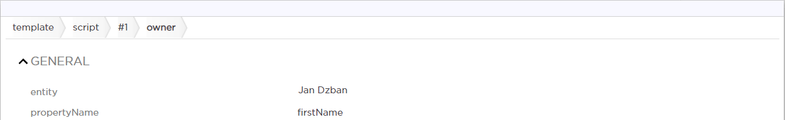
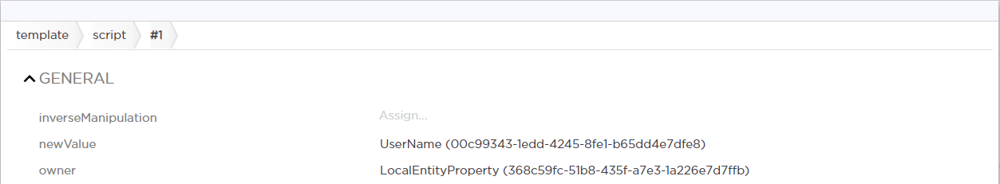
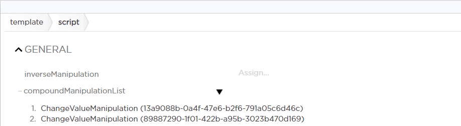
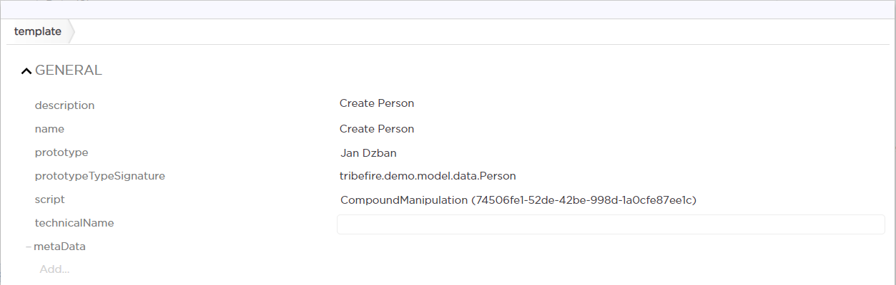
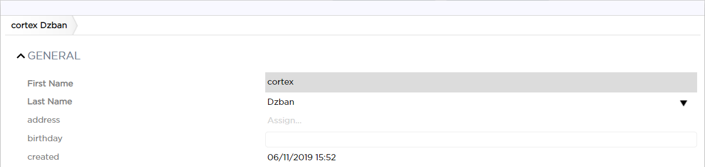

# Using Value Descriptors with Templates

The ultimate goal of Value Descriptors is to provide data to your [templates](asset://tribefire.cortex.documentation:concepts-doc/features/Templates/template.md). Let's assume we want to create a template-based instantiation action which creates a new instance of entity type `Person` with the same `firstName` property as the currently logged-in user's name. Additionally, we want the `created` property to be assigned with the current date. We have Value Descriptors just for that - the `UserName` descriptor, which gets the user name in context of the current session, and the `Now` descriptor, which gets the current date.

## Prerequisites
> This tutorial is based on the Demo Cartridge, where the `anything` property of **Person** entity has been renamed to `created`.

* You have a `person-model` in your Tribefire instance, declaring the `Person` entity type with a `firstName` (string) and `created` (date) property.
* `person-model` is added as a dependency to the meta-model of the workbench of the access where you want to use Value Descriptors.
* `person-model` is added as a dependency to the meta-model of the access where you want to execute the template-based action.
* `basic-value-descriptor-model` (one of the **Base Models**) is added to the access workbench meta-model.

## Creating a Template-based Instantiation Action

The most intuitive approach to use Value Descriptors in GME would be probably the following: 

1. Switch to the target access' workbench.
1. Create a template with the `Person` prototype.
2. Assign the `UserName` descriptor as the person `firstName` in the prototype instance.
2. Similarly, assign the `Now` descriptor as the `created` date.
3. Create the instantiation action from template.
4. Profit.

Unfortunately, the above would result in a type mismatch. **firstName** property expects a `string`, while the Value Descriptor has its own type. We need to use Template Evaluation (an internal process) to resolve the Value Descriptor to a string (because `firstName` is a string). To do so, you need to assign the descriptor as follows:

1. Switch to the access workbench.
1. Find the `Template` query in **Quick Access...** and create a new template
1. Assign `Person` as the prototype.
    > Note that you need to instantiate `Person` at this point. Keep this instance in mind - you will need to refer to it later.
2. Assign the `typeSignature` of your prototype. 
    >You can copy the signature from the `EntityTypes` query in **Control Center** after finding your prototype there.
2. Assign new `CompoundValueManipulation` as the template `script`. A new window opens, presenting the `compoundManipulationList`. This is where you need to add the actual manipulations (two in our case).
2. Add new `ChangeValueManipulation` instance to the list. 
3. Assign the `UserName` descriptor as `newValue`.
4. Now, you need to define where the new value is to be assigned. Configure the ChangeValueManipulation `owner` as follows:
    1. Assign new `LocalEntityProperty` as `owner`.
    2. Inside the `LocalEntityProperty`, assign `Person` as the `entity` to be changed.
        > Important: it has to be the same instance of `Person` as used in your prototype.
    3. Assign `firstName` as the property to be changed. This configuration states that our `newValue` (in this case the user name descriptor) is to be assigned as the firstName. Owner's `entity` should now be assigned with the prototype instance of `Person`, referring to its `firstName` property.

        

4. Apply your changes. Your first manipulation should now look as below:

    

4. Following the same procedure, add another `ChangeValueManipulation` to the list. This time, assign the `Now` descriptor as `newValue`.
4. Configure the `owner` as you did previously, but this time with `created` as the property to be changed.
4. Finally, apply your changes. You should now have two entries in `compoundManupulationList`:

    

4. Your template is now ready. Commit your changes.

    

5. Find the `TemplateInstantiationAction` query in **Quick Access...**. Create a new instantiation action that creates a new `Person` based on your template (to achieve this, simply assign the previously configured template to the action). When committed, the action is available in **Global Actions** query in the workbench.
6. Assign your instantiation action in the workbench. For more information, see [Configuring Workbench](../workbench/configuring_workbench.md)
6.  Once commited, your instantiation action should be available in the target access as assigned in the workbench. Try it out! The result should be a new instance of Person with a new `firstName` and `created` date:

    

## What's next?
Take a look at the [available Value Descriptors](asset://tribefire.cortex.documentation:concepts-doc/features/value_descriptors.md), and think about how they could benefit your templates. Note that you are not limited to a single manipulation, as described above - you can create complex, compound manipulations just as easily.