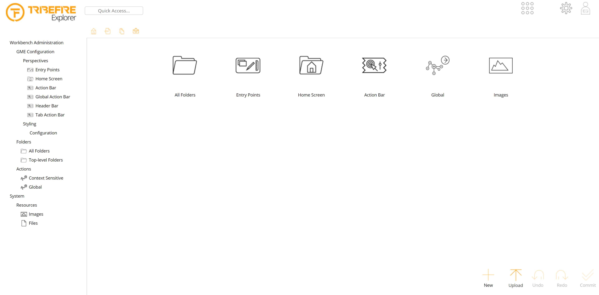

# Creating a Workbench Access

If you want to configure how your custom access looks in Explorer you need a workbench access.

## General

If you want to configure how your custom access looks in Explorer you need a workbench access. You can create one using an action on the Action Bar.

> For information on Action Bar, see [UI Elements](asset://tribefire.cortex.documentation:concepts-doc/features/ui-clients/ui_elements.md#global-actions).

The functionality of creating a workbench access relies on name patterns. The system detects whether a workbench exists by searching for a model with a particular name in existing models. The service checks against the following name patterns:

Element    | Pattern  
------- | -----------
accessName Access  | `accessName.wb`
MyModel Model | `MyWorkbenchModel`  

Instances of `WorkbenchAccess` created using the **Setup Workbench** service are created as `CollaborativeSmoodAccess`. This enables packaging the content of workbenches as platform assets.

> For more information on `CollaborativeSmoodAccess` and platform assets, see [SMOOD](asset://tribefire.cortex.documentation:concepts-doc/features/smood.md) and [Platform Assets](asset://tribefire.cortex.documentation:concepts-doc/features/platform_assets.md).

## Configuring a Workbench for a Custom Access

To set up a workbench for a custom access:

1. In Control Center, go to Action Bar and navigate to **More -> Setup Workbench**. Guided Instantiation and Manipulation Assistant (GIMA) is displayed. In the template editor, configure your workbench:

   Option    | Description  
   ------- | -----------
   Reset Existing Access  | Resets all properties of the access, for example name or metamodel.
   Reset Existing Model | Resets all properties of the model, for example dependencies. Select this box when a model with the expected name already exists.  

2. Click **Execute**. The service checks for a workbench or a model with a specific name and if both do not exist, the workbench model and access are assigned to the access. An error message is thrown if:

   * you already have a workbench access configured for your access
   * the metamodel of your access already has a workbench model

   For safety reasons, the service does not work if a model or workbench with the expected name already exists. If you want to override this behavior, mark the **Reset Existing Access** and **Reset Existing Model** boxes. This results in resetting the access or model and assigning it as the workbench access to the access, which means that folder structures you might have configured in this access are reused.
   An empty workbench access is created. Now it's time to populate your new workbench access with some folders.

3. Click the **Configure Workbench** button on the action bar. GIMA is displayed.

4. Configure your workbench by selecting an color style from the Explorer Style drop-down list. Make sure that the **Ensure Standard Folders** checkbox is marked and click the **Execute** button. Your new workbench access is created and configured with the standard folder structure:

## What's Next?

Now that you created your workbench access, you can customize what is displayed in Explorer.
> For more information, see [Configuring Workbench](configuring_workbench.md).