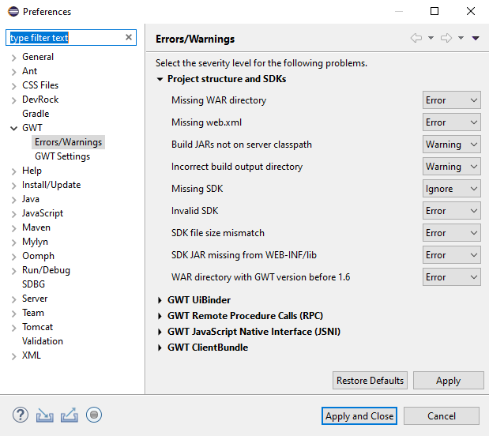
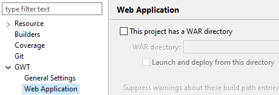
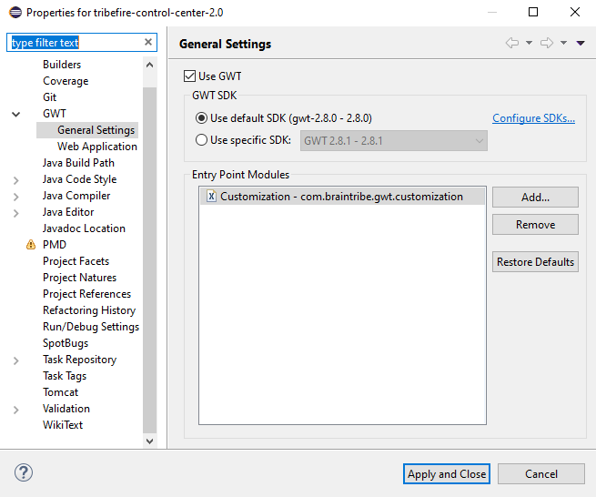
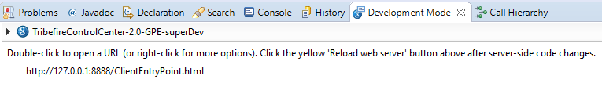
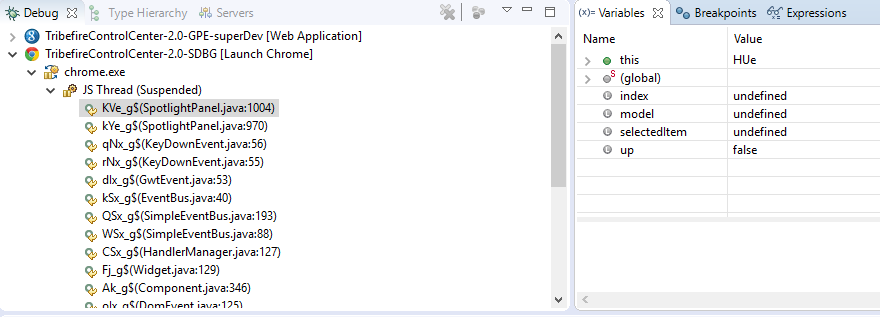
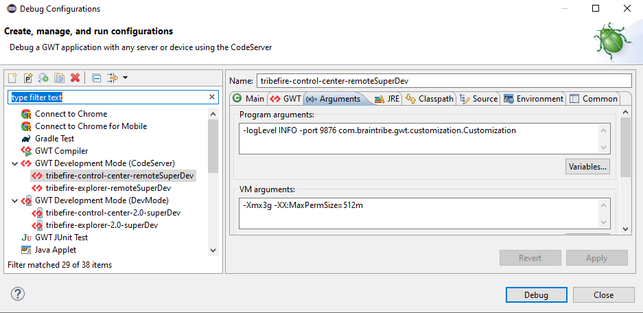
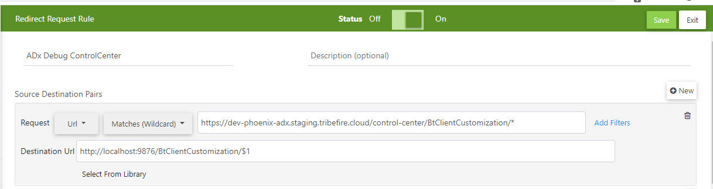

# Configuring GWT Debug with SuperDevMode
This document will guide you through the process of installing and configuring the tools required for Debugging a GWT Application using the SuperDev Mode. We will do that by providing an example, which will be the tribefire-explorer.

## Step-by-step guide
We are preparing an Eclipse 2022-09, which was the latest Eclipse version available by the time of this writing.

1. Install the GWT Eclipse Plugin 3.0.0:
   - In Eclipse, go to `Help`, `Eclipse Market Place`
   - In the `Find` field, type `GWT` and press `ENTER`
   - Click Install
   - Finish the installation

2. Once installed, we need to configure the plugin:
   - In Eclipse, go to `Window`, `Preferences`
   - Expand `GWT`, and select `Errors/Warnings`
     - Make sure the entry `Missing SDK` is set with `Ignore` as shown in the image bellow:

    

   - Select `GWT Settings`
     - Click `Add` and select the directory where your GWT Folder was extracted to. For example: `C:\Development\gwt-2.8.0`
    > If you have not yet downloaded GWT, you can get it from [here](http://www.gwtproject.org/)
    >Download it, and extract it to a directory, which will be used for the step above.

   - The Display name will be filled automatically, you can either change or keep the suggested name
    
3. Check the Eclipse Project Configuration. It should be already configured correctly due to the commit of the configurations to git, but, just in case, double check if it is configured configured as follows:
   - In Eclipse's `Package Explorer`, right click the `tribefire-explorer` project and select `Properties`
   - Look for the `GWT` entry and expand it
     - Select the entry `Web Application` and make sure it is configured as bellow:
    
    
    
   - Select the entry `General Settings` and make sure it is configured as bellow:
    
    
    
4. Once you check `Use GWT`, then the SDK appears automatically as library in the project build path. We need to remove that:
   - In Eclipse's `Package Explorer`, right click the `tribefire-explorer` project and select `Properties`
   - Look for `Java Build Path` and click into it
   - Go to the `Libraries` tab
   - You will see that the `GWT SDK` is listed there. Select it and click `Remove`
   - Apply the changes
  
5. A String substitution must be set for the Debug Configuration
   - In Eclipse, go to `Window`, `Preferences`
   - Look for `Run/Debug`, expand it, then select `String Substitution`
   - Click `New`
   - Enter `tomcat-explorer` as the name
   - For the value, enter the path where `tribefire-explorer` is deployed, for example: `C:\Tomcat\webapps\tribefire-explorer`
  
6. Now it is time to run the superDevMode. In Eclipse, go to `Run`, then select `Debug Configurations`
   - Under `GWT Development Mode (DevMode)`, select `tribefire-explorer-2.0-superDev`, and then click `Debug`
     - This will then start the superDev mode. A small pre-compilation will take place. It may take a while the first time it runs, but further runs should be way faster. You will know compilation is done when the `Development Mode` tab is highlighed in Eclipse, and it is shown as bellow:

    
    
7. Finally, we run the `SDBG plugin`, which will open TCC in `Chrome`, loading the application
   - Right click the URL shown as in the image above, and select `Open With SDBG Chrome JS Debugger` or
   - Go to `Run`, then click `Debug Configurations`, then under `Launch Chrome`, select `TribefireExplorer-2.0-SDBG`, and then click `Debug`
   - A new `Chrome` window will get opened, and the application will start. If you choose the right click to start (a. path), then you will need to adjust the URL for the original URL for TfExplorer, for example: `http://localhost:8080/tribefire-explorer/`
   - The code will be compiled. Again, the first time it will take a while, but consecutive runs will be much faster
   - Once the compilation is done, the application is shown, and you can start using it. Set your breakpoints in Eclipse normally, as you would before. Even breakpoints within emulated classes will now work, which is great. The image bellow will show an example of a breakpoint set. As can be seen, 2 threads are shown in the left side: the one from the `GPE plugin`, used for starting the superDevMode, and the one from the `SDBG plugin`, used for having the possibility to debug inside Eclipse. The stacktrace is shown (showing both the Java classes and its obfuscated JS names, and in the variables, the values and names of the variables corresponding to the current selected entry in the stacktrace.

  

## Important Information

1. Somehow, the `notification-api` artifact must be present in your Eclipse workspace. I am not sure why. But just in case, add it, please.

2. The original launch file is still available (for the non SuperDev mode debugging, in case you still want - or need - to use that). But please that some settings must be applied. Please check section `Debugging without SuperDevMode` bellow.

3. Please notice that if you open the `Development Tools` in `Chrome`, the `SDBG plugin` will be put on hold, and so, the brekpoints will no longer work in Eclipse. Once the `Development Tools` is again closed in `Chrome`, the `SDBG plugin` will resume.

4. If you want to change a code, most of the time it will be fine to leave both Debug (Super Dev Mode and SDBG) running, and simply refresh the browser after editing a file. This is very fast since only the changed code is recompiled. I only had troubles with that after opening or closing a project in Eclipse, which means, messing with AC`s dependencies. It wasn't able to delete some stuff, which makes Eclipse show some errors. I had then to restart both debugs (Super Dev Mode and SDBG).

## Step-by-step guide for Remote Debugging

For remote debugging, we will use a tool named `Requestly` (which is available as a Chrome or Firefox plugin). Notice that there may be other ways to support the redirect we want, but it is super easy to do that with the use of the plugin.

1. Start gwt's CodeServer for your project by running the remote superDev launch config
   - `tribefire-explorer` already has a launch configuration for it. It is called `tribefire-explorer-remoteSuperDev`
   - If your project doesn't have such a launch, follow those steps:
     - In Eclipse, go to `Debug Configurations`
     - Select `GWT Development Mode (CodeServer)`
     - Click on the button `New launch configuration`
     - Choose a name, and select your GWT application artifact in project
     - Leave the main class as is (`com.google.gwt.dev.codeserver.CodeServer`)
     - Go to the `Arguments` tab and check if program arguments look like this: `-port 9876 -logLevel INFO com.braintribe.gwt.customization.Customization`
     - Still there, set VM arguments to this: `-Xmx3g -XX:MaxPermSize=512m`
     - In the `Common` tab, set `Save as` as shared file, so others can use the settings you created
    
    
    
2. Wait for the console to show: `The code server is ready at http://127.0.0.1:9876/`

3. GWT compile your sources by entering the following URL (in the browser, for example): `http://localhost:9876/recompile/BtClientCustomization?gxt.device=desktop&gxt.user.agent=chrome&locale=default&user.agent=safari&user.agent.os=windows`
   - some parameters in the URL are fixed (gxt.device and locale), but others are different depending on your environment. The possible values for the parameters are:
     - `gxt.user.agent`: gecko1_9, chrome, edge, safari5
     - `user.agent`: gecko1_8, ie10, safari (safari is the one used for Chrome Browser and ie10 is the one for Edge)
     - `user.agent.os`: linux, mac, unknown, windows
   - This will trigger a GWT compilation. As usugual, the first time it is taking some time, but further compilations are really fast
   - Notice that you will need to perform this step manually after every change to the sources that you want to debug is done. If you want, there is a possibility to configure Eclipse to do that automatically for you. Research on that and update this documentation, please :-)
  
4. Wait for the console to show: `Compile completed`

5. The trick now is to get the browser to use the GWT assets served from the local code server instead of the remote webserver. This is where the `Requestly` Chrome extension comes in. Access https://www.requestly.in/ install the extension, and set the following settings on it:
   - Click in the `Requestly` icon in Chrome and then click on `Manage Favourite Rules`
   - Click on `New Rule` and then select `Redirect Request`
   - For this example, we will configure the support for `ADx's dev stage explorer debug`
   - Give the rule a name, and select `Matches (Wildcard)`
   - In the URL value, type this: `https://dev-phoenix-adx.staging.tribefire.cloud/explorer/BtClientCustomization/*`
   - As destination URL, enter this: `http://localhost:9876/BtClientCustomization/$1`
   - Click `Save`. With this, we then make sure that all requests to anything in `https://dev-phoenix-adx.staging.tribefire.cloud/explorer/BtClientCustomization/` is redirected to `http://localhost:9876/BtClientCustomization/`
  
  
  
6. Now, in chrome, navigate to the remote site, as you normally would. If you open `Chrome Developer Tools` and check the `Network` tab, you will see that all requests to the GWT related code is having the 307 code (redirect). Your code can be debugged by using sourcemaps in chrome only.

## Debugging without SuperDevMode

If you still want to use the old way of debugging, as of the codebase split was done, three new Eclipse classpath variables are needed to be set.

They are:

`GmCore4Jvm_JAR`, which must point to the GmCore4Jvm artifact jar file. Unfortunately, **one must pay attention** to possible updates of this artifact (new versions) manually, and update the path accordingly.
So, for example, this path: `C:\Users\michel\.m2\repository\tribefire\js\gwt-gm-core4-jvm\3.0.11\gwt-gm-core4-jvm-3.0.11.jar`
The same must be done for `BT_ASM_JAR`, which points to `C:/Users/michel/.m2/repository/com/braintribe/asm/btasm/2.0.5/btasm-2.0.5.jar`
And last, `ITW_JAR`, which points to `C:/Users/michel/.m2/repository/com/braintribe/gm/instant-type-weaving/2.0.8/instant-type-weaving-2.0.8.jar`

By doing that, debugging without superDevMode will still work.

 

**Well, that is it. Happy debugging!**  
