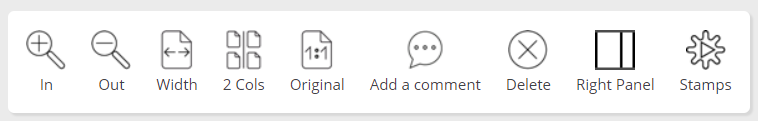
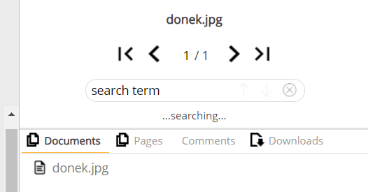

# Using WebReader UI

## General

Having installed WebReader, you can use the instructions on this page to find your way around the UI.

## Uploading Documents

You can upload documents using the Web Terminal installed together with WebReader.

1. On tribefire landing page, select **File Upload** from Web Terminals menu. The **Document Upload** page opens.
2. Select the files to be uploaded.
3. Optionally, select the **Wait for result** option. When enabled, the page will wait for the server response, and present it to you. The response contains the ID of the converted document (among other parameters), which you can later use to find the document by ID in tribefire.

    When disabled, the response will simply contain the conversion job ID, meaning that the conversion has begun. You can check the conversion status at any time in tribefire. You can only open your file in WebReader when the conversion has finished.

4. Click **Upload**. Your files are converted into instances of tribefire document model, and uploaded to the documents server.

## Browsing Documents in WebReader

Once uploaded, you can open your documents in WebReader from tribefire.

1. On the landing page, select **Explore** under Documents Access (part of Service Domain). The All Documents query opens by default, showing all uploaded documents (i.e. those for which the **Conversion Job** has finished).
    > Note that you can switch between ready documents and conversion jobs - simply select the required query from the left-hand menu.
2. To open a document in WebReader, r-click and select **Open/WebReader**. The document opens in WebReader. Note the main UI elements:

    * Top panel, where you can change document display settings, add comments, and open comments saved as stamps:

        

    * Side panel, where you can run search queries, switch between documents or pages, browse comments, and download the file:

        

## Disabling the Comments Feature

By default, adding comments to a document is enabled. If you want to disable this feature, simply set the URL parameter `useComments` to `false`, as in:

https://HOST_NAME/WEBREADER_LOCATION/?`useComments=false`&userId=ravenhurst

If the parameter is set to `true` or missing, comments are enabled.

## Changing the Comment Signature

Comments added to WebReader documents are normally signed with the logged-in user name. You can override this by assigning the desired signature to the `userId` URL parameter, as in:

https://HOST_NAME/WEBREADER_LOCATION/?`userId=MyNewSignature`

Naturally, comments must be enabled for the override to take effect.