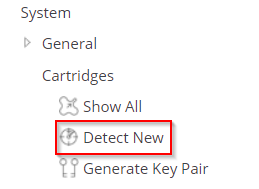
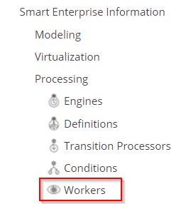
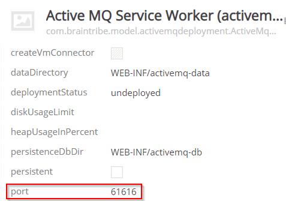

# ActiveMQ Cartridge

The ActiveMQ cartridge provides messaging infrastructure for tribefire servers.

## General

You can use this cartridge to facilitate communication between tribefire servers working in a distributed environment.
ActiveMQ cartridge is available under [https://artifactory.EXAMPLE.com/artifactory/core-stable-20180927/tribefire/extension/activemq/active-mq-server-cartridge](https://artifactory.EXAMPLE.com/artifactory/core-stable-20180927/tribefire/extension/activemq/active-mq-server-cartridge).

## Setting up the Messaging Infrastructure Server

Follow the below procedure to provide messaging infrastructure based on the ActiveMQ Cartridge:

1. Install tribefire in your target destination using the following command: . Replace `yourInstallationPath` with the actual destination.
2. Navigate to `yourInstallationDirectory/runtime/host/bin` and start the server (run the `catalina start` command, or open the `tribefire-console-start` file).
3. Deploy the `ActiveMQ cartridge` to tomcat (use `tribefire-services` or copy the .war file into the `/runtime/host/webapps` folder).
4. Open **Tribefire Control Center**.

5. In the left-hand menu, navigate to `System/Cartridges/Detect New`. The cartridge should now appear in the **Cartridge List**. 

    

6. Select the `ActiveMQ cartridge` and click **Synchronize**. Cartridge synchronization should be confirmed by a success message.

7. Navigate to `Smart Enterprise Information/Processing/Workers`. **ActiveMQ Service Worker** should be available. 

    

8. Take note of the `port` property of the worker (`61616` by default). This is the listening port of your messaging server,       which you will later have to provide to the ActiveMQ messaging plugins installed on your distributed servers. 

    

9. Click **Deploy** to deploy the worker. The `deploymentStatus` property of the worker should now read **deployed**. That's it - you can now proceed to setting up your distributed servers!

## What's Next?

You can now set up your distributed tribefire servers. For details, see [Setting up tribefire in a Distributed Environment](asset://tribefire.cortex.documentation:tutorials-doc/configuration/distributed_setup.md). Remember to start the messaging server first!
