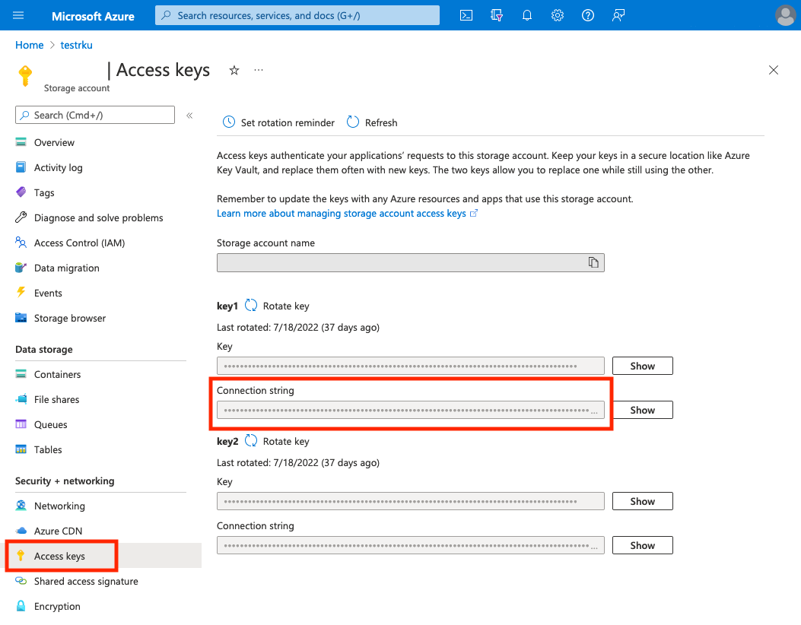
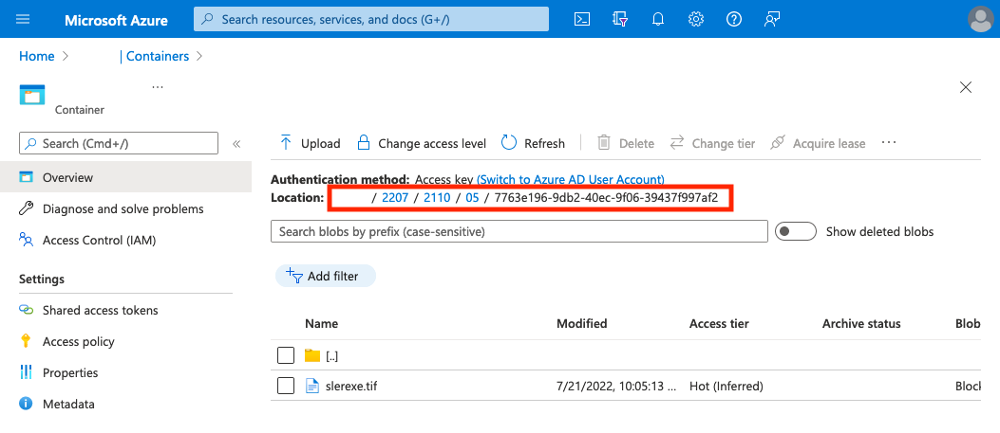

# Azure Module

This module provides an implementation of the `BinaryRetrieval` and `BinaryPersistence` interfaces that are necessary for storing Resources in and streaming Resource from an Azure Blob Storage.

Requirements:

* An Azure storage account
* The API connection String
* A container where files should be stored



## Setup and Configuration

In order to use the Azure module in your setup, you have to include the artifact:

`tribefire.extension.azure:azure-aggregator`

The initializer can automatically set up a default configuration. If you want to do that, you can set the environment variable `AZURE_CREATE_DEFAULT_ACCESS` to `true` (default is `false`). It is recommended to use the provided Wire templates to create a custom configuration.

### Encrypt

Encrypting string can be do e.g. using:
```bash
encrypt.sh -v 'YOUR_AZURE_CONNECTION_STRING'
```

### Default Configuration

The default configuration creates a standard setup that can be influenced by the following environment variables.


| Property           | Description      | Default      |
| :------------- | :----     | :----      |
| `AZURE_CONNECTION_STRING_ENCRYPTED`  | The connection String that is to access the Azure Blob Storage. | `none` |
| `AZURE_CONTAINER_NAME`  | The name of the container the default Binary Processor should use.  | `none` |
| `AZURE_PATH_PREFIX`  | The (optional) path prefix .  | `none` |

This will create a default `SmoodAccess` with the Azure Binary Processor attached to the model and is merely intended to be a quick testbed to verify that the connection to Azure works as intended.

### Custom Configuration

When the default configuration settings described above are not sufficient, it is also possible to use the `azure-wire-templates` to create a specific configuration.

The main entry point to the configuration is the `AzureTemplatesContract`. Here's an example of how it can be used in a custom initializer:

```java
@Import
private AzureTemplatesContract templates;

@Override
@Managed
public AzureBlobBinaryProcessor blobProcessor() {
    AzureTemplateContext context = defaultContext();
    return templates.binaryProcessor(context);
}

@Override
@Managed
public BinaryProcessWith binaryProcessWith() {
    BinaryProcessWith bean = create(BinaryProcessWith.T);

    AzureBlobBinaryProcessor processor = blobProcessor();

    bean.setRetrieval(processor);
    bean.setPersistence(processor);
    return bean;
}
```

The resulting `BinaryProcessWith` can then be attached to `ResourceSource` and `AzureBlobSource`.

To create the context, this code can be used:

```java
@Managed
private AzureTemplateContext defaultContext() {
    //@formatter:off
    AzureTemplateContext context = AzureTemplateContext.builder().setIdPrefix(initializerSupport.initializerId())
            .setLookupFunction(super::lookup)
            .setEntityFactory(super::create)
            .setName("Default")
            .setStorageConnectionString("...Connection String...")
            .setContainerName("...Conntainer Name...")
            .setPathPrefix("...(optional) Path Prefix...")
            .setAzureModule(existingInstances.azureModule())
            .build();
    //@formatter:on

    return context;
}
```

The `AzureTemplateContextBuilder` provides a set of methods to change the configuration of the `AzureTemplateContext`:


| Method           | Description      | Default      |
| :------------- | :----     | :----      |
| `setStorageConnectionString`      | The Connection String provided in the `Access keys` section of the Storage account.  | `null` |
| `setContainerName`      | The name of the container within the Storage accound.  | `null` |
| `setPathPrefix`      | The (optional) path prefix for all files stored in the container.  | `null` |


## Storage

File are stored in a hierarchical way in the Azure Blob Storage container. The full path contains (after a configurable path prefix) a directory structure that is based on the date and time when the file gets uploaded. The final directory is the full ID of the `Resource` to ensure that each file is stored in its own directory.

The name of the file stored in the Container will be based on the original filename provided in the `Resource`. However, special characters (i.e., anything other than characters and digits, `.`, and `-`) will be removed. It is also ensured that the full path does not exceed the length of 1024 characters.

